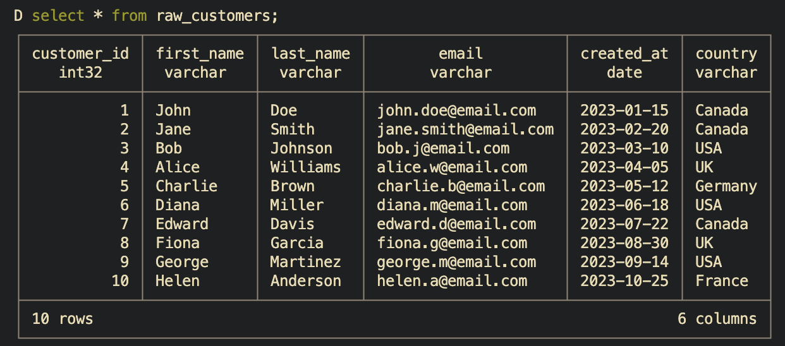

## Why I’m Learning dbt as an Analyst

You can find the project on GitHub here: [zhugejun/learn-dbt-by-building](https://github.com/zhugejun/learn-dbt-by-building)

I've been an Institutional Research Analyst in higher education for almost a decade.
For my day-to-day job, I can wrangle enrollment with SQL, automate reports with R, build prediction models with Python, and visualize data with Power BI.
There are times that I need to run queries to pull data from CAMS directly, download data from ZogoTech (our third-party OLAP vendor), save it as CSV, and load it to R for aggregation, visualization, and further analysis.
Sometimes, I need to ingest the enrollment history data from National Student Clearinghouse (NSC) and combine it with data from multiple resources to create a superintendent report.

The process works, but it's far from ideal.
The CAMS views are mostly generic and not built with analytics in mind.
This means I often spend a lot of time cleaning and transforming the data before I can use it for analysis and dashboards in Power BI.

So, why learn dbt?

I first heard about dbt a couple of years ago, but I didn't look into it closely because I thought it was mainly a tool for data engineers.
Most recently, I discovered the idea of the analytics engineer, a role that sits between analysis and engineering.
That completely changed how I saw dbt.
It turns out this role fits me almost perfectly: I enjoy analysis, but I also care about building clean, reliable, and scalable data pipelines.
And dbt is designed exactly for that.

Instead of learning dbt by just watching videos or reading tutorials, I wanted to learn it by building something real.
So I created a small project to get hands-on experience.

The project simulates a simple retail analytics scenario where I can practice transforming raw data into meaningful insights using dbt.
In a real production setting, this transformed data would live in a cloud data warehouse.
Since I don’t have access to a real one for this project, I used synthetic data and DuckDB as a local warehouse to simulate the environment.

## What This Project Is

This project is a small, self-contained dbt setup that simulates a simple retail analytics workflow.

It takes raw, synthetic data (orders, customers, and products), loads it into DuckDB, and uses dbt to transform that data into analytics-ready tables such as daily revenue, customer cohorts, and product performance.

The goal is not to build a production-grade system, but to create a realistic environment where I can practice:

- writing dbt models,
- organizing transformations,
- adding tests and documentation,
- and thinking about analytics engineering patterns.

In short: it’s a sandbox for learning dbt by doing.

## Project Setup

### Overview

An overview of the architecture of this project is as follows:

```txt
  Seeds (Raw CSVs)
      ↓
   Staging        ← "Make it clean"
      ↓
  Intermediate    ← "Make it useful"
      ↓
    Marts         ← "Make it ready"
```

### Setting Up The `TechMart` Project

Before I can start building models, I need to set up my dbt project by running `dbt init techmart`.
This command initializes a new dbt project named `techmart` with the default directory structure and configuration files.
Since we are using DuckDB locally, we will need to configure the `profiles.yml` file (usually located in `~/.dbt/profiles.yml`) to include the connection details for DuckDB.
For a cloud data warehouse, just follow the instructions provided and your credentials will be saved to `~/.dbt/profiles.yml` automatically.
Here is an example configuration for DuckDB in `profiles.yml`:

```yml
techmart:
  target: dev
  outputs:
    dev:
      type: duckdb
      path: ./techmart.duckdb
      threads: 1
    prod:
      type: duckdb
      path: ./prod.duckdb
      threads: 4
```

The `target` specifies which output/database to connect to when running dbt commands.
In real-world scenarios, you might have different targets, for example, `dev` for development, `staging` for testing, and `prod` for production.
To switch to a different target, use the `--target` flag with the desired target name, e.g., `dbt run --target prod`.

To verify the setup, simply run `dbt debug`. You should see "All checks passed!" if everything is configured correctly.

Now, the project structure is ready and looks like this:

```txt
techmart/
├── dbt_project.yml      # Project configuration
├── models/              # Your SQL transformations
├── seeds/               # CSV files to load as tables
├── snapshots/           # SCD Type 2 tracking
├── macros/              # Reusable SQL snippets
├── tests/               # Custom data tests
└── analyses/            # Ad-hoc analytical queries
```

Let's take a closer look at `dbt_project.yml`. Everything is intuitive by its name except the last section about materializations.
There are several types of materializations in dbt, including `table`, `view`, `incremental`, and `ephemeral`.
Each materialization determines how dbt will build and store the model in the data warehouse.

- `table`: Creates a physical table and rebuilt on each `dbt run`.
- `view`: Creates a view in the data warehouse that is rebuilt on each `dbt run`.
- `incremental`: Only updates new or changed records, rather than rebuilding the entire table.
- `ephemeral`: Not materialized at all; instead, it injects as CTEs (Common Table Expressions) into downstream models.

### Loading Sample Data with `dbt seed`

When I run `dbt seed`, dbt loads the CSV files defined in the `seeds` directory into the data warehouse as tables.
This is useful for loading static or reference data that doesn't change frequently.

To verify the data was loaded correctly, I can run a simple query like `select * from raw_customers;` in terminal to see the contents of the `customers` table as below. Or simply `.tables` to list all tables in DuckDB.



### Building Staging Models

Staging models are boring on purpose. They map 1:1 with the raw data and only do basic cleaning: rename columns to consistent conventions, cast data types, handle missing values, and maybe some light transformations. No joins. No business logic.

Why? Because when your source system changes a column name from `customer_id` to `cust_id`, you only need to update the staging model, and all downstream models will continue to work without any changes.

Usually, staging models are named with a `stg_` prefix to indicate that they are staging models, e.g., `stg_customers`, `stg_orders`, etc.
A yml config file, `_stg_sources.yml`, is used to tell dbt where your source data is coming from and how to reference it in your staging models.

```yml
version: 2

sources:
  - name: raw
    description: Raw TechMart data loaded from seeds
    schema: main # For DuckDB
    tables:
      - name: raw_customers
        description: Customer information
        columns:
          - name: customer_id
            description: Primary key
            tests:
              - unique
              - not_null
      - name: raw_products
        description: Product catalog
      - name: raw_orders
        description: Order headers
      - name: raw_order_items
        description: Order line items
```

This allows you to write your code like, `select * from {{ source('raw', 'raw_customers') }}`, instead of hardcoding `select * from main.raw_customers` in the staging models.

### Building Intermediate Models

Intermediate models are where the magic happens. This is where you join data, calculate aggregations, and enrich records.
For example, `int_orders_enriched` takes raw orders and calculates totals from line items:

```sql
select
    order_id,
    sum(net_amount) as net_total,
    count(*) as total_line_items
from {{ source('raw', 'raw_order_items') }}
group by order_id
```

Why a separate layer? Because multiple marts might need order totals. Calculate once, use everywhere.

To run the intermediate models, you can use the command `dbt run --models intermediate`.

### Building Mart Models (Final Business Tables)

Mart models are the finished business tables that data analysts and BI tools actually query.
In dimensional modeling terms, these are your facts and dimensions, which I will explain in the next section.

What makes mart models different from intermediate models is that they are designed for end-user consumption, optimized for reporting and analysis, and often include business logic specific to the organization's needs.

To run the mart models, you can use the command `dbt run --models mart` or just `dbt run`.

## The "Aha!" Moments

### 1. The Dimensional Model

Dimensional modeling is the most important concept I learned in this project.
It is a star schema design where a central fact table is connected to multiple dimension tables, forming a star-like structure.

```txt
           dim_customers
                 ↑
                 │
dim_products ← fct_orders → dim_dates
```

#### Dimension

A dimension is a descriptive attribute or set of attributes that provide context to the facts in your fact tables.
Each row in a dimension table represents a unique entity.
For example, a `customer` dimension might include attributes like `customer_id`, `name`, `email`, and `signup_date`.

#### Fact

A fact is a quantitative measure that represents a business process.
Each row in a fact table represents a unique event or transaction.
For example, an `order` fact might include measures like `order_id`, `net_total`, and `total_line_items`.

The power is in the simplicity.
Want revenue by customer segment by month?
One query:

```sql
select
    d.month_name,
    f.customer_segment,
    sum(f.net_total) as revenue
from fct_orders f
join dim_dates d on f.order_date = d.date_day
group by 1, 2
```

No complex joins or subqueries needed.
Everything an analyst needs is either in the fact or one join away.

### 2. Business Logic Has a Home

Where do you put "what makes a VIP customer"?
It's an attribute of a customer, so it belongs to the `dim_customers` dimension table.

```sql
-- In dim_customers
case
    when lifetime_value >= 200 and total_orders >= 3 then 'VIP'
    when lifetime_value >= 100 or total_orders >= 2 then 'Regular'
    when total_orders = 1 then 'New'
    else 'Prospect'
end as customer_segment
```

Now when marketing says "actually, VIP should be $150 and 2 orders," I can just update the logic in one place, and it will automatically propagate to all reports and analyses that use the `dim_customers` table.

### 3. Testing, Testing, Testing

Testing is a crucial part of dbt.
It ensures that your data is accurate, consistent, and reliable.
dbt provides built-in tests for common scenarios like uniqueness, not null, and referential integrity.

For example, to test that each customer has a unique `customer_id` in the `dim_customers` table, you can add the following to your `schema.yml`:

```yaml
columns:
  - name: customer_id
    tests:
      - unique
      - not_null
  - name: customer_segment
    tests:
      - accepted_values:
          values: ['VIP', 'Regular', 'New', 'Prospect']
```

To run the tests, use the command `dbt test`.
This will execute all tests defined in your project and report any failures.

### Naming Conventions

The pattern of naming I adopted:

| Prefix | Meaning |
| ------ | ------- |
| `stg_` | Staging (1:1 with source) |
| `int_` | Intermediate (joins/transforms) |
| `dim_` | Dimension table |
| `fct_` | Fact table |
| `rpt_` | Report/aggregated mart |

When I see `stg_customers`, I know it's a staging table that mirrors the source data for customers.

## Key Takeaways

- Layers exist for maintainability, not complexity. Staging -> Intermediate -> Mart keeps logic organized and reusable.
- Dimensional modeling is worth learning. Facts and dimensions make it easy to answer business questions without complex SQL.
- Tests are features, not chores. They catch bugs, document expectations, and build confidence in your data.
- Naming conventions compound. Boring? Yes. Essential at scale? Absolutely.

## What's Next

Now that I have a foundation, it's time to apply it to real work: enrollment pipelines, CBM reports, and superintendent dashboards.
I'll also explore snapshots for SCD Type 2, dbt macros and packages, CI/CD with GitHub Actions, and eventually a real cloud warehouse.

The best part of learning in public? Accountability. Now I have to actually build something. More to come.
