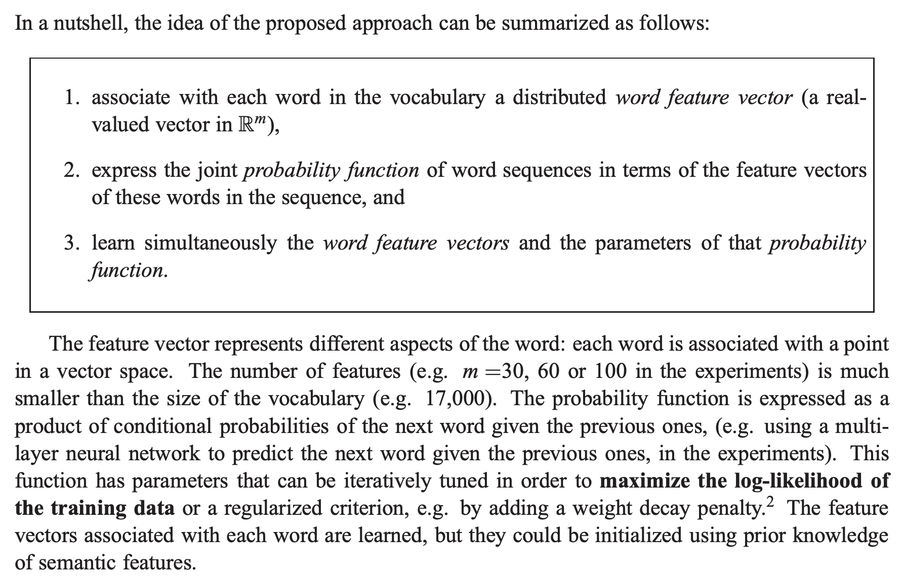
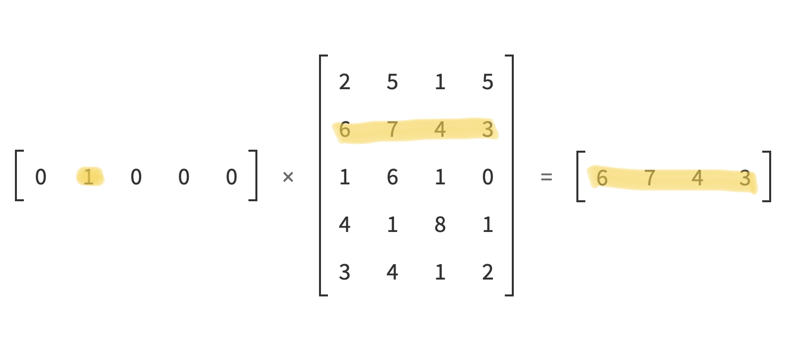
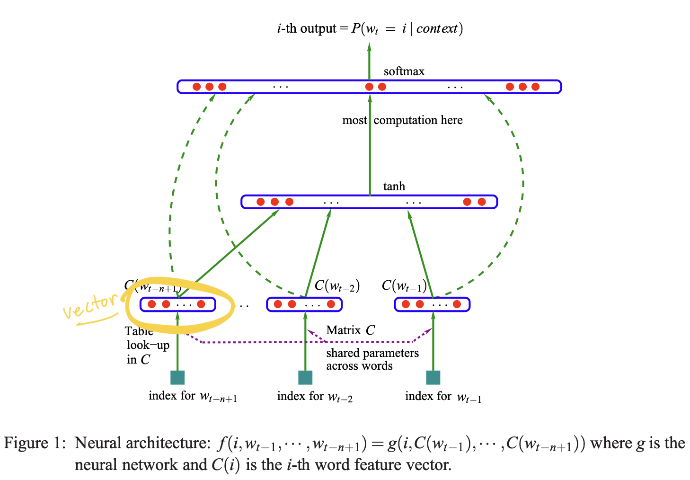
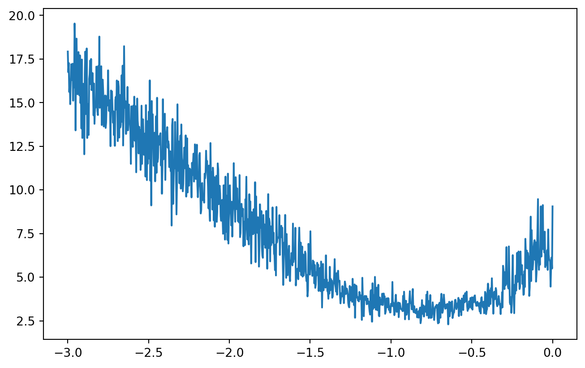
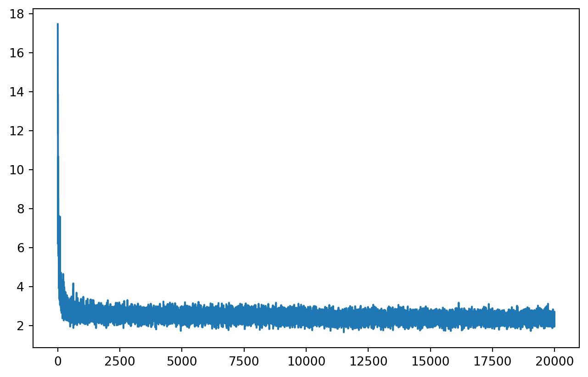
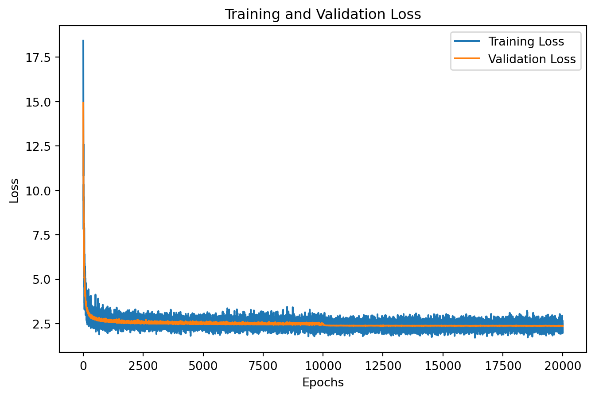
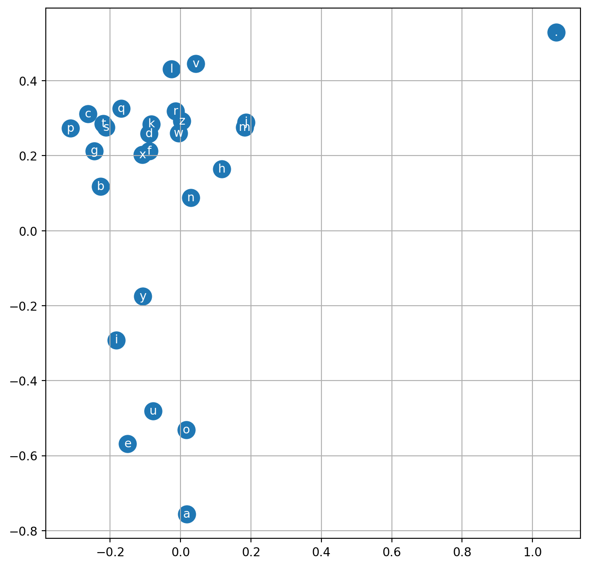

In [Part1](), we learned how to build a neural network with one hidden layer to generate words.
The model we built performed fairly well as we got the exact words generated based on counting.
However, the bigram model suffers from the limitation that it assumes that each character only depends on its previous character.
Suppose there is only one bigram starting with a particular character.
In that case, the model will always generate the following character in that bigram, regardless of the context or the probability of other characters.
This lack of context can lead to poor performance of bigram models.
In this lecture, Andrej shows us how to build a multilayer neural network to improve the model performance.

Unlike the bigram model we built in the last lecture, our new mode is a multilayer perceptron (MLP) that takes the previous 2 characters to predict the probabilities of the next character.
This MLP language model was proposed in the paper [A Neural Probabilistic Language Model](https://www.jmlr.org/papers/volume3/bengio03a/bengio03a.pdf) by Bengio et al. in 2003.
As always, the official Jupyter Notebook for this part is [here](https://github.com/karpathy/nn-zero-to-hero/blob/master/lectures/makemore/makemore_part2_mlp.ipynb).

## Data Preparation

First, we build our vocabulary as we did before.

```python
from collections import Counter
import torch
import string
import matplotlib.pyplot as plt
import torch.nn.functional as F

words = open("names.txt", "r").read().splitlines()
chars = string.ascii_lowercase
stoi = {s: i+1 for i, s in enumerate(chars)}
stoi["."] = 0
itos = {i: s for s, i in stoi.items()}
print(stoi, itos)
```

    {'a': 1, 'b': 2, 'c': 3, 'd': 4, 'e': 5, 'f': 6, 'g': 7, 'h': 8, 'i': 9, 'j': 10, 'k': 11, 'l': 12, 'm': 13, 'n': 14, 'o': 15, 'p': 16, 'q': 17, 'r': 18, 's': 19, 't': 20, 'u': 21, 'v': 22, 'w': 23, 'x': 24, 'y': 25, 'z': 26, '.': 0} {1: 'a', 2: 'b', 3: 'c', 4: 'd', 5: 'e', 6: 'f', 7: 'g', 8: 'h', 9: 'i', 10: 'j', 11: 'k', 12: 'l', 13: 'm', 14: 'n', 15: 'o', 16: 'p', 17: 'q', 18: 'r', 19: 's', 20: 't', 21: 'u', 22: 'v', 23: 'w', 24: 'x', 25: 'y', 26: 'z', 0: '.'}

Next, we create the training data.
This time, we use the last 2 characters, instead of 1, to predict the next character, which is a 3-gram or trigram model.

```python
block_size = 3
X, y = [], []

for word in words:
  # initialize context
  context = [0] * block_size
  for char in word + ".":
    idx = stoi[char]
    X.append(context)
    y.append(idx)
    # truncate the first char and add the new char
    context = context[1:] + [idx]
X = torch.tensor(X)
y = torch.tensor(y)
print(X.shape, y.shape)
```

    torch.Size([228146, 3])
    torch.Size([228146])

## Multilayer Perceptron (MLP)

As stated in the name, our neural network model will have multiple hidden layers.
Besides this, we will also learn a new way to represent characters.

### Feature Vector



The paper proposed that each word would be associated with a feature vector which can be learned as training progresses.
In other words, we use feature vectors to represent words in a language model.
The number of features or the length of the vector is much smaller than the size of the vocabulary.
Since the size of our vocabulary is 27, we will use a vector of length of 2 for now.
This feature vector can be considered as word embedding nowadays.

```python
g = torch.Generator().manual_seed(42)
# initialize lookup table
C = torch.randn((27, 2), generator=g)
print(f"Vector representation for character a is: {C[stoi['a']]}")
```

    Vector representation for character a is: tensor([ 0.9007, -2.1055])

The code above initializes our lookup table with $27\times 2$ random numbers using `torch.randn` function.
As we can see that the vector representation for the character `a` is `[ 0.9007, -2.1055]`.

Next, we are going to replace the indices in matrix `X` with vector representations.
Since multiplying a one-hot encoding vector having a 1 at index `i` with the weight matrix `W` is the same as getting the `ith` row of `W`, we will extract the `ith` row from the embedding matrix directly instead of multiplying one-hot encoding with it.



According to the [tensor indexing documentation](https://pytorch.org/cppdocs/notes/tensor_indexing.html#getter) of PyTorch, we can extract corresponding feature vectors by treating `X` as an indexing matrix.

```python
embed = C[X]
print(f"First row of X: {X[0, :]}")
print(f"First row of embedding: {embed[0,:]}")
print(embed.shape)
```

    First row of X: tensor([0, 0, 0])
    First row of embedding: tensor([[1.9269, 1.4873],
            [1.9269, 1.4873],
            [1.9269, 1.4873]])
    torch.Size([228146, 3, 2])

To put it in another way, we transform the matrix `X` of $228146\times 3$ to the embedding matrix `embed` of $228146\times 3 \times 2$ because all the indices have been replaced with a vector of $1\times 2$.

### Model Architecture



As highlighted in the picture above, we should have a vector for each trigram after extracting its feature from the lookup table.
This way, we can do matrix multiplication like before.
However, we have a $3\times 2$ matrix for each trigram instead.
So we need to concatenate all the rows of the matrix into one vector.
We can use `torch.cat` to concatenate the second dimension together, but PyTorch has a more efficient way, the `view` function([doc](https://pytorch.org/docs/stable/generated/torch.Tensor.view.html)), to do so.
See this [blog post](http://blog.ezyang.com/2019/05/pytorch-internals/) for more details about tensor and PyTorch internals.

```python
print(embed[0, :])
print(embed.view(-1, 6)[0, :])
```

    tensor([[1.9269, 1.4873],
            [1.9269, 1.4873],
            [1.9269, 1.4873]])
    tensor([1.9269, 1.4873, 1.9269, 1.4873, 1.9269, 1.4873])

### Building Model

Next, we are going to initialize the weights and biases of our first and second hidden layers.
Since the input dimension of our first layer is 6 and the number of neurons is 100, we initialize the weight matrix of shape $6\times 100$ and the bias vector of length 100.
The same rule applies to the second layer.
The second layer's input dimension is the first layer's output dimension, 100.
Because the output of the second layer is the probability of all 27 characters, we initialize the weight matrix of shape $100\times 27$ with the bias vector of length 27.

```python
# 1st hidden layer
W1 = torch.randn((6, 100))
b1 = torch.randn(100)

# output for 1st layer
h = embed.view(-1, 6) @ W1 + b1

# 2nd hidden layer
W2 = torch.randn((100, 27))
b2 = torch.randn(27)

# output for 2nd layer
logits = h @ W2 + b2
```

### Making Predictions

The next step is our first forward pass to obtain the probabilities of the next characters.

```python
# softmax
counts = logits.exp()
probs = counts / counts.sum(1, keepdims=True)
loss = -probs[torch.arange(X.shape[0]), y].log().mean()
print(f"Overall loss: {loss:.6f}")
```

    Overall loss: nan

However, as Andrej mentioned in the video, there is a potential issue with calculating the softmax function traditionally, as we saw above.
If the output logits contain a large value, such as 100, applying the exponential function can result in `nan` values.
Therefore, a better way to calculate the loss is to use the built-in `cross_entropy` function instead.

```python
loss = F.cross_entropy(logits, y) 
print(f"Overall loss: {loss:.6f}")
```

    Overall loss: 78.392731

## Put Everything Together

Here is the code after we put everything together and enabled backward pass.

```python
g = torch.Generator().manual_seed(42)
C = torch.randn((27, 2), generator=g)
W1 = torch.randn((6, 100), generator=g)
b1 = torch.randn(100, generator=g)
W2 = torch.randn((100, 27), generator=g)
b2 = torch.randn(27, generator=g)
parameters = [C, W1, b1, W2, b2]

for p in parameters:
  p.requires_grad = True

print(f"Total parameters: {sum(p.nelement() for p in parameters)}")
```

    Total parameters: 3481

The total number of learnable parameters of our model is 3482.
Next, we are going to run the model for 10 epochs and see how loss changes.
Notice that we apply the activation function `tanh` as described in the paper in the code below.

```python
for _ in range(10):
  # forward pass
  embed = C[X]
  h = torch.tanh(embed.view(-1, 6) @ W1 + b1)
  logits = h @ W2 + b2
  loss = F.cross_entropy(logits, y)
  print(f"Loss: {loss.item()}")

  # backward pass
  for p in parameters:
    p.grad = None
  loss.backward()

  # update weights
  lr = 0.1
  for p in parameters:
    p.data += -lr * p.grad
```

    Loss: 16.72646713256836
    Loss: 14.942943572998047
    Loss: 13.863017082214355
    Loss: 13.003837585449219
    Loss: 12.292213439941406
    Loss: 11.732643127441406
    Loss: 11.270574569702148
    Loss: 10.859720230102539
    Loss: 10.479723930358887
    Loss: 10.136445045471191

The model's loss decreases as expected.
However, you will notice that the loss comes out slower if you have a larger model with much more parameters.
Why? Because we are using the whole dataset as a batch to calculate the loss and update the weights accordingly.
In [Stochastic Gradient Descent (SGD)](https://www.wikiwand.com/en/Stochastic_gradient_descent), the model parameters are updated based on the gradient of the loss function with respect to a randomly selected subset of the training data.
Moreover, we can apply this idea to accelerate the training process.

### Applying Mini-batch

We pick 32 as the mini-batch size, and the model runs very fast for 1000 epochs.

```python
for i in range(1000):
  # batch_size = 32
  idx = torch.randint(0, X.shape[0], (32, ))

  # forward pass
  embed = C[X[idx]]
  h = torch.tanh(embed.view(-1, 6) @ W1 + b1)
  logits = h @ W2 + b2
  # using the whole dataset as a batch
  loss = F.cross_entropy(logits, y[idx])
  if i % 50 == 0:
    print(f"Loss: {loss.item()}")

  # backward pass
  for p in parameters:
    p.grad = None
  loss.backward()

  # update weights
  lr = 0.1
  for p in parameters:
    p.data += -lr * p.grad

embed = C[X]
h = torch.tanh(embed.view(-1, 6) @ W1 + b1)
logits = h @ W2 + b2
loss = F.cross_entropy(logits, y)
print(f"Overall loss: {loss.item()}")
```

    Loss: 10.522725105285645
    Loss: 4.547809600830078
    Loss: 3.9053943157196045
    Loss: 3.5418882369995117
    Loss: 3.312927722930908
    Loss: 3.10072660446167
    Loss: 3.188538074493408
    Loss: 2.6955881118774414
    Loss: 2.9730937480926514
    Loss: 2.5453033447265625
    Loss: 3.034700870513916
    Loss: 2.2029476165771484
    Loss: 2.5462143421173096
    Loss: 2.6591145992279053
    Loss: 2.9640085697174072
    Loss: 3.142090082168579
    Loss: 2.5031352043151855
    Loss: 2.721736431121826
    Loss: 2.7801644802093506
    Loss: 2.32700252532959
    Overall loss: 2.6130335330963135

### Learning Rate Selection

So how can we determine a suitable learning rate?
In our previous training processes, we used a fixed learning rate of 0.1, but how can we know that 0.1 is optimal?
Next, we are going to do some experiments to explore how to choose a good learning rate.

```python
g = torch.Generator().manual_seed(42)
C = torch.randn((27, 2), generator=g)
W1 = torch.randn((6, 100), generator=g)
b1 = torch.randn(100, generator=g)
W2 = torch.randn((100, 27), generator=g)
b2 = torch.randn(27, generator=g)
parameters = [C, W1, b1, W2, b2]

for p in parameters:
  p.requires_grad = True

# logarithm learning rate, base 10
lre = torch.linspace(-3, 0, 1000)
# learning rates
lrs = 10 ** lre

losses = []

for i in range(1000):
  idx = torch.randint(0, X.shape[0], (32, ))
  embed = C[X[idx]]
  h = torch.tanh(embed.view(-1, 6) @ W1 + b1)
  logits = h @ W2 + b2
  loss = F.cross_entropy(logits, y[idx])
  if i % 50 == 0:
    print(f"Loss: {loss.item()}")

  for p in parameters:
    p.grad = None
  loss.backward()

  lr = lrs[i]
  for p in parameters:
    p.data += -lr * p.grad
  losses.append(loss.item())

plt.plot(lre, losses)
```

    Loss: 17.930665969848633
    Loss: 15.90300464630127
    Loss: 14.608807563781738
    Loss: 11.146048545837402
    Loss: 14.368053436279297
    Loss: 10.241884231567383
    Loss: 10.7547607421875
    Loss: 9.06742000579834
    Loss: 6.721671104431152
    Loss: 4.959266185760498
    Loss: 7.631305694580078
    Loss: 6.03385591506958
    Loss: 3.6078100204467773
    Loss: 3.7624008655548096
    Loss: 2.994145393371582
    Loss: 2.6852164268493652
    Loss: 3.392582893371582
    Loss: 3.5405192375183105
    Loss: 4.318221569061279
    Loss: 5.7273149490356445

<figure>

<figcaption aria-hidden="true">Figure 1: A plot for loss on different logarithm of learing rates</figcaption>
</figure>

According to the plot in [Figure 1](#fig-loss-vs-lr), the optimal logarithmic learning rate is around -1.0, which makes the learning rate 0.1.

### Learning Rate Decay

As the training progresses, the loss could encounter a plateau, meaning that it stops decreasing even though the training process is still ongoing.
To overcome this, learning rate decay can be applied, which decreases the learning rate over time as the training progresses.
The model can escape from plateaus and continue improving its performance.

```python
g = torch.Generator().manual_seed(42)
C = torch.randn((27, 2), generator=g)
W1 = torch.randn((6, 100), generator=g)
b1 = torch.randn(100, generator=g)
W2 = torch.randn((100, 27), generator=g)
b2 = torch.randn(27, generator=g)
parameters = [C, W1, b1, W2, b2]

for p in parameters:
  p.requires_grad = True

losses = []
epochs = 20000
for i in range(epochs):
  idx = torch.randint(0, X.shape[0], (32, ))
  embed = C[X[idx]]
  h = torch.tanh(embed.view(-1, 6) @ W1 + b1)
  logits = h @ W2 + b2
  loss = F.cross_entropy(logits, y[idx])

  for p in parameters:
    p.grad = None
  loss.backward()

  # learning rate decay
  lr = 0.1 if i < epochs // 2 else 0.001

  for p in parameters:
    p.data += -lr * p.grad
  losses.append(loss.item())

plt.plot(range(epochs), losses)
```



### Train, Validation, and Test

Evaluating the model performance on unseen data is important to make sure it generalizes well.
It is common practice to split the training data into three parts: 80% for training, 10% for validation, and 10% for testing.
The validation set could also be used for early stopping, which means stopping the training process when the performance on the validation set starts to degrade, preventing the model from overfitting to the training set.

```python
def build_dataset(words, block_size=3):
  X, Y = [], []

  for w in words:
    context = [0] * block_size
    for char in w + ".":
      idx = stoi[char]
      X.append(context)
      Y.append(idx)
      context = context[1:] + [idx]
  X = torch.tensor(X)
  Y = torch.tensor(Y)
  print(X.shape, Y.shape)
  return X, Y


import random
random.seed(42)
random.shuffle(words)
n1 = int(0.8*len(words))
n2 = int(0.9*len(words))

X_tr, y_tr = build_dataset(words[:n1])
X_va, y_va = build_dataset(words[n1:n2])
X_te, y_te = build_dataset(words[n2:])

g = torch.Generator().manual_seed(42)
C = torch.randn((27, 2), generator=g)
W1 = torch.randn((6, 100), generator=g)
b1 = torch.randn(100, generator=g)
W2 = torch.randn((100, 27), generator=g)
b2 = torch.randn(27, generator=g)
parameters = [C, W1, b1, W2, b2]

for p in parameters:
  p.requires_grad = True

tr_losses = []
va_losses = []

epochs = 20000
for i in range(epochs):
  idx = torch.randint(0, X_tr.shape[0], (32, ))
  embed = C[X_tr[idx]]
  h = torch.tanh(embed.view(-1, 6) @ W1 + b1)
  logits = h @ W2 + b2
  loss = F.cross_entropy(logits, y_tr[idx])

  for p in parameters:
    p.grad = None
  loss.backward()

  # learning rate decay
  lr = 0.1 if i < epochs // 2 else 0.01

  for p in parameters:
    p.data += -lr * p.grad
  tr_losses.append(loss.item())

  val_embed = C[X_va]
  val_h = torch.tanh(val_embed.view(-1, 6) @ W1 + b1)
  val_logits = val_h @ W2 + b2
  val_loss = F.cross_entropy(val_logits, y_va)
  va_losses.append(val_loss.item())

plt.plot(range(epochs), tr_losses, label='Training Loss')
plt.plot(range(epochs), va_losses, label='Validation Loss')
 
plt.title('Training and Validation Loss')
plt.xlabel('Epochs')
plt.ylabel('Loss')

plt.legend(loc='best')
plt.show()
```

    torch.Size([182625, 3]) torch.Size([182625])
    torch.Size([22655, 3]) torch.Size([22655])
    torch.Size([22866, 3]) torch.Size([22866])

<figure>

<figcaption aria-hidden="true">Figure 2: Plot for training and validation loss</figcaption>
</figure>

As shown in [Figure 2](#fig-loss-plot), there is a tiny drop in the validation loss at 10000 epochs, which indicates that our training did encounter a plateau and learning rate decay works very well.
Let's check the loss of the testing data.

```python
test_embed = C[X_te]
test_h = torch.tanh(test_embed.view(-1, 6) @ W1 + b1)
test_logits = test_h @ W2 + b2
test_loss = F.cross_entropy(test_logits, y_te)
print(f"Loss on validation data: {val_loss:.6f}")
print(f"Loss on testing data: {test_loss:.6f}")
```

    Loss on validation data: 2.375811
    Loss on testing data: 2.374066

The losses on validation and testing data are close, indicating we are not overfitting.

## Visualization of Embedding

Let's visualize our embedding matrix.

```python
plt.figure(figsize=(8,8))
plt.scatter(C[:, 0].data, C[:, 1].data, s = 200)
for i in range(C.shape[0]):
  plt.text(C[i, 0].item(), C[i, 1].item(), itos[i], ha="center", va="center", color="white")
plt.grid('minor')
plt.show()
```

<figure>

<figcaption aria-hidden="true">Figure 3: Visualization of 2D embedding matrix</figcaption>
</figure>

As depicted in [Figure 3](#fig-embedding), the vowels are closely grouped in the left bottom corner of the plot, while the `.` is situated far away in the top right corner.

## Word Generation

The last thing we want to do is word generation.

```python
g = torch.Generator().manual_seed(420)

for _ in range(20):
  out = []
  context = [0] * block_size
  while True:
    embed = C[torch.tensor([context])]
    h = torch.tanh(embed.view(1, -1) @ W1 + b1)
    logits = h @ W2 + b2
    probs = F.softmax(logits, dim=1)
    idx = torch.multinomial(probs, num_samples=1, generator=g).item()
    context = context[1:] + [idx]
    if idx == 0:
      break
    out.append(idx)
  print(''.join(itos[i] for i in out))
```

    rai
    mal
    lemistani
    iua
    kacyt
    tan
    zatlixahnen
    rarbi
    zethanli
    blie
    mozien
    nar
    ameson
    xaxun
    koma
    aedh
    sarixstah
    elin
    dyannili
    saom

The words generated by the multilayer perceptron model make more sense than those from our last model.
Still, there are many other ways to improve model performance.
For example, train more epochs with learning rate decay, increase the batch size to make the training more stable, and add more data.
