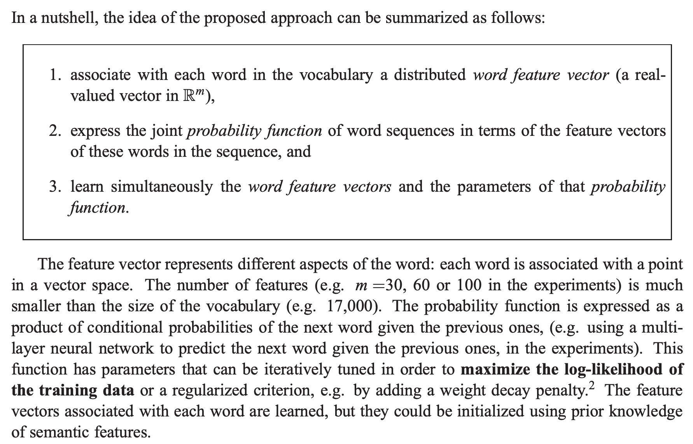
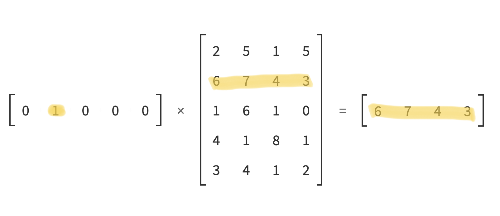
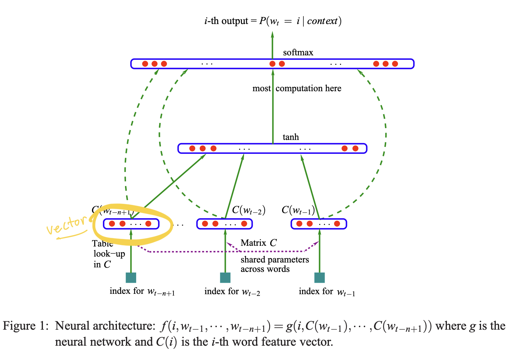
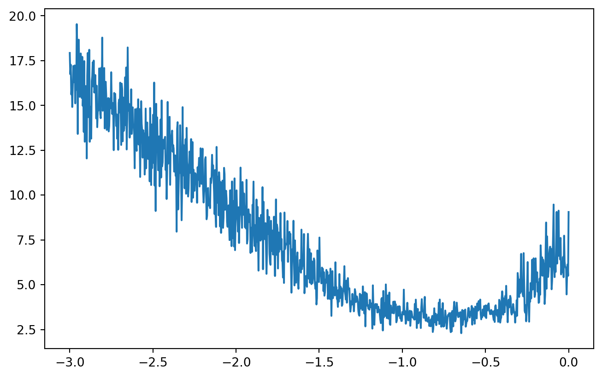
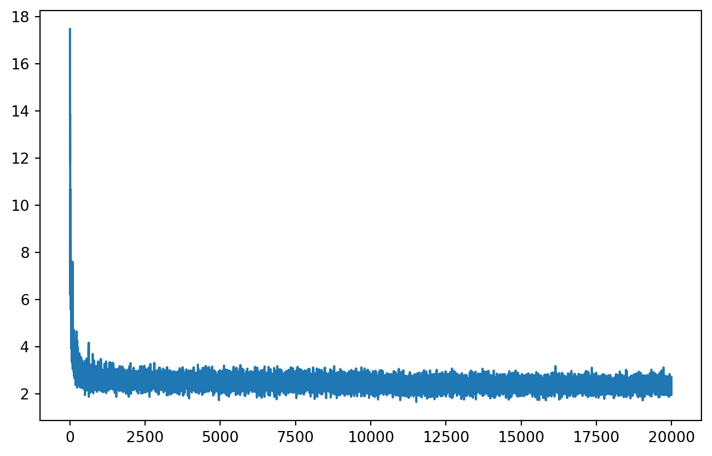
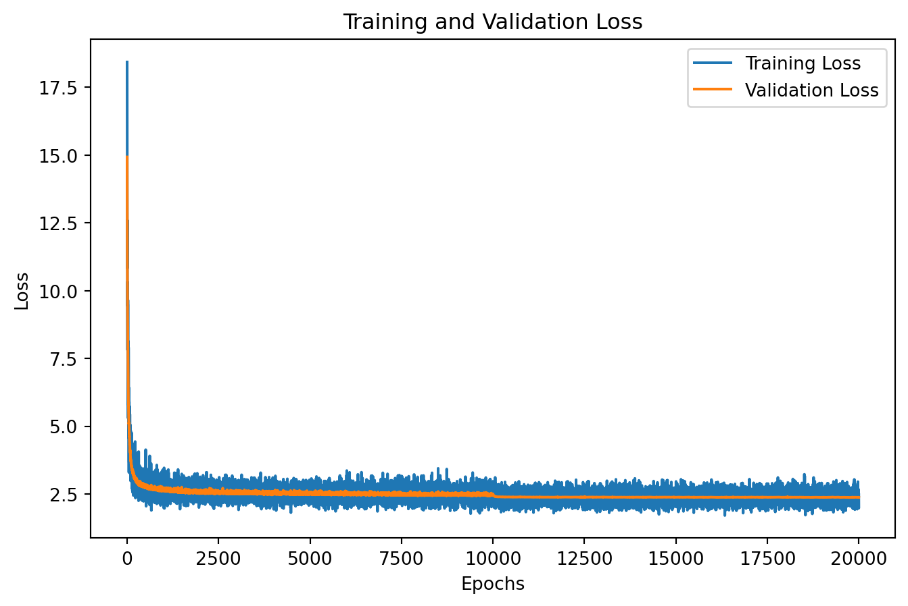
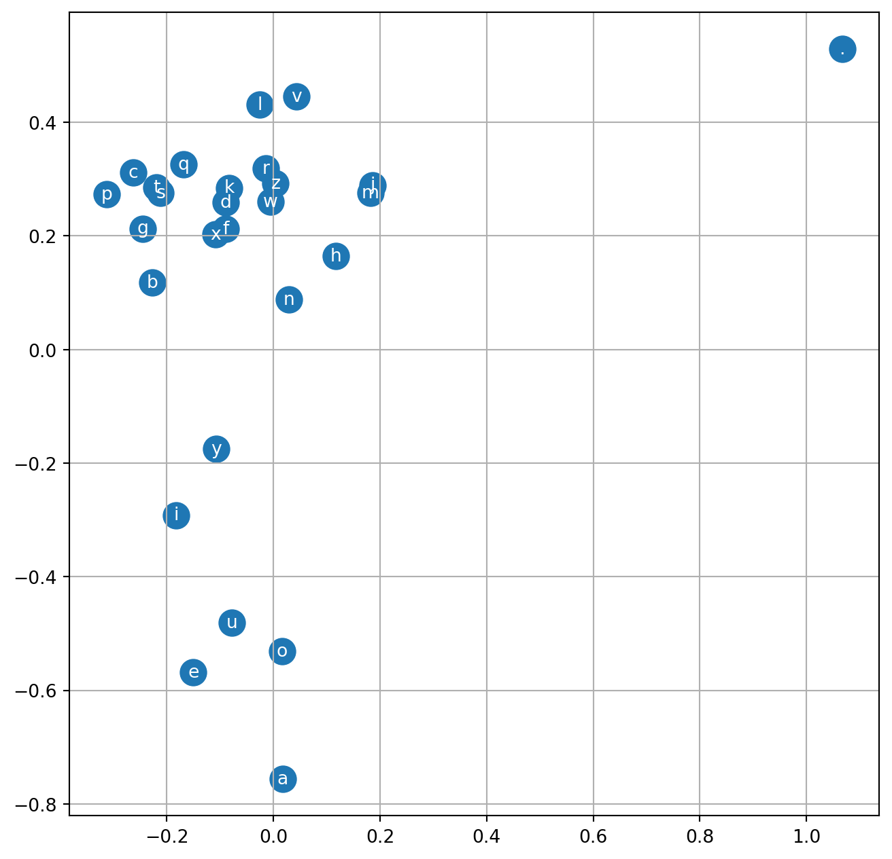

In [Part 1](), we built a neural network with a single hidden layer that generates words one character at a time.
It worked well enough: the network reproduced exactly what the simple counting model had produced.
But a bigram model is limited by construction, since it assumes each character depends only on the one immediately before it.
If a character starts just one bigram, the model will always emit that same next character, no matter what came earlier or how likely the alternatives are.
That missing context is what holds bigram models back.
In this lecture, [Andrej Karpathy](https://karpathy.ai) shows how a deeper network fixes it.

Unlike that bigram model, our new one is a multilayer perceptron (MLP) that looks at the previous 3 characters to predict the probability of the next one.
This MLP language model was proposed in the paper [A Neural Probabilistic Language Model](https://www.jmlr.org/papers/volume3/bengio03a/bengio03a.pdf) by Bengio et al. in 2003.
As always, Andrej's official notebook for this lecture is [on GitHub](https://github.com/karpathy/nn-zero-to-hero/blob/master/lectures/makemore/makemore_part2_mlp.ipynb).

## Data Preparation

First, we build our vocabulary as we did before.

```python
from collections import Counter
import torch
import string
import matplotlib.pyplot as plt
import torch.nn.functional as F

words = open("names.txt", "r").read().splitlines()
chars = string.ascii_lowercase
stoi = {s: i+1 for i, s in enumerate(chars)}
stoi["."] = 0
itos = {i: s for s, i in stoi.items()}
print(stoi, itos)
```

    {'a': 1, 'b': 2, 'c': 3, 'd': 4, 'e': 5, 'f': 6, 'g': 7, 'h': 8, 'i': 9, 'j': 10, 'k': 11, 'l': 12, 'm': 13, 'n': 14, 'o': 15, 'p': 16, 'q': 17, 'r': 18, 's': 19, 't': 20, 'u': 21, 'v': 22, 'w': 23, 'x': 24, 'y': 25, 'z': 26, '.': 0} {1: 'a', 2: 'b', 3: 'c', 4: 'd', 5: 'e', 6: 'f', 7: 'g', 8: 'h', 9: 'i', 10: 'j', 11: 'k', 12: 'l', 13: 'm', 14: 'n', 15: 'o', 16: 'p', 17: 'q', 18: 'r', 19: 's', 20: 't', 21: 'u', 22: 'v', 23: 'w', 24: 'x', 25: 'y', 26: 'z', 0: '.'}

Next, we create the training data.
This time we feed the model the last 3 characters instead of 1, so `block_size` is 3 and every training example is a 4-gram: three characters of context plus the character to predict.

```python
block_size = 3
X, y = [], []

for word in words:
  # initialize context
  context = [0] * block_size
  for char in word + ".":
    idx = stoi[char]
    X.append(context)
    y.append(idx)
    # truncate the first char and add the new char
    context = context[1:] + [idx]
X = torch.tensor(X)
y = torch.tensor(y)
print(X.shape, y.shape)
```

    torch.Size([228146, 3])
    torch.Size([228146])

## Multilayer Perceptron (MLP)

As the name suggests, a multilayer perceptron stacks fully connected layers with a nonlinearity in between, which is where our new model gains its depth over the bigram one.
Along the way, we will also learn a new way to represent characters.

### Feature Vector



The paper proposes associating every word with a feature vector that the model learns as training progresses.
The vector is much shorter than the vocabulary is large, which is the whole point: similar words can end up close to one another instead of each getting its own isolated slot.
Our vocabulary holds only 27 characters, so a vector of length 2 is enough to start with, and short enough that we can plot it later.
Today we would simply call this vector an embedding.

```python
g = torch.Generator().manual_seed(42)
# initialize lookup table
C = torch.randn((27, 2), generator=g)
print(f"Vector representation for character a is: {C[stoi['a']]}")
```

    Vector representation for character a is: tensor([ 0.9007, -2.1055])

The code above initializes the lookup table with $27\times 2$ random numbers via `torch.randn`, which gives the character `a` the vector `[0.9007, -2.1055]`.

Next, we replace the indices in `X` with their vector representations.
Multiplying a one-hot vector that has a 1 at index $i$ by a weight matrix $W$ simply picks out the $i$-th row of $W$, so instead of building those one-hot vectors at all, we index into the embedding matrix directly.



PyTorch lets us do exactly that: as its [tensor indexing documentation](https://pytorch.org/cppdocs/notes/tensor_indexing.html#getter) explains, we can pass `X` itself as an index matrix and get the corresponding feature vectors back.

```python
embed = C[X]
print(f"First row of X: {X[0, :]}")
print(f"First row of embedding: {embed[0,:]}")
print(embed.shape)
```

    First row of X: tensor([0, 0, 0])
    First row of embedding: tensor([[1.9269, 1.4873],
            [1.9269, 1.4873],
            [1.9269, 1.4873]])
    torch.Size([228146, 3, 2])

In other words, `X` of shape $228146\times 3$ becomes `embed` of shape $228146\times 3 \times 2$: every index has been swapped for the length-2 vector it points to.

### Model Architecture



As the picture above highlights, we want a single vector per training example so that we can do matrix multiplication as before.
What the lookup gives us instead is a $3\times 2$ matrix per example, one row per context character.
So we flatten those rows into one vector of length 6.
`torch.cat` would do the job, but PyTorch has a cheaper option in the `view` function ([doc](https://pytorch.org/docs/stable/generated/torch.Tensor.view.html)), which reinterprets the same underlying storage without copying it.
See this [blog post](http://blog.ezyang.com/2019/05/pytorch-internals/) for more on tensors and PyTorch internals.

```python
print(embed[0, :])
print(embed.view(-1, 6)[0, :])
```

    tensor([[1.9269, 1.4873],
            [1.9269, 1.4873],
            [1.9269, 1.4873]])
    tensor([1.9269, 1.4873, 1.9269, 1.4873, 1.9269, 1.4873])

### Building the Model

Next, we initialize the weights and biases of the hidden layer and the output layer.
The hidden layer takes the flattened 6-dimensional input and has 100 neurons, so its weight matrix has shape $6\times 100$ and its bias vector has length 100.
The output layer follows the same rule: its input dimension is the hidden layer's output, 100, and because it has to score all 27 characters, its weight matrix has shape $100\times 27$ with a bias vector of length 27.

```python
# 1st hidden layer
W1 = torch.randn((6, 100))
b1 = torch.randn(100)

# output for 1st layer
h = embed.view(-1, 6) @ W1 + b1

# 2nd hidden layer
W2 = torch.randn((100, 27))
b2 = torch.randn(27)

# output for 2nd layer
logits = h @ W2 + b2
```

### Making Predictions

The next step is our first forward pass to obtain the probabilities of the next characters.

```python
# softmax
counts = logits.exp()
probs = counts / counts.sum(1, keepdims=True)
loss = -probs[torch.arange(X.shape[0]), y].log().mean()
print(f"Overall loss: {loss:.6f}")
```

    Overall loss: nan

The loss came out as `nan`, and the culprit is the way we computed the softmax by hand.
If a logit is large enough, say 100, then `exp(100)` overflows to `inf`, and dividing `inf` by `inf` gives `nan`.
PyTorch's built-in `cross_entropy` avoids this by subtracting the largest logit before exponentiating, so we use it instead.

```python
loss = F.cross_entropy(logits, y) 
print(f"Overall loss: {loss:.6f}")
```

    Overall loss: 78.392731

## Putting It All Together

Here is the code with everything assembled and the backward pass enabled.

```python
g = torch.Generator().manual_seed(42)
C = torch.randn((27, 2), generator=g)
W1 = torch.randn((6, 100), generator=g)
b1 = torch.randn(100, generator=g)
W2 = torch.randn((100, 27), generator=g)
b2 = torch.randn(27, generator=g)
parameters = [C, W1, b1, W2, b2]

for p in parameters:
  p.requires_grad = True

print(f"Total parameters: {sum(p.nelement() for p in parameters)}")
```

    Total parameters: 3481

That comes to 3,481 learnable parameters in total.
Next, we run the model for 10 full passes over the dataset and watch how the loss changes.
Note the `tanh` activation on the hidden layer in the code below, as the paper prescribes.

```python
for _ in range(10):
  # forward pass
  embed = C[X]
  h = torch.tanh(embed.view(-1, 6) @ W1 + b1)
  logits = h @ W2 + b2
  loss = F.cross_entropy(logits, y)
  print(f"Loss: {loss.item()}")

  # backward pass
  for p in parameters:
    p.grad = None
  loss.backward()

  # update weights
  lr = 0.1
  for p in parameters:
    p.data += -lr * p.grad
```

    Loss: 16.72646713256836
    Loss: 14.942943572998047
    Loss: 13.863017082214355
    Loss: 13.003837585449219
    Loss: 12.292213439941406
    Loss: 11.732643127441406
    Loss: 11.270574569702148
    Loss: 10.859720230102539
    Loss: 10.479723930358887
    Loss: 10.136445045471191

The loss decreases, as expected, but slowly, and it gets slower still on a larger model with more parameters.
The reason is that each of those 10 updates required a forward and backward pass over all 228,146 examples just to take a single step.
[Stochastic gradient descent (SGD)](https://www.wikiwand.com/en/Stochastic_gradient_descent) trades exactness for speed: it estimates the gradient from a small random subset of the training data, which is noisier per step but lets us take far more steps in the same amount of time.

### Applying Mini-batch

With a mini-batch size of 32, 1000 steps finish almost instantly, and they reach a far lower loss than the 10 full-batch passes did.

```python
for i in range(1000):
  # batch_size = 32
  idx = torch.randint(0, X.shape[0], (32, ))

  # forward pass
  embed = C[X[idx]]
  h = torch.tanh(embed.view(-1, 6) @ W1 + b1)
  logits = h @ W2 + b2
  # using the whole dataset as a batch
  loss = F.cross_entropy(logits, y[idx])
  if i % 50 == 0:
    print(f"Loss: {loss.item()}")

  # backward pass
  for p in parameters:
    p.grad = None
  loss.backward()

  # update weights
  lr = 0.1
  for p in parameters:
    p.data += -lr * p.grad

embed = C[X]
h = torch.tanh(embed.view(-1, 6) @ W1 + b1)
logits = h @ W2 + b2
loss = F.cross_entropy(logits, y)
print(f"Overall loss: {loss.item()}")
```

    Loss: 10.522725105285645
    Loss: 4.547809600830078
    Loss: 3.9053943157196045
    Loss: 3.5418882369995117
    Loss: 3.312927722930908
    Loss: 3.10072660446167
    Loss: 3.188538074493408
    Loss: 2.6955881118774414
    Loss: 2.9730937480926514
    Loss: 2.5453033447265625
    Loss: 3.034700870513916
    Loss: 2.2029476165771484
    Loss: 2.5462143421173096
    Loss: 2.6591145992279053
    Loss: 2.9640085697174072
    Loss: 3.142090082168579
    Loss: 2.5031352043151855
    Loss: 2.721736431121826
    Loss: 2.7801644802093506
    Loss: 2.32700252532959
    Overall loss: 2.6130335330963135

### Learning Rate Selection

So far we have used a fixed learning rate of 0.1, but how would we know whether 0.1 is any good?
One simple way to find out is to sweep it: train once while raising the learning rate exponentially from 0.001 to 1, record the loss at every step, and see where the curve bottoms out.

```python
g = torch.Generator().manual_seed(42)
C = torch.randn((27, 2), generator=g)
W1 = torch.randn((6, 100), generator=g)
b1 = torch.randn(100, generator=g)
W2 = torch.randn((100, 27), generator=g)
b2 = torch.randn(27, generator=g)
parameters = [C, W1, b1, W2, b2]

for p in parameters:
  p.requires_grad = True

# logarithm learning rate, base 10
lre = torch.linspace(-3, 0, 1000)
# learning rates
lrs = 10 ** lre

losses = []

for i in range(1000):
  idx = torch.randint(0, X.shape[0], (32, ))
  embed = C[X[idx]]
  h = torch.tanh(embed.view(-1, 6) @ W1 + b1)
  logits = h @ W2 + b2
  loss = F.cross_entropy(logits, y[idx])
  if i % 50 == 0:
    print(f"Loss: {loss.item()}")

  for p in parameters:
    p.grad = None
  loss.backward()

  lr = lrs[i]
  for p in parameters:
    p.data += -lr * p.grad
  losses.append(loss.item())

plt.plot(lre, losses)
```

    Loss: 17.930665969848633
    Loss: 15.90300464630127
    Loss: 14.608807563781738
    Loss: 11.146048545837402
    Loss: 14.368053436279297
    Loss: 10.241884231567383
    Loss: 10.7547607421875
    Loss: 9.06742000579834
    Loss: 6.721671104431152
    Loss: 4.959266185760498
    Loss: 7.631305694580078
    Loss: 6.03385591506958
    Loss: 3.6078100204467773
    Loss: 3.7624008655548096
    Loss: 2.994145393371582
    Loss: 2.6852164268493652
    Loss: 3.392582893371582
    Loss: 3.5405192375183105
    Loss: 4.318221569061279
    Loss: 5.7273149490356445

<figure>

<figcaption aria-hidden="true">Figure 1: A plot for loss on different logarithm of learning rates</figcaption>
</figure>

As [Figure 1](#fig-loss-vs-lr) shows, the loss bottoms out around an exponent of -1.0, which corresponds to a learning rate of $10^{-1}=0.1$, the value we had been using all along.

### Learning Rate Decay

Training often reaches a plateau, where the loss stops falling even though the steps keep coming, because a learning rate that was useful early on is now too large to settle into a minimum.
Learning rate decay fixes this by shrinking the learning rate over time, letting the model take finer steps once it is close.

```python
g = torch.Generator().manual_seed(42)
C = torch.randn((27, 2), generator=g)
W1 = torch.randn((6, 100), generator=g)
b1 = torch.randn(100, generator=g)
W2 = torch.randn((100, 27), generator=g)
b2 = torch.randn(27, generator=g)
parameters = [C, W1, b1, W2, b2]

for p in parameters:
  p.requires_grad = True

losses = []
epochs = 20000
for i in range(epochs):
  idx = torch.randint(0, X.shape[0], (32, ))
  embed = C[X[idx]]
  h = torch.tanh(embed.view(-1, 6) @ W1 + b1)
  logits = h @ W2 + b2
  loss = F.cross_entropy(logits, y[idx])

  for p in parameters:
    p.grad = None
  loss.backward()

  # learning rate decay
  lr = 0.1 if i < epochs // 2 else 0.001

  for p in parameters:
    p.data += -lr * p.grad
  losses.append(loss.item())

plt.plot(range(epochs), losses)
```



### Train, Validation, and Test

To know whether the model generalizes, we have to measure it on data it has never seen.
The common practice is to split the data three ways: 80% for training, 10% for validation, and 10% for testing.
The validation set is the one we tune against, and it also enables early stopping, which halts training as soon as validation performance starts to degrade, before the model overfits the training set.
The test set stays untouched until the very end.

```python
def build_dataset(words, block_size=3):
  X, Y = [], []

  for w in words:
    context = [0] * block_size
    for char in w + ".":
      idx = stoi[char]
      X.append(context)
      Y.append(idx)
      context = context[1:] + [idx]
  X = torch.tensor(X)
  Y = torch.tensor(Y)
  print(X.shape, Y.shape)
  return X, Y


import random
random.seed(42)
random.shuffle(words)
n1 = int(0.8*len(words))
n2 = int(0.9*len(words))

X_tr, y_tr = build_dataset(words[:n1])
X_va, y_va = build_dataset(words[n1:n2])
X_te, y_te = build_dataset(words[n2:])

g = torch.Generator().manual_seed(42)
C = torch.randn((27, 2), generator=g)
W1 = torch.randn((6, 100), generator=g)
b1 = torch.randn(100, generator=g)
W2 = torch.randn((100, 27), generator=g)
b2 = torch.randn(27, generator=g)
parameters = [C, W1, b1, W2, b2]

for p in parameters:
  p.requires_grad = True

tr_losses = []
va_losses = []

epochs = 20000
for i in range(epochs):
  idx = torch.randint(0, X_tr.shape[0], (32, ))
  embed = C[X_tr[idx]]
  h = torch.tanh(embed.view(-1, 6) @ W1 + b1)
  logits = h @ W2 + b2
  loss = F.cross_entropy(logits, y_tr[idx])

  for p in parameters:
    p.grad = None
  loss.backward()

  # learning rate decay
  lr = 0.1 if i < epochs // 2 else 0.01

  for p in parameters:
    p.data += -lr * p.grad
  tr_losses.append(loss.item())

  val_embed = C[X_va]
  val_h = torch.tanh(val_embed.view(-1, 6) @ W1 + b1)
  val_logits = val_h @ W2 + b2
  val_loss = F.cross_entropy(val_logits, y_va)
  va_losses.append(val_loss.item())

plt.plot(range(epochs), tr_losses, label='Training Loss')
plt.plot(range(epochs), va_losses, label='Validation Loss')
 
plt.title('Training and Validation Loss')
plt.xlabel('Epochs')
plt.ylabel('Loss')

plt.legend(loc='best')
plt.show()
```

    torch.Size([182625, 3]) torch.Size([182625])
    torch.Size([22655, 3]) torch.Size([22655])
    torch.Size([22866, 3]) torch.Size([22866])

<figure>

<figcaption aria-hidden="true">Figure 2: Plot for training and validation loss</figcaption>
</figure>

As [Figure 2](#fig-loss-plot) shows, the validation loss drops again right at step 10,000, exactly where the learning rate falls from 0.1 to 0.01.
The training had indeed plateaued, and the decay got it moving again.
Let's check the loss of the testing data.

```python
test_embed = C[X_te]
test_h = torch.tanh(test_embed.view(-1, 6) @ W1 + b1)
test_logits = test_h @ W2 + b2
test_loss = F.cross_entropy(test_logits, y_te)
print(f"Loss on validation data: {val_loss:.6f}")
print(f"Loss on testing data: {test_loss:.6f}")
```

    Loss on validation data: 2.375811
    Loss on testing data: 2.374066

The validation and test losses are nearly identical, which is a good sign that we are not overfitting.

## Visualization of Embedding

Because our embedding is only 2-dimensional, we can plot it directly and see what the model learned.

```python
plt.figure(figsize=(8,8))
plt.scatter(C[:, 0].data, C[:, 1].data, s = 200)
for i in range(C.shape[0]):
  plt.text(C[i, 0].item(), C[i, 1].item(), itos[i], ha="center", va="center", color="white")
plt.grid('minor')
plt.show()
```

<figure>

<figcaption aria-hidden="true">Figure 3: Visualization of 2D embedding matrix</figcaption>
</figure>

As [Figure 3](#fig-embedding) shows, the vowels cluster together in the bottom-left corner, while `.`, the end-of-word token, sits far off in the top right.
The model worked out that grouping on its own, purely from the task of predicting the next character.

## Word Generation

The last thing to do is generate some names.

```python
g = torch.Generator().manual_seed(420)

for _ in range(20):
  out = []
  context = [0] * block_size
  while True:
    embed = C[torch.tensor([context])]
    h = torch.tanh(embed.view(1, -1) @ W1 + b1)
    logits = h @ W2 + b2
    probs = F.softmax(logits, dim=1)
    idx = torch.multinomial(probs, num_samples=1, generator=g).item()
    context = context[1:] + [idx]
    if idx == 0:
      break
    out.append(idx)
  print(''.join(itos[i] for i in out))
```

    rai
    mal
    lemistani
    iua
    kacyt
    tan
    zatlixahnen
    rarbi
    zethanli
    blie
    mozien
    nar
    ameson
    xaxun
    koma
    aedh
    sarixstah
    elin
    dyannili
    saom

These read much more like real names than anything the bigram model produced.
There is still plenty of room to improve, though: train for more steps, widen the embedding beyond 2 dimensions, enlarge the hidden layer, or raise the batch size to make each step less noisy.
