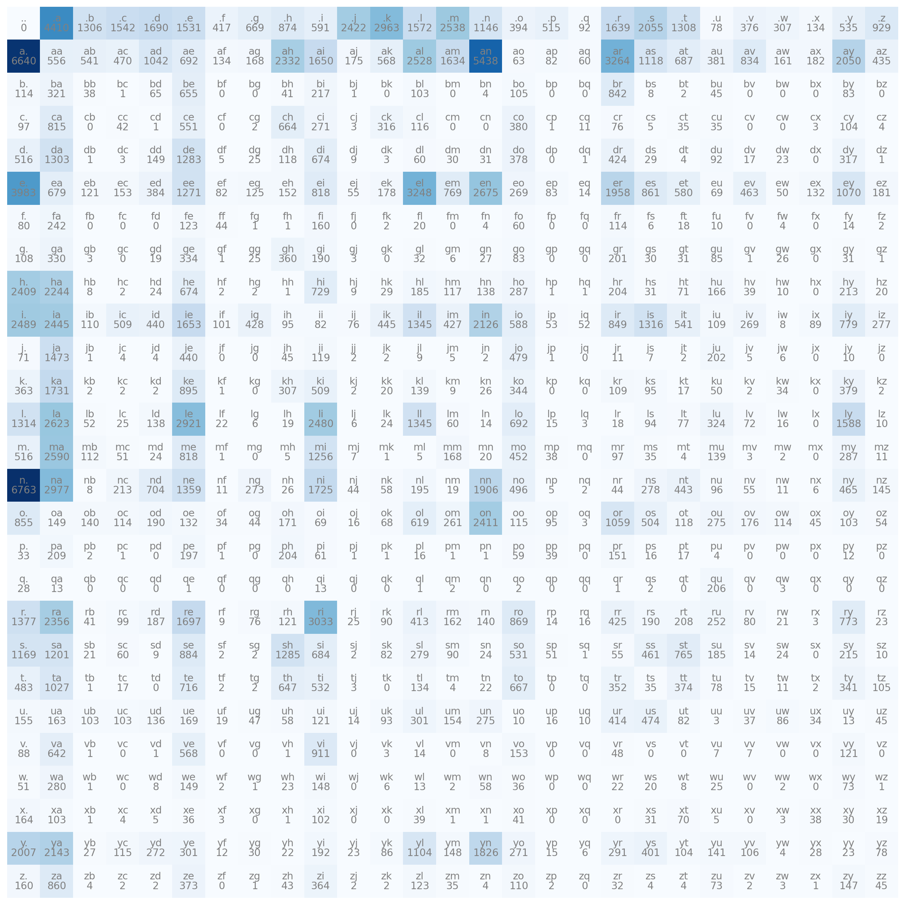

This is a series of learning notes for the excellent online course [Neural Networks: Zero to Hero](https://karpathy.ai/zero-to-hero.html) created by [Andrej Karpathy](https://karpathy.ai/). The official Jupyter Notebook for this lecture is [here](https://github.com/karpathy/nn-zero-to-hero/blob/master/lectures/makemore/makemore_part1_bigrams.ipynb).

In this lecture, Andrej shows us two different approaches to generating characters.
The first approach involves sampling characters based on a probability distribution, while the second uses a neural network built from scratch.
Before we can generate characters using either approach, let's prepare the data first.

## Data Preparation

### Load data

We are using the most common 32k names of 2018 from ssa.gov website as our data source.
First, we apply the code below to obtain each bigram's frequency.
If you don't know what a bigram is, a bigram is a sequence of two adjacent words or characters in a text.
We also add a special character, ".", to the name's beginning and end to indicate its start and end, respectively.
As can be seen that the top 5 common bigrams in the data are `n.`, `a.`, `an`, `.a`, and `e.`.

``` python
from collections import Counter
words = open("names.txt", "r").read().splitlines()

counter = Counter()
for word in words:
  chs = list("." + word + ".")
  for c1, c2 in zip(chs, chs[1:]):
    bigram = (c1, c2)
    counter[bigram] += 1

for bigram, frequency in counter.most_common(5):
  print(f"Frequency of {''.join(bigram)}: {frequency}")
```

    Frequency of n.: 6763
    Frequency of a.: 6640
    Frequency of an: 5438
    Frequency of .a: 4410
    Frequency of e.: 3983

### Numericallization

As is known that computers are good at processing numerical data; however, they may not be efficient in dealing with text.
So our second step is to create two mappings: string to index and index to string.
These mappings are used to represent words or characters numerically.
This process is sometimes called numericalization.

``` python
import torch
import string
import matplotlib.pyplot as plt

chars = string.ascii_lowercase
stoi = {s: i+1 for i, s in enumerate(chars)}
stoi["."] = 0
itos = {i: s for s, i in stoi.items()}
print(stoi, itos)
```

    {'a': 1, 'b': 2, 'c': 3, 'd': 4, 'e': 5, 'f': 6, 'g': 7, 'h': 8, 'i': 9, 'j': 10, 'k': 11, 'l': 12, 'm': 13, 'n': 14, 'o': 15, 'p': 16, 'q': 17, 'r': 18, 's': 19, 't': 20, 'u': 21, 'v': 22, 'w': 23, 'x': 24, 'y': 25, 'z': 26, '.': 0} {1: 'a', 2: 'b', 3: 'c', 4: 'd', 5: 'e', 6: 'f', 7: 'g', 8: 'h', 9: 'i', 10: 'j', 11: 'k', 12: 'l', 13: 'm', 14: 'n', 15: 'o', 16: 'p', 17: 'q', 18: 'r', 19: 's', 20: 't', 21: 'u', 22: 'v', 23: 'w', 24: 'x', 25: 'y', 26: 'z', 0: '.'}

## Counting Approach

### Frequency

Our first step is to obtain the frequencies of the bigrams.
Since we have a vocabulary of 27 characters-26 letters in lowercase plus 1 special character, we need a $27\times 27$ matrix to store the frequencies of all possible bigrams.
[Figure 1](#fig-heatmap) is a heatmap of the calculated frequencies.
The darker the color, the higher the frequency of the bigram.

``` python
N = torch.zeros((27, 27), dtype=torch.int32)

for (c1, c2), freq in counter.items():
  idx1 = stoi[c1]
  idx2 = stoi[c2]
  N[idx1, idx2] = freq

plt.figure(figsize=(16, 16))
plt.imshow(N, cmap="Blues")
for i in range(27):
  for j in range(27):
    chstr = itos[i] + itos[j]
    plt.text(j, i, chstr, ha="center", va="bottom", color="gray")
    plt.text(j, i, N[i, j].item(), ha="center", va="top", color="gray")
plt.axis("off")
plt.show()
```

<figure>

<figcaption aria-hidden="true">Figure 1: A heatmap plot for frequencies of bigrams</figcaption>
</figure>

### Probability

To get the probability of each bigram, we want to normalize the matrix `N` by row.
Why? Because we want to know the probability of the character given the current character we have in the process of character generation, i.e., $P(next\ char | current\ char)$.
To avoid calculating $log0$ later on, we add 1 to the frequency of each bigram.

``` python
P = (N + 1).float()
P /= P.sum(1, keepdims=True)
```

### Maximum Likelihood

[Maximum likelihood](https://www.wikiwand.com/en/Maximum_likelihood_estimation) is a statistical method to estimate the parameters of a probability distribution based on observed data.
The goal of maximum likelihood is to find the values of the distribution's parameters that make the observed data most likely to have been generated by that distribution.
In our case, we want the next generated character comes from the probability distribution as much as possible.
How do we calculate the likelihood? It is the product of the probability of each bigram in a word.
$$ L(\theta) = P(X_1=x_1, X_2=x_2, ..., X_n=x_n) = \Pi_i^n P(X_i=x_i)$$
For example, the likelihood of the word *good* is calculated as
$$Likelihood= P(".g") * P("go") * P("oo") * P("od") * P("d.") $$
$$ = 0.0209\*0.0430\*0.0146\*0.0240\*0.0936=2.9399e-8$$

``` python
def calc_likelihood(word, verbose=False):
  word = list("." + word + ".")
  likelihood = 1.0
  for c1, c2 in zip(word, word[1:]):
    idx1 = stoi[c1]
    idx2 = stoi[c2]
    prob = P[idx1, idx2]
    if verbose:
      print(f"probability for {''.join((c1, c2))}: {prob:.4f}")
    likelihood *= prob
  return likelihood

prob = calc_likelihood("good", verbose=True)
print(f"Likelihood for good is: {prob:.4e}")
```

    probability for .g: 0.0209
    probability for go: 0.0430
    probability for oo: 0.0146
    probability for od: 0.0240
    probability for d.: 0.0936
    Likelihood for good is: 2.9399e-08

Let's generate some words by randomly picking the bigram according to its probability using `torch.multinomial` function and calculate their likelihoods.

``` python
g = torch.Generator().manual_seed(420)
generated_words = []
for i in range(5):
  out = []
  ix = 0
  while True:
    p = P[ix]
    ix = torch.multinomial(p, num_samples=1, replacement=True, generator=g).item()
    if ix == 0:
      break
    out.append(itos[ix])
  generated_words.append(("".join(out), calc_likelihood("".join(out)).item()))
generated_words.sort(key=lambda x: -x[1])
for gw, lh in generated_words:
  print(f"Likelihood for {gw}: {lh}")
```

    Likelihood for jen: 0.0005491252522915602
    Likelihood for jor: 0.0001786774955689907
    Likelihood for she: 0.00017446796118747443
    Likelihood for tais: 3.90183367926511e-06
    Likelihood for anuir: 2.335933579900029e-08

It turns out `jen` which has the maximum likelihood 0.000549 is the winner in these 5 randomly generated words.
Remember that our goal is to maximize the likelihood of the word the model generates because the higher the likelihood, the better the model.
However, notice that the likelihoods for the generated words are too small, so applying a log function to each probability would make it easier to work with.
$$ logL(\theta) = log\Pi_i^n P(X_i=x_i)=\Sigma_i^nlogP(X_i=x_i)$$

Additionally, maximizing the likelihood is the same as maximizing the log-likelihood because the logarithm function is a monotonic increasing function, which is the same as minimizing the negative log-likelihood.
We prefer minimization to maximization in any optimization problem.
Let's calculate the average negative log-likelihood of our name dataset, which is 2.454679.

``` python
def calc_nll(word):
  word = list("." + word + ".")
  log_likelihood = 0.0
  for c1, c2 in zip(word, word[1:]):
    idx1 = stoi[c1]
    idx2 = stoi[c2]
    prob = P[idx1, idx2]
    log_prob = torch.log(prob)
    log_likelihood += log_prob
  return -log_likelihood

nlls = [calc_nll(w) for w in words]
ns = [len(w) + 1 for w in words]
print(f"Average negative log-likelihood: {sum(nlls)/sum(ns):.6f}")
```

    Average negative log-likelihood: 2.454579

## Neural Network

How does a neural network model fit in the character generation?
Think of it in this way: given the last generated character, we want the model to output a probability distribution for the next character, in which we can find the most likely character to follow it.
In other words, our task is to use the model to estimate the probability distribution based on the dataset rather than relying on counting the occurrences of each bigram.
As always, let's prepare the data in the first step.

### Training Data Preparation

The training data is created using bigrams, where the first character is the input feature, and the second character is used as the target of the model.
Since feeding integers into a neural network and multiplying them with weights does not make sense, we need to transform them into a different format.
The most common method is one-hot encoding, which transforms each integer into a vector with all 0s except for a 1 at the index corresponding to the integer. PyTorch provides a built-in `torch.nn.functional.one_hot` function for one-hot encoding.

``` python
import torch.nn.functional as F
xs, ys = [], []

for word in words:
  chs = list("." + word + ".")
  for c1, c2 in zip(chs, chs[1:]):
    idx1 = stoi[c1]
    idx2 = stoi[c2]
    xs.append(idx1)
    ys.append(idx2)

# tensor function returns the same type as its original
xs = torch.tensor(xs)
ys = torch.tensor(ys)

xenc = F.one_hot(xs, num_classes=27).float()
print(xenc.shape)
```

    torch.Size([228146, 27])

After applying one-hot encoding, we have a tensor `xenc` of shape $228146\times 27$.

### Understanding Weights

The weight matrix of our model has the same shape as the matrix `N` above but is initialized with random values.
PyTorch's built-in function `torch.randn` gives us random numbers from a normal distribution with mean 0 and standard deviation 1, resulting in positive and negative values.
After multiplying the one-hot encoding matrix with weights, we obtain the output of the first layer, which may contain negative values.
However, we want the output to represent the probability of the next character, as we calculated above.
To achieve this, we can treat the output as the logarithm of the frequencies and apply the exponential function to obtain the positive values, which can be interpreted as the frequencies of the bigrams starting with the input feature.
Why? Because multiplying a one-hot encoding vector having a 1 at index `i`, with the weight matrix `W` is the same as getting the `ith` row of `W`.
And we want this frequency matrix to be close to the matrix `N` as close as possible.
If we further normalize the output over the rows, we can obtain the probability distribution of bigrams.
In fact, the last two steps, applying exponential function and normalization, of calculation are known as the **softmax** function.

``` python
g = torch.Generator().manual_seed(420)
W = torch.randn((27, 27), generator=g, requires_grad=True)
# log-counts
logits = xenc @ W # (228146, 27) x (27, 27)
# counts
counts = logits.exp()
# probability
probs = counts / counts.sum(1, keepdim=True)
print(probs.shape)
print(sum(probs[1,:]))
```

    torch.Size([228146, 27])
    tensor(1.0000, grad_fn=<AddBackward0>)

### Optimization

Remember that our goal is to approach the actual probabilities from the training data using maximum likelihood estimation.
As the training progresses, the model adjusts the weights in such a way that the predicted probabilities for the next character in a word are as close to the actual probabilities of the training data.
By minimizing the negative log-likelihood, we effectively minimize the distance between predicted and actual probabilities.
Let's take the first word, `emma`, as an example and see how the neural network calculates its loss.
This step is also called **forward pass**.
The first bigram is `.e` with the input `.` (index 0) and actual label `e` (index 5).
The one-hot encoding for `.` is `[1, 0, ..., 0]`, and the output probability for `e` is 0.0246.
Applying log and negation, we have the loss as 3.7050.
The same calculation applies to `em`, `mm`, `ma`, and `a.`.
Finally, we get the loss for `emma` is 3.6985.

``` python
nlls = torch.zeros(5)
for i in range(5):
  x = xs[i].item()
  y = ys[i].item()
  print('-' * 50)
  print(f'bigram example {i+1}: {itos[x]} {itos[y]} (indexes {x}, {y})')
  print(f'input to the neural network: {x}')
  print(f'output probbabilities from the nn: {probs[i]}')
  print(f'label (actual next character): {y}')
  p = probs[i, y]
  print(f'probability assigned by the nn to the correct character: {p.item()}')
  logp = torch.log(p)
  print(f'log-likelihood: {logp.item()}')
  nll = -logp
  print(f'negative log likelihood: {nll}')
  nlls[i] = nll
print(f"Average negative log-likelihood, i.e., loss={nlls.mean().item()}")
```

    --------------------------------------------------
    bigram example 1: . e (indexes 0, 5)
    input to the neural network: 0
    output probbabilities from the nn: tensor([0.0167, 0.0278, 0.0328, 0.0114, 0.0173, 0.0246, 0.0100, 0.0341, 0.1024,
            0.0259, 0.2364, 0.0219, 0.0422, 0.0108, 0.1262, 0.0647, 0.0130, 0.0162,
            0.0157, 0.0093, 0.0184, 0.0022, 0.0482, 0.0090, 0.0069, 0.0195, 0.0362],
           grad_fn=<SelectBackward0>)
    label (actual next character): 5
    probability assigned by the nn to the correct character: 0.024598384276032448
    log-likelihood: -3.7050745487213135
    negative log likelihood: 3.7050745487213135
    --------------------------------------------------
    bigram example 2: e m (indexes 5, 13)
    input to the neural network: 5
    output probbabilities from the nn: tensor([0.1219, 0.0087, 0.0157, 0.0546, 0.0067, 0.0149, 0.0185, 0.0338, 0.0110,
            0.0030, 0.0060, 0.0697, 0.0211, 0.0579, 0.0061, 0.0043, 0.0746, 0.0416,
            0.0264, 0.0611, 0.0823, 0.0124, 0.0179, 0.0129, 0.0374, 0.1633, 0.0162],
           grad_fn=<SelectBackward0>)
    label (actual next character): 13
    probability assigned by the nn to the correct character: 0.057898372411727905
    log-likelihood: -2.8490660190582275
    negative log likelihood: 2.8490660190582275
    --------------------------------------------------
    bigram example 3: m m (indexes 13, 13)
    input to the neural network: 13
    output probbabilities from the nn: tensor([0.3351, 0.0126, 0.0370, 0.0075, 0.0302, 0.0635, 0.0042, 0.0339, 0.0155,
            0.0512, 0.0080, 0.0283, 0.0557, 0.0171, 0.0388, 0.0103, 0.0507, 0.0398,
            0.0191, 0.0074, 0.0174, 0.0132, 0.0121, 0.0245, 0.0307, 0.0219, 0.0142],
           grad_fn=<SelectBackward0>)
    label (actual next character): 13
    probability assigned by the nn to the correct character: 0.017136109992861748
    log-likelihood: -4.066567420959473
    negative log likelihood: 4.066567420959473
    --------------------------------------------------
    bigram example 4: m a (indexes 13, 1)
    input to the neural network: 13
    output probbabilities from the nn: tensor([0.3351, 0.0126, 0.0370, 0.0075, 0.0302, 0.0635, 0.0042, 0.0339, 0.0155,
            0.0512, 0.0080, 0.0283, 0.0557, 0.0171, 0.0388, 0.0103, 0.0507, 0.0398,
            0.0191, 0.0074, 0.0174, 0.0132, 0.0121, 0.0245, 0.0307, 0.0219, 0.0142],
           grad_fn=<SelectBackward0>)
    label (actual next character): 1
    probability assigned by the nn to the correct character: 0.012621787376701832
    log-likelihood: -4.372330665588379
    negative log likelihood: 4.372330665588379
    --------------------------------------------------
    bigram example 5: a . (indexes 1, 0)
    input to the neural network: 1
    output probbabilities from the nn: tensor([0.0302, 0.0788, 0.0096, 0.0099, 0.0151, 0.1021, 0.0146, 0.0253, 0.0076,
            0.0107, 0.0429, 0.0286, 0.0371, 0.0437, 0.0168, 0.0133, 0.0129, 0.0075,
            0.0038, 0.0199, 0.0854, 0.0875, 0.1194, 0.1119, 0.0151, 0.0325, 0.0177],
           grad_fn=<SelectBackward0>)
    label (actual next character): 0
    probability assigned by the nn to the correct character: 0.030220769345760345
    log-likelihood: -3.4992258548736572
    negative log likelihood: 3.4992258548736572
    Average negative log-likelihood, i.e., loss=3.6984527111053467

So how do we calculate the loss efficiently?
It turns out that we can pass all these row and column indices to the matrix, and then take log and mean afterwards.
The loss for the forward pass is 3.6374.

``` python
loss = -probs[torch.arange(len(xs)), ys].log().mean()
print(f"Overall loss: {loss.item()}")
```

    Overall loss: 3.637367010116577

After obtaining the average loss from the forward pass, we need a backward pass to update the weights.
To do this, we need to make sure that the parameter `requires_grad` is set to `True` for the weight matrix `W`.
Next, we zero out all gradients to avoid the accumulation of gradients across batches.
We then call `loss.backward()` to compute the gradient of the oss with regard to each weight.
The gradient of a weight indicates how much that increasing that weight will affect the loss.
If it is positive, increasing the weight will increase the loss too.
Conversely, increasing the weight will decrease the loss if the gradient is negative.
For example, `W.grad[0, 0]=0.002339` means that `W[0, 0]` has a positive effect on the loss.

``` python
# set the gradient to zero
W.grad = None
# backward pass
loss.backward()
```

The next step is to update the weights and recalculate the averge loss.

``` python
lr = 0.1
W.data += -lr * W.grad
# forward pass
logits = xenc @ W
counts = logits.exp()
probs = counts / counts.sum(1, keepdim=True)
loss = -probs[torch.arange(len(xs)), ys].log().mean()
print(f"Overall loss: {loss.item()}")
```

    Overall loss: 3.6365137100219727

The overall loss is now 3.6365, which is slightly lower than before.
We can keep doing this **gradient descent** step until the model performance is good enough.
As we train more epochs, the overall loss is getting closer to the actual overall loss, which is 2.454579.

``` python
lr = 50
for i in range(301):
  logits = xenc @ W
  counts = logits.exp()
  probs = counts / counts.sum(1, keepdim=True)
  loss = -probs[torch.arange(len(xs)), ys].log().mean()
  if i % 50 == 0:
    print(f"Epochs: {i}, loss: {loss.item()}")

  W.grad = None
  loss.backward()

  W.data += -lr * W.grad
```

    Epochs: 0, loss: 3.6365137100219727
    Epochs: 50, loss: 2.4955990314483643
    Epochs: 100, loss: 2.4727954864501953
    Epochs: 150, loss: 2.4657769203186035
    Epochs: 200, loss: 2.4625258445739746
    Epochs: 250, loss: 2.4606406688690186
    Epochs: 300, loss: 2.459399700164795

Note that our current neural network only has one hidden layer.
We can add more hidden layers to improve the model performance.
Additionally, we can add a **regularization** item (e.g., the mean of the square of all weights) in the loss function to prevent overfitting.

``` python
loss = -probs[torch.arange(len(xs)), ys].log().mean() + 0.01 * (W ** 2).mean()
print(loss)
```

    tensor(2.4834, grad_fn=<AddBackward0>)

In this case, the optimization has two components--average negative log-likelihood and mean of the square of weights.
The regularization item works like a force to squeeze the weights and make them close to zeros as much as possible.
The last step is to sample characters from the neural network model.

``` python
g = torch.Generator().manual_seed(420)

nn_generated_words = []
for _ in range(5):
  out = []
  idx = 0
  while True:
    xenc = F.one_hot(torch.tensor([idx]), num_classes=27).float()
    logits = xenc @ W
    counts = logits.exp()
    probs = counts / counts.sum(1, keepdim=True)
    idx = torch.multinomial(probs, num_samples=1, replacement=True, generator=g).item()
    if idx == 0:
      break
    out.append(itos[idx])
  nn_generated_words.append(("".join(out), calc_likelihood("".join(out)).item()))
nn_generated_words.sort(key=lambda x: -x[1])
for gw, lh in nn_generated_words:
  print(f"Likelihood for {gw}: {lh}")
```

    Likelihood for jen: 0.0005491252522915602
    Likelihood for jor: 0.0001786774955689907
    Likelihood for she: 0.00017446796118747443
    Likelihood for tais: 3.90183367926511e-06
    Likelihood for anuir: 2.335933579900029e-08

We are using the same seed for the generator.
The words generated from the neural network are exactly the same as those generated from the probability table above, which is what we want to see.

<!-- ## Exercises
E01: train a trigram language model, i.e. take two characters as an input to predict the 3rd one. Feel free to use either counting or a neural net. Evaluate the loss; Did it improve over a bigram model?

E02: split up the dataset randomly into 80% train set, 10% dev set, 10% test set. Train the bigram and trigram models only on the training set. Evaluate them on dev and test splits. What can you see?

E03: use the dev set to tune the strength of smoothing (or regularization) for the trigram model - i.e. try many possibilities and see which one works best based on the dev set loss. What patterns can you see in the train and dev set loss as you tune this strength? Take the best setting of the smoothing and evaluate on the test set once and at the end. How good of a loss do you achieve?

E04: we saw that our 1-hot vectors merely select a row of W, so producing these vectors explicitly feels wasteful. Can you delete our use of F.one_hot in favor of simply indexing into rows of W?

E05: look up and use F.cross_entropy instead. You should achieve the same result. Can you think of why we'd prefer to use F.cross_entropy instead?

E06: meta-exercise! Think of a fun/interesting exercise and complete it. -->
