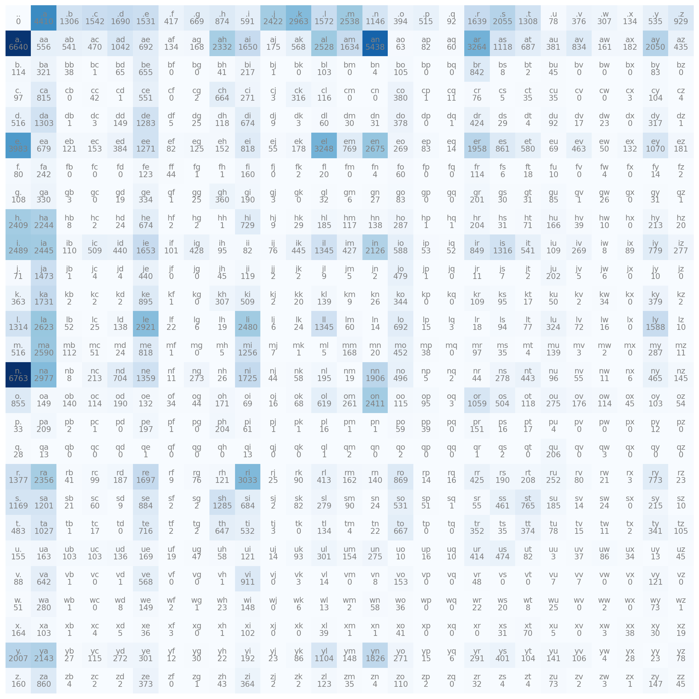

This is a series of learning notes for the excellent online course [Neural Networks: Zero to Hero](https://karpathy.ai/zero-to-hero.html) created by [Andrej Karpathy](https://karpathy.ai/). Andrej's official notebook for this lecture is [on GitHub](https://github.com/karpathy/nn-zero-to-hero/blob/master/lectures/makemore/makemore_part1_bigrams.ipynb).

In this lecture, Andrej shows two different approaches to generating characters.
The first samples characters from a probability distribution built by counting; the second trains a neural network from scratch.
The interesting part is where they end up, so let's prepare the data first.

## Data Preparation

### Load Data

Our data source is the 32k most common names of 2018, from the ssa.gov website.
The code below counts how often each bigram occurs, a bigram being simply a sequence of two adjacent characters (or words) in a text.
We also wrap every name in a special character, `.`, marking where it starts and ends, so that the model can learn which characters tend to begin a name and which tend to end one.
The five most common bigrams turn out to be `n.`, `a.`, `an`, `.a`, and `e.` -- already a hint that names lean heavily on `a`, `e`, and `n`.

``` python
from collections import Counter
words = open("names.txt", "r").read().splitlines()

counter = Counter()
for word in words:
  chs = list("." + word + ".")
  for c1, c2 in zip(chs, chs[1:]):
    bigram = (c1, c2)
    counter[bigram] += 1

for bigram, frequency in counter.most_common(5):
  print(f"Frequency of {''.join(bigram)}: {frequency}")
```

    Frequency of n.: 6763
    Frequency of a.: 6640
    Frequency of an: 5438
    Frequency of .a: 4410
    Frequency of e.: 3983

### Numericalization

Computers work with numbers, not characters, so our second step is to build two mappings: string to index, and index back to string.
Together they let us represent each character numerically, a process sometimes called numericalization.

``` python
import torch
import string
import matplotlib.pyplot as plt

chars = string.ascii_lowercase
stoi = {s: i+1 for i, s in enumerate(chars)}
stoi["."] = 0
itos = {i: s for s, i in stoi.items()}
print(stoi, itos)
```

    {'a': 1, 'b': 2, 'c': 3, 'd': 4, 'e': 5, 'f': 6, 'g': 7, 'h': 8, 'i': 9, 'j': 10, 'k': 11, 'l': 12, 'm': 13, 'n': 14, 'o': 15, 'p': 16, 'q': 17, 'r': 18, 's': 19, 't': 20, 'u': 21, 'v': 22, 'w': 23, 'x': 24, 'y': 25, 'z': 26, '.': 0} {1: 'a', 2: 'b', 3: 'c', 4: 'd', 5: 'e', 6: 'f', 7: 'g', 8: 'h', 9: 'i', 10: 'j', 11: 'k', 12: 'l', 13: 'm', 14: 'n', 15: 'o', 16: 'p', 17: 'q', 18: 'r', 19: 's', 20: 't', 21: 'u', 22: 'v', 23: 'w', 24: 'x', 25: 'y', 26: 'z', 0: '.'}

## Counting Approach

### Frequency

Our first step is to obtain the frequencies of the bigrams.
Our vocabulary holds 27 characters, the 26 lowercase letters plus the special one, so a $27\times 27$ matrix is enough to store the frequency of every possible bigram.
[Figure 1](#fig-heatmap) is a heatmap of the calculated frequencies.
The darker the color, the higher the frequency of the bigram.

``` python
N = torch.zeros((27, 27), dtype=torch.int32)

for (c1, c2), freq in counter.items():
  idx1 = stoi[c1]
  idx2 = stoi[c2]
  N[idx1, idx2] = freq

plt.figure(figsize=(16, 16))
plt.imshow(N, cmap="Blues")
for i in range(27):
  for j in range(27):
    chstr = itos[i] + itos[j]
    plt.text(j, i, chstr, ha="center", va="bottom", color="gray")
    plt.text(j, i, N[i, j].item(), ha="center", va="top", color="gray")
plt.axis("off")
plt.show()
```

<figure>

<figcaption aria-hidden="true">Figure 1: A heatmap plot for frequencies of bigrams</figcaption>
</figure>

### Probability

To turn those frequencies into probabilities, we normalize `N` row by row.
Row-wise is the right axis because what we need while generating is the probability of the next character *given* the current one, $P(\text{next char} \mid \text{current char})$.
Adding 1 to every count before normalizing keeps any entry from being exactly zero, which would send $\log 0$ to $-\infty$ later on.
This is known as Laplace smoothing.

``` python
P = (N + 1).float()
P /= P.sum(1, keepdims=True)
```

### Maximum Likelihood

[Maximum likelihood](https://www.wikiwand.com/en/Maximum_likelihood_estimation) is a statistical method to estimate the parameters of a probability distribution based on observed data.
The goal of maximum likelihood is to find the values of the distribution's parameters that make the observed data most likely to have been generated by that distribution.
In our case, we want the model to assign as much probability as possible to the names we actually observed.
The likelihood of a word is the product of the probability of each of its bigrams, which by the chain rule under the bigram assumption is
$$L(\theta) = P(x_1, x_2, \dots, x_n) = \prod_{i=1}^{n} P(x_i \mid x_{i-1})$$
For example, the likelihood of the word *good* works out to
$$\text{Likelihood} = P(g \mid \text{.}) \cdot P(o \mid g) \cdot P(o \mid o) \cdot P(d \mid o) \cdot P(\text{.} \mid d)$$
$$= 0.0209 \cdot 0.0430 \cdot 0.0146 \cdot 0.0240 \cdot 0.0936 = 2.9399 \times 10^{-8}$$

``` python
def calc_likelihood(word, verbose=False):
  word = list("." + word + ".")
  likelihood = 1.0
  for c1, c2 in zip(word, word[1:]):
    idx1 = stoi[c1]
    idx2 = stoi[c2]
    prob = P[idx1, idx2]
    if verbose:
      print(f"probability for {''.join((c1, c2))}: {prob:.4f}")
    likelihood *= prob
  return likelihood

prob = calc_likelihood("good", verbose=True)
print(f"Likelihood for good is: {prob:.4e}")
```

    probability for .g: 0.0209
    probability for go: 0.0430
    probability for oo: 0.0146
    probability for od: 0.0240
    probability for d.: 0.0936
    Likelihood for good is: 2.9399e-08

Let's generate a few words by sampling each next character according to its probability with `torch.multinomial`, then score them.

``` python
g = torch.Generator().manual_seed(420)
generated_words = []
for i in range(5):
  out = []
  ix = 0
  while True:
    p = P[ix]
    ix = torch.multinomial(p, num_samples=1, replacement=True, generator=g).item()
    if ix == 0:
      break
    out.append(itos[ix])
  generated_words.append(("".join(out), calc_likelihood("".join(out)).item()))
generated_words.sort(key=lambda x: -x[1])
for gw, lh in generated_words:
  print(f"Likelihood for {gw}: {lh}")
```

    Likelihood for jen: 0.0005491252522915602
    Likelihood for jor: 0.0001786774955689907
    Likelihood for she: 0.00017446796118747443
    Likelihood for tais: 3.90183367926511e-06
    Likelihood for anuir: 2.335933579900029e-08

Of these five, `jen` wins with a likelihood of 0.000549.
Our goal is to maximize that number, since a higher likelihood means the model finds the observed names more plausible.
But notice how small these values already are, and each one is a product of five probabilities.
On a long name, that product underflows to zero in floating point.
Taking a logarithm turns the product into a sum and keeps the numbers in a comfortable range:
$$\log L(\theta) = \log \prod_{i=1}^{n} P(x_i \mid x_{i-1}) = \sum_{i=1}^{n} \log P(x_i \mid x_{i-1})$$

Because the logarithm is monotonically increasing, maximizing the likelihood and maximizing the log-likelihood are the same thing, and both are the same as *minimizing* the negative log-likelihood.
That last form is what we want, since optimizers are conventionally written to minimize.
Let's compute the average negative log-likelihood over the whole dataset, which comes to 2.454579.
Keep that number in mind, since the neural network will be aiming at it.

``` python
def calc_nll(word):
  word = list("." + word + ".")
  log_likelihood = 0.0
  for c1, c2 in zip(word, word[1:]):
    idx1 = stoi[c1]
    idx2 = stoi[c2]
    prob = P[idx1, idx2]
    log_prob = torch.log(prob)
    log_likelihood += log_prob
  return -log_likelihood

nlls = [calc_nll(w) for w in words]
ns = [len(w) + 1 for w in words]
print(f"Average negative log-likelihood: {sum(nlls)/sum(ns):.6f}")
```

    Average negative log-likelihood: 2.454579

## Neural Network

How does a neural network fit into character generation?
Think of it this way: given the current character, we want the model to output a probability distribution over the 27 possible next characters.
The task is the same as before, but the distribution is now *learned* from the data instead of read off a table of counts.
As always, we start by preparing the data.

### Training Data Preparation

The training data comes from the bigrams: the first character is the input feature and the second is the target.
Feeding the raw indices into the network would be a mistake, because multiplying them by weights implies that `z` (26) is twenty-six times as much of something as `a` (1), when the indices are just arbitrary labels.
The usual fix is one-hot encoding, which turns each integer into a vector of all 0s with a single 1 at the corresponding index.
PyTorch provides `torch.nn.functional.one_hot` for exactly this.

``` python
import torch.nn.functional as F
xs, ys = [], []

for word in words:
  chs = list("." + word + ".")
  for c1, c2 in zip(chs, chs[1:]):
    idx1 = stoi[c1]
    idx2 = stoi[c2]
    xs.append(idx1)
    ys.append(idx2)

# tensor function returns the same type as its original
xs = torch.tensor(xs)
ys = torch.tensor(ys)

xenc = F.one_hot(xs, num_classes=27).float()
print(xenc.shape)
```

    torch.Size([228146, 27])

After applying one-hot encoding, we have a tensor `xenc` of shape $228146\times 27$.

### Understanding Weights

The weight matrix of our model has the same shape as the matrix `N` above but is initialized with random values.
PyTorch's built-in function `torch.randn` gives us random numbers from a normal distribution with mean 0 and standard deviation 1, resulting in positive and negative values.
Multiplying the one-hot matrix by the weights gives us the layer's output, which can contain negative values.
We want probabilities instead, so we interpret the output as *log*-frequencies and exponentiate it, which makes every entry positive.
Those exponentiated values can then be read as the frequencies of the bigrams starting with the input character.
This interpretation works because multiplying a one-hot vector with a 1 at index `i` by the weight matrix `W` simply selects the `i`-th row of `W`, so each row of `W` holds the log-frequencies for one starting character, and we want that matrix to end up as close to `N` as possible.
Normalizing the result across each row finally turns it into a probability distribution.
Those last two steps, exponentiating and normalizing, are together known as the **softmax** function.

``` python
g = torch.Generator().manual_seed(420)
W = torch.randn((27, 27), generator=g, requires_grad=True)
# log-counts
logits = xenc @ W # (228146, 27) x (27, 27)
# counts
counts = logits.exp()
# probability
probs = counts / counts.sum(1, keepdim=True)
print(probs.shape)
print(sum(probs[1,:]))
```

    torch.Size([228146, 27])
    tensor(1.0000, grad_fn=<AddBackward0>)

### Optimization

Remember that our goal is to approach the actual probabilities from the training data using maximum likelihood estimation.
As training progresses, the model adjusts the weights so that the predicted probabilities for the next character land as close as possible to the ones implied by the training data.
Minimizing the negative log-likelihood is what closes that gap.
Let's walk through the first word, `emma`, and see how the network arrives at its loss.
This step is called the **forward pass**.
The first bigram is `.e` with the input `.` (index 0) and actual label `e` (index 5).
The one-hot encoding for `.` is `[1, 0, ..., 0]`, and the output probability for `e` is 0.0246.
Applying log and negation, we have the loss as 3.7050.
The same calculation applies to `em`, `mm`, `ma`, and `a.`.
Averaging over all five bigrams gives `emma` a loss of 3.6985.

``` python
nlls = torch.zeros(5)
for i in range(5):
  x = xs[i].item()
  y = ys[i].item()
  print('-' * 50)
  print(f'bigram example {i+1}: {itos[x]} {itos[y]} (indexes {x}, {y})')
  print(f'input to the neural network: {x}')
  print(f'output probbabilities from the nn: {probs[i]}')
  print(f'label (actual next character): {y}')
  p = probs[i, y]
  print(f'probability assigned by the nn to the correct character: {p.item()}')
  logp = torch.log(p)
  print(f'log-likelihood: {logp.item()}')
  nll = -logp
  print(f'negative log likelihood: {nll}')
  nlls[i] = nll
print(f"Average negative log-likelihood, i.e., loss={nlls.mean().item()}")
```

    --------------------------------------------------
    bigram example 1: . e (indexes 0, 5)
    input to the neural network: 0
    output probbabilities from the nn: tensor([0.0167, 0.0278, 0.0328, 0.0114, 0.0173, 0.0246, 0.0100, 0.0341, 0.1024,
            0.0259, 0.2364, 0.0219, 0.0422, 0.0108, 0.1262, 0.0647, 0.0130, 0.0162,
            0.0157, 0.0093, 0.0184, 0.0022, 0.0482, 0.0090, 0.0069, 0.0195, 0.0362],
           grad_fn=<SelectBackward0>)
    label (actual next character): 5
    probability assigned by the nn to the correct character: 0.024598384276032448
    log-likelihood: -3.7050745487213135
    negative log likelihood: 3.7050745487213135
    --------------------------------------------------
    bigram example 2: e m (indexes 5, 13)
    input to the neural network: 5
    output probbabilities from the nn: tensor([0.1219, 0.0087, 0.0157, 0.0546, 0.0067, 0.0149, 0.0185, 0.0338, 0.0110,
            0.0030, 0.0060, 0.0697, 0.0211, 0.0579, 0.0061, 0.0043, 0.0746, 0.0416,
            0.0264, 0.0611, 0.0823, 0.0124, 0.0179, 0.0129, 0.0374, 0.1633, 0.0162],
           grad_fn=<SelectBackward0>)
    label (actual next character): 13
    probability assigned by the nn to the correct character: 0.057898372411727905
    log-likelihood: -2.8490660190582275
    negative log likelihood: 2.8490660190582275
    --------------------------------------------------
    bigram example 3: m m (indexes 13, 13)
    input to the neural network: 13
    output probbabilities from the nn: tensor([0.3351, 0.0126, 0.0370, 0.0075, 0.0302, 0.0635, 0.0042, 0.0339, 0.0155,
            0.0512, 0.0080, 0.0283, 0.0557, 0.0171, 0.0388, 0.0103, 0.0507, 0.0398,
            0.0191, 0.0074, 0.0174, 0.0132, 0.0121, 0.0245, 0.0307, 0.0219, 0.0142],
           grad_fn=<SelectBackward0>)
    label (actual next character): 13
    probability assigned by the nn to the correct character: 0.017136109992861748
    log-likelihood: -4.066567420959473
    negative log likelihood: 4.066567420959473
    --------------------------------------------------
    bigram example 4: m a (indexes 13, 1)
    input to the neural network: 13
    output probbabilities from the nn: tensor([0.3351, 0.0126, 0.0370, 0.0075, 0.0302, 0.0635, 0.0042, 0.0339, 0.0155,
            0.0512, 0.0080, 0.0283, 0.0557, 0.0171, 0.0388, 0.0103, 0.0507, 0.0398,
            0.0191, 0.0074, 0.0174, 0.0132, 0.0121, 0.0245, 0.0307, 0.0219, 0.0142],
           grad_fn=<SelectBackward0>)
    label (actual next character): 1
    probability assigned by the nn to the correct character: 0.012621787376701832
    log-likelihood: -4.372330665588379
    negative log likelihood: 4.372330665588379
    --------------------------------------------------
    bigram example 5: a . (indexes 1, 0)
    input to the neural network: 1
    output probbabilities from the nn: tensor([0.0302, 0.0788, 0.0096, 0.0099, 0.0151, 0.1021, 0.0146, 0.0253, 0.0076,
            0.0107, 0.0429, 0.0286, 0.0371, 0.0437, 0.0168, 0.0133, 0.0129, 0.0075,
            0.0038, 0.0199, 0.0854, 0.0875, 0.1194, 0.1119, 0.0151, 0.0325, 0.0177],
           grad_fn=<SelectBackward0>)
    label (actual next character): 0
    probability assigned by the nn to the correct character: 0.030220769345760345
    log-likelihood: -3.4992258548736572
    negative log likelihood: 3.4992258548736572
    Average negative log-likelihood, i.e., loss=3.6984527111053467

So how do we compute this efficiently, for every bigram at once?
We can index the probability matrix with all the row and column indices in one go, then take the log and the mean.
Across the entire dataset, the forward pass gives a loss of 3.6374.

``` python
loss = -probs[torch.arange(len(xs)), ys].log().mean()
print(f"Overall loss: {loss.item()}")
```

    Overall loss: 3.637367010116577

After obtaining the average loss from the forward pass, we need a backward pass to update the weights.
To do this, we need to make sure that the parameter `requires_grad` is set to `True` for the weight matrix `W`.
Next, we zero out all gradients to avoid the accumulation of gradients across batches.
We then call `loss.backward()` to compute the gradient of the loss with respect to each weight.
A weight's gradient tells us how the loss would respond if we nudged that weight upward.
A positive gradient means the loss would rise; a negative one means it would fall.
For example, `W.grad[0, 0]=0.002339` says that increasing `W[0, 0]` would increase the loss, so gradient descent will push it down.

``` python
# set the gradient to zero
W.grad = None
# backward pass
loss.backward()
```

The next step is to update the weights and recalculate the average loss.

``` python
lr = 0.1
W.data += -lr * W.grad
# forward pass
logits = xenc @ W
counts = logits.exp()
probs = counts / counts.sum(1, keepdim=True)
loss = -probs[torch.arange(len(xs)), ys].log().mean()
print(f"Overall loss: {loss.item()}")
```

    Overall loss: 3.6365137100219727

The overall loss is now 3.6365, slightly lower than before.
Repeating this **gradient descent** step drives it down further.
Notice where it settles: the loss converges toward 2.454579, the negative log-likelihood we computed from the counting model.
That is no coincidence, since both models can only capture bigram statistics, so the counting table is the best a bigram model can do, and gradient descent is rediscovering it.

``` python
lr = 50
for i in range(301):
  logits = xenc @ W
  counts = logits.exp()
  probs = counts / counts.sum(1, keepdim=True)
  loss = -probs[torch.arange(len(xs)), ys].log().mean()
  if i % 50 == 0:
    print(f"Epochs: {i}, loss: {loss.item()}")

  W.grad = None
  loss.backward()

  W.data += -lr * W.grad
```

    Epochs: 0, loss: 3.6365137100219727
    Epochs: 50, loss: 2.4955990314483643
    Epochs: 100, loss: 2.4727954864501953
    Epochs: 150, loss: 2.4657769203186035
    Epochs: 200, loss: 2.4625258445739746
    Epochs: 250, loss: 2.4606406688690186
    Epochs: 300, loss: 2.459399700164795

Note that this network has no hidden layer at all: it is a single linear layer followed by a softmax, which is why it can do no better than the counting table.
Adding hidden layers is one way forward, and that is exactly what Part 2 does.
We can also add a **regularization** term, such as the mean of the squared weights, to the loss function to guard against overfitting.

``` python
loss = -probs[torch.arange(len(xs)), ys].log().mean() + 0.01 * (W ** 2).mean()
print(loss)
```

    tensor(2.4834, grad_fn=<AddBackward0>)

The objective now has two components: the average negative log-likelihood and the mean of the squared weights.
The regularization term acts like a spring pulling the weights toward zero, so the model only grows a large weight when the data justifies it.
The last step is to sample characters from the trained network.

``` python
g = torch.Generator().manual_seed(420)

nn_generated_words = []
for _ in range(5):
  out = []
  idx = 0
  while True:
    xenc = F.one_hot(torch.tensor([idx]), num_classes=27).float()
    logits = xenc @ W
    counts = logits.exp()
    probs = counts / counts.sum(1, keepdim=True)
    idx = torch.multinomial(probs, num_samples=1, replacement=True, generator=g).item()
    if idx == 0:
      break
    out.append(itos[idx])
  nn_generated_words.append(("".join(out), calc_likelihood("".join(out)).item()))
nn_generated_words.sort(key=lambda x: -x[1])
for gw, lh in nn_generated_words:
  print(f"Likelihood for {gw}: {lh}")
```

    Likelihood for jen: 0.0005491252522915602
    Likelihood for jor: 0.0001786774955689907
    Likelihood for she: 0.00017446796118747443
    Likelihood for tais: 3.90183367926511e-06
    Likelihood for anuir: 2.335933579900029e-08

Using the same generator seed, the network produces exactly the same words as the probability table did.
That is the payoff of this lecture: counting and gradient descent, two approaches that look nothing alike, converged on the same bigram distribution.

<!-- ## Exercises
E01: train a trigram language model, i.e. take two characters as an input to predict the 3rd one. Feel free to use either counting or a neural net. Evaluate the loss; Did it improve over a bigram model?

E02: split up the dataset randomly into 80% train set, 10% dev set, 10% test set. Train the bigram and trigram models only on the training set. Evaluate them on dev and test splits. What can you see?

E03: use the dev set to tune the strength of smoothing (or regularization) for the trigram model - i.e. try many possibilities and see which one works best based on the dev set loss. What patterns can you see in the train and dev set loss as you tune this strength? Take the best setting of the smoothing and evaluate on the test set once and at the end. How good of a loss do you achieve?

E04: we saw that our 1-hot vectors merely select a row of W, so producing these vectors explicitly feels wasteful. Can you delete our use of F.one_hot in favor of simply indexing into rows of W?

E05: look up and use F.cross_entropy instead. You should achieve the same result. Can you think of why we'd prefer to use F.cross_entropy instead?

E06: meta-exercise! Think of a fun/interesting exercise and complete it. -->
