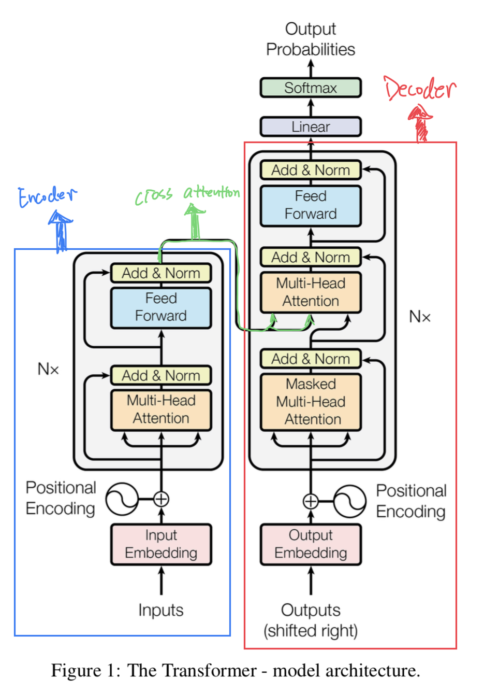
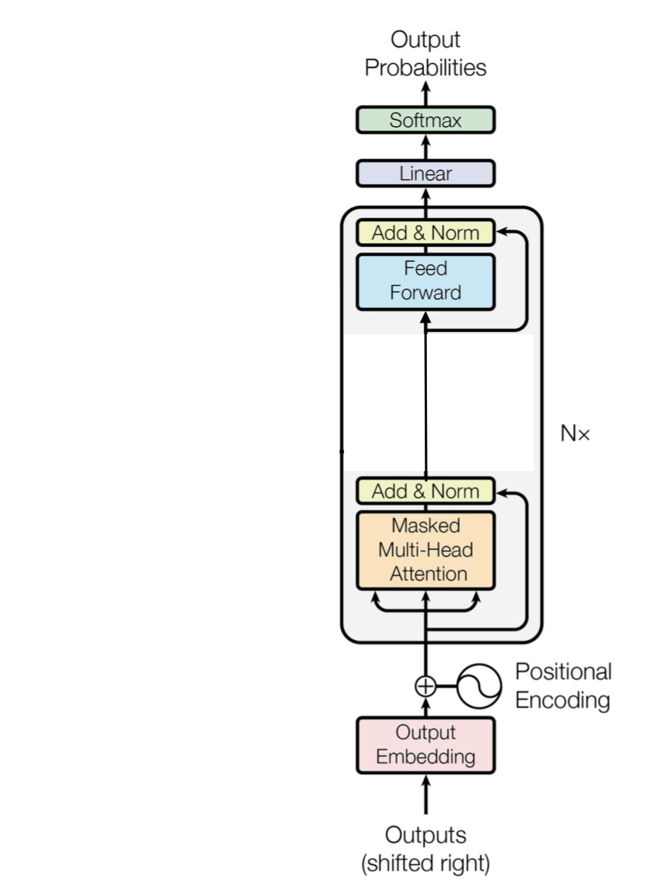
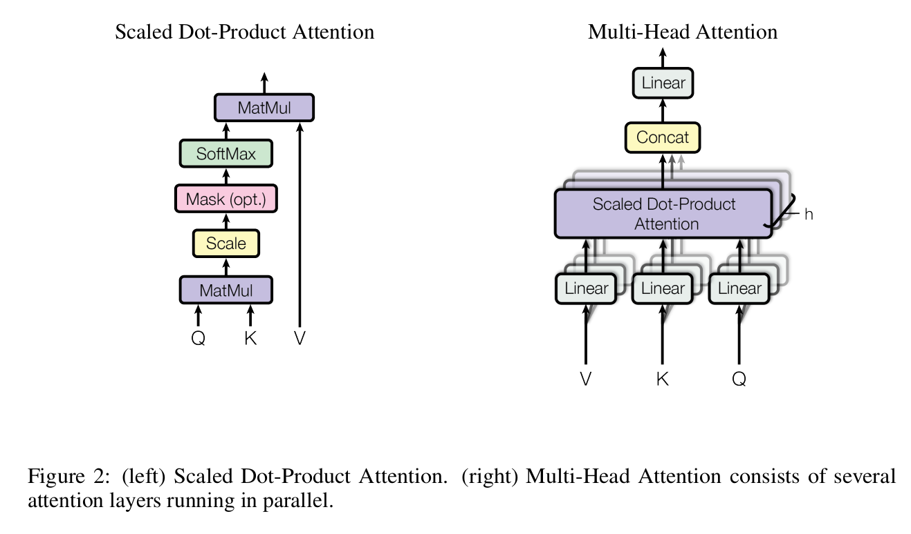
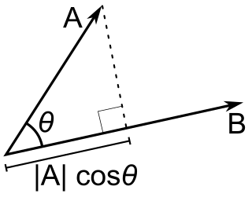
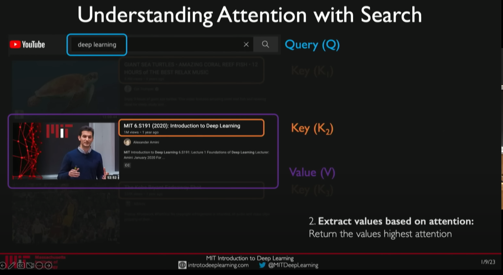
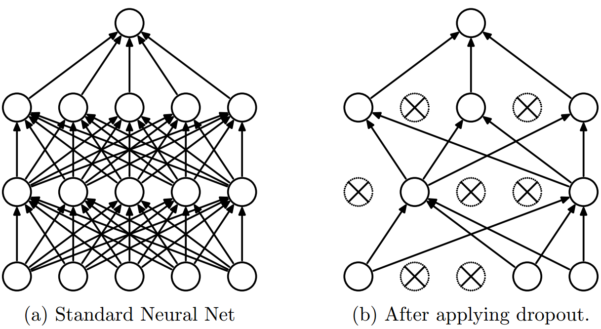



In [Part2](https://gejun.name/natural-language-processing/building-makemore-mlp/), we constructed a straightforward MLP model to generate characters based on 32k popular names.
In this lecture, [Andrej](https://karpathy.ai) guides us on gradually incorporating the transformer architecture to improve the performance of our bigram model.
We will start by refactoring our previous model and then add code from the transformer architecture piece by piece to see how it helps our model.

## Data Preparation

Let's first import the necessary libraries and get the data ready.
We will use the tiny shakespeare dataset, featured in Andrej Karpathy's blog post [The Unreasonable Effectiveness of Recurrent Neural Networks](http://karpathy.github.io/2015/05/21/rnn-effectiveness/).

```python
import math
import requests
import torch
from torch import nn
import torch.nn.functional as F
import numpy as np
import matplotlib.pyplot as plt

device = 'cuda' if torch.cuda.is_available() else 'cpu'

data_url = "https://t.ly/u1Ax"
text = requests.get(data_url).text

# building vocabulary
chars = sorted(list(set(text)))
vocab_size = len(chars)
print(f"Vocabulary size: {vocab_size}")
print(f"Vocabulary: {repr(''.join(chars))}")

# mappings
stoi = {c: i for i, c in enumerate(chars)}
itos = {v: k for k, v in stoi.items()}
def encode(s): return [stoi[c] for c in s]
def decode(l): return ''.join([itos[i] for i in l])
```

    Vocabulary size: 65
    Vocabulary: "\n !$&',-.3:;?ABCDEFGHIJKLMNOPQRSTUVWXYZabcdefghijklmnopqrstuvwxyz"

We have 65 characters, including all lower- and upper-case letters and a few special characters, `\n !$&',-.3:;?`.
Next, we split the data into two parts: 90% of the dataset for training and 10% for validation.

```python
# create tensor
data = torch.tensor(encode(text), dtype=torch.long)
n = int(0.9*len(data))
train_data = data[:n]
val_data = data[n:]
print(train_data.shape)
print(val_data.shape)
```

    torch.Size([1003854])
    torch.Size([111540])

### Training Data

Feeding the entire text to the transformer all at once can be computationally expensive and prohibitive.
To address this issue, neural network models use batch processing techniques to update the model's weights and biases.
This technique involves dividing the training dataset into smaller subsets, or batches, of size `batch_size`.
The batches are then processed separately by the neural network to update the model's parameters.
For a character generation model, we need a sequence of characters as our training sample, which can be considered a time dimension.
For the sample below, the input is `[18]` and the target is `47` at time 0, and the input is `[18, 47]` and the target is `56`, and so on.

```python
block_size = 8
x = train_data[:block_size]
y = train_data[1:block_size+1]
for t in range(block_size):
    context = x[:t+1]
    target = y[t]
    print(f"Time: {t}, input: {context}, target: {target}")
```

    Time: 0, input: tensor([18]), target: 47
    Time: 1, input: tensor([18, 47]), target: 56
    Time: 2, input: tensor([18, 47, 56]), target: 57
    Time: 3, input: tensor([18, 47, 56, 57]), target: 58
    Time: 4, input: tensor([18, 47, 56, 57, 58]), target: 1
    Time: 5, input: tensor([18, 47, 56, 57, 58,  1]), target: 15
    Time: 6, input: tensor([18, 47, 56, 57, 58,  1, 15]), target: 47
    Time: 7, input: tensor([18, 47, 56, 57, 58,  1, 15, 47]), target: 58

To create our training data, we select a sequence starting from the character of a fixed size `block_size` in each batch.
We then create our input and target along the time dimension inside each sequence, resulting in `batch_size` time `block_size` training examples.
The example below shows that there are $4\times 8=32$ training examples in each batch as we have 4 sequences of 8 characters each.

``` python
batch_size = 4
block_size = 8


def get_batch(split):
    data = train_data if split == "train" else val_data
    idx = torch.randint(len(data) - block_size, (batch_size,))
    x = torch.stack([data[i:i+block_size] for i in idx])
    y = torch.stack([data[i+1:i+block_size+1] for i in idx])
    x, y = x.to(device), y.to(device)
    return x, y

x_batch, y_batch = get_batch("train")
print(x_batch.shape, y_batch.shape)

for b in range(batch_size):
    print(f"---------- Batch {b} ----------")
    for t in range(block_size):
        context = x_batch[b, :t+1] 
        target = y_batch[b, t]
        print(f"Time: {t}, input: {context}, target: {target}")
```

    torch.Size([4, 8]) torch.Size([4, 8])
    ---------- Batch 0 ----------
    Time: 0, input: tensor([53], device='cuda:0'), target: 56
    Time: 1, input: tensor([53, 56], device='cuda:0'), target: 58
    Time: 2, input: tensor([53, 56, 58], device='cuda:0'), target: 46
    Time: 3, input: tensor([53, 56, 58, 46], device='cuda:0'), target: 11
    Time: 4, input: tensor([53, 56, 58, 46, 11], device='cuda:0'), target: 1
    Time: 5, input: tensor([53, 56, 58, 46, 11,  1], device='cuda:0'), target: 41
    Time: 6, input: tensor([53, 56, 58, 46, 11,  1, 41], device='cuda:0'), target: 53
    Time: 7, input: tensor([53, 56, 58, 46, 11,  1, 41, 53], device='cuda:0'), target: 51
    ---------- Batch 1 ----------
    Time: 0, input: tensor([52], device='cuda:0'), target: 52
    Time: 1, input: tensor([52, 52], device='cuda:0'), target: 53
    Time: 2, input: tensor([52, 52, 53], device='cuda:0'), target: 58
    Time: 3, input: tensor([52, 52, 53, 58], device='cuda:0'), target: 1
    Time: 4, input: tensor([52, 52, 53, 58,  1], device='cuda:0'), target: 46
    Time: 5, input: tensor([52, 52, 53, 58,  1, 46], device='cuda:0'), target: 47
    Time: 6, input: tensor([52, 52, 53, 58,  1, 46, 47], device='cuda:0'), target: 58
    Time: 7, input: tensor([52, 52, 53, 58,  1, 46, 47, 58], device='cuda:0'), target: 1
    ---------- Batch 2 ----------
    Time: 0, input: tensor([35], device='cuda:0'), target: 43
    Time: 1, input: tensor([35, 43], device='cuda:0'), target: 56
    Time: 2, input: tensor([35, 43, 56], device='cuda:0'), target: 58
    Time: 3, input: tensor([35, 43, 56, 58], device='cuda:0'), target: 1
    Time: 4, input: tensor([35, 43, 56, 58,  1], device='cuda:0'), target: 58
    Time: 5, input: tensor([35, 43, 56, 58,  1, 58], device='cuda:0'), target: 46
    Time: 6, input: tensor([35, 43, 56, 58,  1, 58, 46], device='cuda:0'), target: 53
    Time: 7, input: tensor([35, 43, 56, 58,  1, 58, 46, 53], device='cuda:0'), target: 59
    ---------- Batch 3 ----------
    Time: 0, input: tensor([53], device='cuda:0'), target: 59
    Time: 1, input: tensor([53, 59], device='cuda:0'), target: 50
    Time: 2, input: tensor([53, 59, 50], device='cuda:0'), target: 42
    Time: 3, input: tensor([53, 59, 50, 42], device='cuda:0'), target: 1
    Time: 4, input: tensor([53, 59, 50, 42,  1], device='cuda:0'), target: 41
    Time: 5, input: tensor([53, 59, 50, 42,  1, 41], device='cuda:0'), target: 46
    Time: 6, input: tensor([53, 59, 50, 42,  1, 41, 46], device='cuda:0'), target: 53
    Time: 7, input: tensor([53, 59, 50, 42,  1, 41, 46, 53], device='cuda:0'), target: 54

## BigramLanguageModel

Let's rewrite our previous bigram model.
Here is the main part of the model we built in [Part 1](https://gejun.name/natural-language-processing/building-makemore/).

``` python
W = torch.randn((27, 27), requires_grad=True)
logits = xenc @ W 
counts = logits.exp()
probs = counts / counts.sum(1, keepdim=True)
```

### Base model

From [Part 2](https://gejun.name/natural-language-processing/building-makemore-mlp/), we learned how to represent a token with a fixed-length, real-valued, and learnable vector, which is known as token embedding.
The embedding matrix can be initialized by [`nn.Embedding`](https://pytorch.org/docs/stable/generated/torch.nn.Embedding.html) where `num_embeddings` refers to the vocabulary size, and `embedding_dim` refers to the length of the feature vector.
For consistency with the original paper, we will use `d_model` to represent the feature vector's length, which will be set to 64 instead of the vocabulary size.
As a result, we need to create another linear layer to ensure that the output dimension is the same as the vocabulary size.

It's worth noting that we cannot compute the cross-entropy for a 3-dimensional matrix, as seen from the [documentation](https://pytorch.org/docs/stable/generated/torch.nn.functional.cross_entropy.html) of `cross_entropy` function.
Therefore, we need to reshape the logits and targets before computing it.

``` python
torch.manual_seed(42)

batch_size = 32
d_model = 64

# B: batch_size
# T: time, up to block_size
# C: d_model
# 65: vocabulary size

class BigramLanguageModel(nn.Module):

    def __init__(self, vocab_size):
        super().__init__()
        self.token_embedding_table = nn.Embedding(vocab_size, d_model) # 65, C
        self.output_linear = nn.Linear(d_model, vocab_size)            # C, 65

    def forward(self, idx, targets=None):
        # idx: B, T
        embedded = self.token_embedding_table(idx) # B, T, C
        logits = self.output_linear(embedded)      # B, T, 65

        # there is no target when predicting
        if targets is None:
            loss = None
        else:
            B, T, C = logits.shape
            logits = logits.view(B*T, C) # N, C
            targets = targets.view(B*T)  # N
            loss = F.cross_entropy(logits, targets)
        return logits, loss
    
    def generate(self, idx, max_length):
        for _ in range(max_length):
            logits, _ = self(idx)
            # focus on the char on last time stamp because it's a bigram model
            logits = logits[:, -1, :] # B, C
            probs = F.softmax(logits, dim=-1)
            idx_next = torch.multinomial(probs, num_samples=1)
            # concatenate the new generated to the old ones
            idx = torch.cat((idx, idx_next), dim=1)
        return idx

base_model = BigramLanguageModel(vocab_size).to(device)
idx = torch.zeros((1, 1), dtype=torch.long, device=device)
print(decode(base_model.generate(idx, max_length=100).squeeze().tolist()))
```


    dF3unFC;RnXbzDP'CnT-P.lBuYkUWdXRaRnqDCk,b!:UE$J,uuheZqKPXEPYMYSAxKlRpvwisS.MIwITP$YqrgGRpP.AwYluRWGI

Certainly, the 100 characters generated at this point are not meaningful as the model has not been trained yet.

### Training

``` python
optimizer = torch.optim.AdamW(base_model.parameters(), lr=1e-3)

# training
epochs = 10000
for epoch in range(epochs):
    x_batch, y_batch = get_batch("train")
    logits, loss = base_model(x_batch, y_batch)
    optimizer.zero_grad(set_to_none=True)
    loss.backward()
    optimizer.step()
    if epoch % 1000 == 0 or epoch == epochs - 1:
        print(f"Epoch {epoch}: {loss.item()}")

# starting with [[0]]
idx = torch.zeros((1, 1), dtype=torch.long, device=device)
print(decode(base_model.generate(idx, max_length=100).squeeze().tolist()))
```

    Epoch 0: 4.440201282501221
    Epoch 1000: 2.5844924449920654
    Epoch 2000: 2.469000816345215
    Epoch 3000: 2.473245859146118
    Epoch 4000: 2.4555399417877197
    Epoch 5000: 2.5115771293640137
    Epoch 6000: 2.3323276042938232
    Epoch 7000: 2.331480026245117
    Epoch 8000: 2.436919927597046
    Epoch 9000: 2.473867893218994
    Epoch 9999: 2.636822462081909

    Tody inde eve d tlakemang yofowhas

    Thind.
    UCESer ur thathapr me machan fl haisu d iere--sthurore ce

The generated characters appear more word-like than before, but most are misspelled because the bigram model only generates a new character based on the last generated character.
To improve our model's performance, we need a way to incorporate information from previously generated characters up to `block_size`.
One solution is to use a bag-of-words model to extract features from previously generated characters.
In a bag-of-words model, a text is treated as a bag of tokens, disregarding grammar and order.
In the next section, we will introduce the transformer architecture from the classic paper, [Attention is all you need](https://arxiv.org/pdf/1706.03762.pdf).
We will explain what attention is, how to calculate, and most importantly, how to understand it intuitively.
Furthermore, we will implement it step by step and see how it improves our model's performance.

## Transformer Architecture

The transformer model architecture from the paper is shown below.



Let's first clarify what an encoder is.
According to the paper:

> "The encoder maps an input sequence of symbol representations $(x_1, ..., x_n)$ to a sequence of continuous representations $z=(z_1, ..., z_n)$.
> It converts an input sequence of tokens into a sequence of embedding vectors, often called a hidden state.
> The encoder is composed of a stack of encoder layers, which are used to update the input embeddings to produce representations that encode some contextual information in the sequence."

In the transformer architecture shown above, the encoder is on the left side inside the blue box, and it contains multiple encoder layers.
The encoder compresses and extracts important information from the input sequence while discarding the irrelevant information.

Next, let's see what a decoder is.
The decoder is inside the red box on the right side of the transformer architecture.
It is also composed of a stack of decoder layers, which are similar to encoder layers except that they add an extra masked layer in the multi-head attention.

Last but not least, the state generated from the encoder is passed to the decoder and generates the output sequence, which is referred to as cross-attention.
A decoder uses the encoder's hidden state to iteratively generate an output sequence of tokens, one at a time.

GPT, which stands for Generative Pretrained Transformer, focuses on the decoder part.
Therefore, our model architecture becomes the following.



In the next few sections, we will build the model from bottom to top.
Since the input embedding stays the same, we will skip the input embedding section and talk about positional embedding.

## Positional Embedding

The embedding of input tokens alone does not capture any information about their relative positions within the sequence.
Hence a positional embedding is introduced to inject this information.
According to the paper, there are multiple ways for positional embeddings, with some being fixed while others are learnable.
For our implementation, we will use a learnable positional embedding with the same dimension as the token embedding, which is `d_model`.
The num_embeddings parameter in the `nn.Embedding` function will be set to `block_size` since our training sequence has a maximum length of `block_size`.

Let's dive into the dimensions of the input tokens.
The input tokens have two dimensions: the batch dimension, which indicates how many independent sequences the model processes in parallel, and the time dimension, which records the current position within the sequence up to a maximum length of `block_size`.
After the input tokens pass through the token and positional embedding layers, they will have an additional channel dimension, which is a convention borrowed from computer vision.
For simplicity, we will use `B`, `T`, and `C` to denote the batch, time, and channel dimensions, respectively.

``` python
class BigramLanguageModel(nn.Module):

    def __init__(self, vocab_size):
        super().__init__()
        self.token_embedding_table = nn.Embedding(vocab_size, d_model)
        # position embedding table
        self.position_embedding_table = nn.Embedding(block_size, d_model)
        self.output_linear = nn.Linear(d_model, vocab_size)

    def forward(self, idx, targets=None):
        # idx: B, T
        B, T = idx.shape
        token_embed = self.token_embedding_table(idx)     # B, T, C
        posit_embed = self.position_embedding_table(torch.arange(T, device=device))  # T, C
        # sum of token and positional embeddings 
        x = token_embed + posit_embed              # B, T, C
        logits = self.output_linear(x)             # B, T, vocab_size

        if targets is None:
            loss = None
        else:
            B, T, C = logits.shape
            logits = logits.view(B*T, C) # (N, C)
            targets = targets.view(B*T)  # (N)
            loss = F.cross_entropy(logits, targets)
        return logits, loss

base_model = BigramLanguageModel(vocab_size).to(device)
optimizer = torch.optim.AdamW(base_model.parameters(), lr=1e-3)
epochs = 10000
for epoch in range(epochs):
    x_batch, y_batch = get_batch("train")
    logits, loss = base_model(x_batch, y_batch)
    optimizer.zero_grad(set_to_none=True)
    loss.backward()
    optimizer.step()
    if epoch % 1000 == 0 or epoch == epochs - 1:
        print(f"Epoch {epoch}: {loss.item()}")
```

    Epoch 0: 4.435860633850098
    Epoch 1000: 2.538156270980835
    Epoch 2000: 2.5488555431365967
    Epoch 3000: 2.479320764541626
    Epoch 4000: 2.3083598613739014
    Epoch 5000: 2.472010850906372
    Epoch 6000: 2.5080037117004395
    Epoch 7000: 2.4842913150787354
    Epoch 8000: 2.3710641860961914
    Epoch 9000: 2.4978179931640625
    Epoch 9999: 2.416473627090454

## Attention

What is attention?

> "An attention function can be described as mapping a query and a set of key-value pairs to an output,
> where the query, keys, values, and output are all vectors. The output is computed as a weighted sum
> of the values, where the weight assigned to each value is computed by a compatibility function of the
> query with the corresponding key."



We can compute the attention score using the following steps as described in the paper.

$$Attention(Q,K,V)=softmax\bigl( \frac{QK^T}{\sqrt{d_k}}\bigr) V$$

To better understand the attention formula above, it's helpful to review some linear algebra concepts.

### Dot Product

The [dot product](https://www.wikiwand.com/en/Dot_product) of two Euclidean vectors $\vec{a}$ and $\vec{b}$ is defined by

$$\vec{a} \cdot \vec{b} = \sum_{i=1}^n a_ib_i$$

where $n$ is the length of the vectors.

Geometrically, the dot product of two vectors is equal to the product of their magnitudes and the cosine of the angle between them.
Specifically, if $\theta$ is the angle between $\vec{a}$ and $\vec{b}$, then

$$\vec{a} \cdot \vec{b} = \|a\| \cdot \|b\| cos(\theta)$$


*[source](https://www.wikiwand.com/en/Dot_product)*

The quantity $\|a\|cos(\theta)$ is the scalar projection of $\vec{a}$ onto $\vec{b}$.
The higher the product, the more similar two vectors.
Let's take the learned embedding from our last model and compute the dot products of some tokens from our vocabulary.

``` python
char1 = 'a'
char2 = 'z'
char3 = 'e'

token_embeddings = base_model.token_embedding_table.weight

def calc_dp(char1, char2):
    with torch.no_grad():
        embed1 = token_embeddings[stoi[char1]]
        embed2 = token_embeddings[stoi[char2]]
        return sum(embed1 * embed2)

print(f"Dot product of {char1} and {char1}: {calc_dp(char1, char1):.6f}")
print(f"Dot product of {char1} and {char2}: {calc_dp(char1, char2):.6f}")
print(f"Dot product of {char1} and {char3}: {calc_dp(char1, char3):.6f}")
```

    Dot product of a and a: 78.494980
    Dot product of a and z: -14.060809
    Dot product of a and e: 12.071777

The dot product of the feature vectors of `a` and itself is much higher than with `e` or `z`.
Also, the results show that `a` is more similar to `e` then to `z`.

### Attention Score

Every token in the input sequence generates a query vector and a key vector of the same dimension.
This operation is called **self-attention** because $Q$, $V$, and $T$ are all derived from the same source in GPT.
The dot product of the query and key vectors measures their similarity.

Let $X_{m\times n}$ and $W$ denote the embedding matrix of the input sequence and the weight of the linear transformation, where $m$ is the number of tokens, $n$ is the token dimension, and $k$ is the output dimension of the linear transformation or the head size of our attention.
Each row represents the token embedding for each token in the input.
Then, we apply three linear transformations on $X$ to project it onto 3 new vector spaces:

-   $X_{m\times n} \cdot W^Q_{n\times k} = Q_{m\times k}$ to obtain the query space.
-   $X_{m\times n} \cdot W^K_{n\times k} = K_{m\times k}$ to obtain the key space.
-   $X_{m\times n} \cdot W^V_{n\times k} = V_{m\times k}$ to obtain the value space.

$Q\cdot K^T$ is the attention score matrix, having a shape of $m \times m$.
The larger the value, the closer the vectors and hence the more attention.

Let's take the learned token and positional embeddings from our previous model, apply the query and key transformations, and calculate the attention scores of the sequence `sea`.

``` python
sequence = "sea"
# get positional embeddings from model
position_embeddings = base_model.position_embedding_table.weight

tokens = torch.tensor([stoi [c] for c in sequence])
positions = torch.tensor([i for i in range(len(sequence))])
# final embedding matrix for a given sequence
embed = token_embeddings[tokens] + position_embeddings[positions]

# query and vector weights
d_k = 16
torch.manual_seed(42)
q = nn.Linear(embed.shape[1], d_k, bias=False).to(device)
k = nn.Linear(embed.shape[1], d_k, bias=False).to(device)

# query and key space
with torch.no_grad():
    Q = q(embed)
    K = k(embed)

    # similarity between query and keys
    score = Q @ K.T
print(score)
```

    tensor([[ 1.5712, -2.8564,  3.0652],
            [ 1.6477,  0.1216, -0.4353],
            [-6.8497, -1.1358, -0.8100]], device='cuda:0')

The attention score vector for `e` is `[ 1.6477,  0.1216, -0.4353]`
However, the dot products may become too large in magnitude when the head size $d_k$ is large, which can result in extremely small gradients after applying the softmax function.
To mitigate this issue, the scores are scaled by multiplying with the factor $\frac{1}{\sqrt{d_k}}$, as suggested in the paper.

``` python
with torch.no_grad():
    score /= math.sqrt(d_k)
    score = F.softmax(score, dim=-1)
    print(score)
```

    tensor([[0.3593, 0.1188, 0.5220],
            [0.4392, 0.2999, 0.2609],
            [0.1031, 0.4302, 0.4667]], device='cuda:0')

After scaling, the attention score vector for token `e` in `sea` becomes `[0.4392, 0.2999, 0.2609]`.
This implies that the token `s` requires more attention than the tokens `e` and `a`.

Wait a minute!
Why does the token `e` pay attention to the future token `a` in a GPT model?
It is cheating in this way.
How can we preserve the information from the previous tokens while not peeking the future tokens?
The masking layer.

### Masking

Where exactly do we apply a masking layer?
Since we want to use a softmax function to normalize the attention scores until the current position so that the divided attention sums to one, it should be applied after calculating the unscaled attention score and before the softmax layer.
In this way, we can exclude the future tokens.
To implement this masking, we will use a PyTorch built-in function, `torch.tril`, which preserves the original values for the lower triangular part of the matrix while setting the upper part to zero.
In our case, we replace the scores in the upper triangular part of the matrix with a very small number, such as `float("-inf")`, so that they will become zeros after applying the softmax function.

``` python
with torch.no_grad():
    mask = torch.tril(torch.ones(embed.shape[0], embed.shape[0])).to(device)
    score = score.masked_fill(mask == 0, float("-inf"))
    score = F.softmax(score, dim=-1)
    print(score)
```

    tensor([[1.0000, 0.0000, 0.0000],
            [0.5348, 0.4652, 0.0000],
            [0.2614, 0.3626, 0.3760]], device='cuda:0')

Now, the scaled attention vector for `e` becomes `[0.5348, 0.4652, 0.0000]`, indicating that the model pays roughly half of its attention to tokens `s` and `e` when it reaches token `e` while completely ignoring the future token `a`.

### Weighted Sum

Finally, we obtain a new adjusted embedding for each token in the context by multiplying the attention matrix with the value matrix $V$.

``` python
v = nn.Linear(embed.shape[1], d_k, bias=False).to(device)

with torch.no_grad():
    V = v(embed)
    new_embed = score @ V
    print(new_embed)
```

    tensor([[ 0.0959,  0.4068, -0.2983,  0.8456, -1.6365,  0.9545, -0.5414,  2.2582,
             -0.3868,  1.1196,  1.6244,  0.3545, -1.1479,  0.4165, -0.7899, -0.7008],
            [ 0.1352, -0.2616, -0.4122,  0.1182, -1.2960,  0.5224, -0.3819,  1.3335,
             -0.1463,  0.2113,  0.8228, -0.0095, -0.8548,  0.0567, -0.5980, -0.3525],
            [-0.4126, -0.4585, -0.2760,  0.0813, -0.9609,  0.2358, -0.3887,  0.7906,
              0.0084, -0.1094,  0.3198, -0.5582, -0.7782,  0.4525, -0.1208,  0.1493]],
           device='cuda:0')

To put it in another way, we force the tokens to look at each other by multiplying the attention scores with the value matrix $V$.
This helps to adjust the value matrix to represent the entire sequence better as training progresses.

### Demystifying QKV

How do we understand attention from intuition?
Here is a great answer from [Cross Validated](https://stats.stackexchange.com/questions/421935/what-exactly-are-keys-queries-and-values-in-attention-mechanisms).

> The key/value/query concept is analogous to retrieval systems.
> For example, when you search for videos on Youtube, the search engine will map your **query**
> (text in the search bar) against a set of **keys** (video title, description, etc.) associated
> with candidate videos in their database, then present you the best matched videos (**values**).


*[source](https://www.youtube.com/watch?v=ySEx_Bqxvvo&ab_channel=AlexanderAmini)*

Here are the intuitive meaning of these matrices:

-   The query matrix represents a piece of information we are looking for in a query we have.
-   The key matrix is intuitively meant to represent the relevance of each word to our query. And the key matrix represents how important each word is to my overall query.
-   The value matrix intuitively represents the contextless meaning of our input tokens.

Imagine that you're at the supermarket buying all the ingredients you need for your dinner.
You have the dish's recipe, and the ingredients (query) are what you look for in a supermarket.
Scanning the shelves, you look at the labels (keys) and check whether they match an ingredient on your list.
You are determining the similarity between query and keys.
If you have a match, you take the item (value) from the shelf.

Let's put the attention layer into a single `Head` class.

``` python
class Head(nn.Module):

    def __init__(self, d_k):
        super().__init__()
        self.query = nn.Linear(d_model, d_k, bias=False) # C, d_k
        self.key = nn.Linear(d_model, d_k, bias=False)   # C, d_k
        self.value = nn.Linear(d_model, d_k, bias=False) # C, d_k
        # not a model parameter
        self.register_buffer('tril', torch.tril(torch.ones(block_size, block_size)))   # block_size, block_size

    def forward(self, x):
        
        B, T, C = x.shape
        q = self.query(x) # B, T, d_k
        k = self.key(x)   # B, T, d_k

        score = torch.matmul(q, k.transpose(-2, -1)) / math.sqrt(C)         # B, T, T
        score = score.masked_fill(self.tril[:T, :T] == 0, float("-inf"))    # B, T, T
        score = F.softmax(score, dim=-1)                                    # B, T, T

        v = self.value(x)   # B, T, d_k
        out = score @ v     # (B, T, T)@(B, T, d_k) = (B, T, d_k)
        return out
```

To ensure compatibility with matrix multiplication, we need to set the head size as the embedding dimension, `d_model`, because we currently only have one head layer.
However, we will not train this model at this moment.

``` python
class BigramLanguageModel(nn.Module):

    def __init__(self, vocab_size):
        super().__init__()
        self.token_embedding_table = nn.Embedding(vocab_size, d_model)
        self.position_embedding_table = nn.Embedding(block_size, d_model)
        self.self_attn = Head(d_model)
        self.output_linear = nn.Linear(d_model, vocab_size)

    def forward(self, idx, targets=None):
        B, T = idx.shape
        token_embed = self.token_embedding_table(idx) 
        posit_embed = self.position_embedding_table(torch.arange(T, device=device)) 
        x = token_embed + posit_embed 
        # apply self attention
        x = self.self_attn(x) 
        logits = self.output_linear(x)

        if targets is None:
            loss = None
        else:
            B, T, C = logits.shape
            logits = logits.view(B*T, C)
            targets = targets.view(B*T)
            loss = F.cross_entropy(logits, targets)
        return logits, loss

    def generate(self, idx, max_length):
        
        for _ in range(max_length):
            logits, loss = self(idx[:, -block_size:])
            logits = logits[:, -1, :]
            probs = F.softmax(logits, dim=-1)
            idx_next = torch.multinomial(probs, num_samples=1)
            idx = torch.cat((idx, idx_next), dim=1) 
        return idx
```

### Multi-head Attention

As an old saying goes, two heads are better than one.
By having multiple heads, we can apply multiple transformations to the embeddings.
Each projection has its own set of learnable parameters, which enables the self-attention layer to focus on different semantic aspects of the sequence.
We will denote the number of heads as `h`.

``` python
class MultiHeadAttention(nn.Module):

    def __init__(self, h, d_k):
        super.__init__()
        self.heads = nn.ModuleList([Head(d_k) for _ in range(h)])
    
    def forward(self, x):
        return torch.cat([head(x) for head in self.heads], dim=-1) # B, T, C
```

### Dropout

Dropout was proposed in [Dropout: A Simple Way to Prevent Neural Networks from Overfitting](https://jmlr.org/papers/volume15/srivastava14a/srivastava14a.pdf) by Nitish Srivastava et al. in 2014.
In this technique, a certain proportion of neurons are randomly dropped out during training to prevent overfitting.

> We apply dropout to the output of each sub-layer, before it is added to the
> sub-layer input and normalized.


*[source](https://wiki.tum.de/download/attachments/23568252/Selection_532.png)*

We will apply PyTorch's built-in function `nn.Dropout` to our `Head` and `MultiHeadAttention` layers.

```python
dropout = 0.1

class Head(nn.Module):

    def __init__(self, d_k):
        super().__init__()
        self.query = nn.Linear(d_model, d_k, bias=False) # C, d_k
        self.key = nn.Linear(d_model, d_k, bias=False)   # C, d_k
        self.value = nn.Linear(d_model, d_k, bias=False) # C, d_k
        # not a model parameter
        self.register_buffer('tril', torch.tril(torch.ones(block_size, block_size)))   # block_size, block_size
        self.dropout = nn.Dropout(dropout)

    def forward(self, x):
        
        B, T, C = x.shape
        q = self.query(x) # B, T, d_k
        k = self.key(x)   # B, T, d_k

        score = torch.matmul(q, k.transpose(-2, -1)) / math.sqrt(C)         # B, T, T
        score = score.masked_fill(self.tril[:T, :T] == 0, float("-inf"))    # B, T, T
        score = F.softmax(score, dim=-1)                                    # B, T, T
        score = self.dropout(score)

        v = self.value(x)   # B, T, d_k
        out = score @ v     # (B, T, T)@(B, T, d_k) = (B, T, d_k)
        return out


class MultiHeadAttention(nn.Module):

    def __init__(self, h, d_k):
        super.__init__()
        self.heads = nn.ModuleList([Head(d_k) for _ in range(h)])
        self.dropout = nn.Dropout(dropout)
    
    def forward(self, x):
        x = torch.cat([head(x) for head in self.heads], dim=-1) # B, T, C
        x = self.dropout(x)
        return x
```

### Residual Connection

The concept of residual connections was first introduced in 2015 by Kaiming He et al. in their paper [Deep Residual Learning for Image Recognition](https://arxiv.org/pdf/1512.03385.pdf).
It allows the network to bypass one or more layers, which helps alleviate the vanishing gradient problem that could occur in very deep neural networks.


*[source](https://paperswithcode.com/)*

To implement residual connections and a projection layer in our multi-head attention module, we modify the `MultiHeadAttention` class as follows.

``` python
class MultiHeadAttention(nn.Module):

    def __init__(self, h, d_k):
        super().__init__()
        self.heads = nn.ModuleList([Head(d_k) for _ in range(h)])
        self.proj = nn.Linear(d_model, d_model)
        self.dropout = nn.Dropout(dropout)
    
    def forward(self, x):
        x = torch.cat([head(x) for head in self.heads], dim=-1)
        x = self.proj(x)
        x = self.dropout(x)
        return x
```

### Feed-Forward

As stated in the paper:

> In addition to attention sub-layers, each of the layers in our encoder and decoder contains a fully
> connected feed-forward network, which is applied to each position separately and identically.

This means that instead of processing the entire sequence of embeddings as a single vector, the feed-forward network applies the same linear transformations to each embedding individually.

> While the linear transformations are the same across different positions, they use different parameters
> from layer to layer. Another way of describing this is as two convolutions with kernel size 1.
> The dimensionality of input and output is $d_{model} = 512$, and the inner-layer has dimensionality
> $d_{ff} = 2048$.

This implies that our first linear layer in the feed-forward layer has an output dimension of `d_model * 4`, which serves as the input dimension of the second linear layer.
We also apply a dropout layer to the feed-forward layer to avoid overfitting.

``` python
class FeedForward(nn.Module):

    def __init__(self):
        super().__init__()
        self.net = nn.Sequential(
            nn.Linear(d_model, d_model * 4),
            nn.ReLU(),
            nn.Linear(d_model * 4, d_model),
            nn.Dropout(dropout)
        )
    
    def forward(self, x):
        x = self.net(x)
        return x
```

### Layer Normalization

The concept of layer normalization was introduced by Jimmy Lei Ba et al. in their paper [Layer Normalization](https://arxiv.org/pdf/1607.06450.pdf) published in 2016.
Unlike batch normalization, which normalizes the inputs to a batch of data, layer normalization normalizes the inputs to a single layer of the network.
In our implementation, we apply layer normalization before self-attention and feed-forward layers.


*[source](https://paperswithcode.com/)*

### Refactoring

Let's refactor the code to put multi-head attention and feed-forward layers to a single `Block` class.
Moreover, the head size would be automatically set to `d_model/h`.

``` python
class Block(nn.Module):

    def __init__(self, h):
        super().__init__()
        d_k = d_model // h
        self.attn = MultiHeadAttention(h, d_k)
        self.ff = FeedForward()
        self.ln1 = nn.LayerNorm(d_model)
        self.ln2 = nn.LayerNorm(d_model)
        
    
    def forward(self, x):
        # attention + residual connection
        x = x + self.attn(x)
        # layer normalization
        x = self.ln1(x)
        # feed forward
        x = x + self.ff(x)
        # layer normalization
        x = self.ln2(x)
        return x
```

## Put Everything Together

Here are the steps to build a GPT with transformer architecture:

1.  Initialize the token embedding table with the vocabulary size and embedding dimension `(vocab_size, d_model)`.
2.  Initialize the positional embedding table with the maximum sequence length and embedding dimension `(block_size, d_model)`.
3.  Create `N` identical decoder layers using the `Block` class with multi-head attention, feed-forward, and layer normalization layers. The `head_size` parameter will be automatically set to `d_model/h`.
4.  Add a linear output layer with the output dimension equal to the `vocab_size`.

``` python
batch_size = 16 
block_size = 32
eval_interval = 1000
eval_iters = 200
learning_rate = 1e-3
epochs = 10000
d_model = 64   # dimension of embedding
h = 8          # number of heads
N = 6          # number of identical layers
dropout = 0.1  # dropout percentage

device = 'cuda' if torch.cuda.is_available() else 'cpu'


@torch.no_grad()
def estimate_loss():
    out = {}
    model.eval()
    for split in ['train', 'val']:
        losses = torch.zeros(eval_iters)
        for k in range(eval_iters):
            X, Y = get_batch(split)
            logits, loss = model(X, Y)
            losses[k] = loss.item()
        out[split] = losses.mean()
    model.train()
    return out

class BigramLanguageModel(nn.Module):

    def __init__(self):
        super().__init__()
        self.token_embedding_table = nn.Embedding(vocab_size, d_model)
        self.position_embedding_table = nn.Embedding(block_size, d_model)
        self.blocks = nn.Sequential(*[Block(h) for _ in range(N)])
        self.output_linear = nn.Linear(d_model, vocab_size)
    
    def forward(self, idx, targets=None):
        B, T = idx.shape

        token_embed = self.token_embedding_table(idx)
        posit_embed = self.position_embedding_table(torch.arange(T, device=device))
        x = token_embed + posit_embed
        x = self.blocks(x)
        logits = self.output_linear(x)

        if targets is None:
            loss = None
        else:
            B, T, C = logits.shape
            logits = logits.view(B*T, C)
            targets = targets.view(B*T)
            loss = F.cross_entropy(logits, targets)
        return logits, loss


    def generate(self, idx, max_length):
        for _ in range(max_length):
            logits, _ = self(idx[:, -block_size:])
            logits = logits[:, -1, :]
            probs = F.softmax(logits, dim=-1)
            idx_next = torch.multinomial(probs, num_samples=1)
            idx = torch.cat((idx, idx_next), dim=1)
        return idx


model = BigramLanguageModel().to(device)
print(sum(p.numel() for p in model.parameters())/1e6, 'M parameters')
```

    0.309185 M parameters

## Retraining

``` python
optimizer = torch.optim.AdamW(model.parameters(), lr=learning_rate)

for i in range(epochs):

    if i % eval_interval == 0 or i == epochs - 1:
        losses = estimate_loss()
        print(f"step {i:>6}: train loss {losses['train']:.4f}, val loss {losses['val']:.4f}")

    x_batch, y_batch = get_batch('train')
    logits, loss = model(x_batch, y_batch)
    optimizer.zero_grad(set_to_none=True)
    loss.backward()
    optimizer.step()

context = torch.zeros((1, 1), dtype=torch.long, device=device)
print(decode(model.generate(context, max_length=2000)[0].tolist()))
```

    step      0: train loss 4.4133, val loss 4.4188
    step   1000: train loss 2.1523, val loss 2.1733
    step   2000: train loss 1.9162, val loss 1.9929
    step   3000: train loss 1.8095, val loss 1.9325
    step   4000: train loss 1.7424, val loss 1.8743
    step   5000: train loss 1.7031, val loss 1.8359
    step   6000: train loss 1.6730, val loss 1.8091
    step   7000: train loss 1.6381, val loss 1.8015
    step   8000: train loss 1.6231, val loss 1.7956
    step   9000: train loss 1.6010, val loss 1.7734
    step   9999: train loss 1.5991, val loss 1.7507


    POLINCE:
    O-momen, marran, stack the blow.

    VALUMNIA:
    TRong it is 'twill o despreng.

    MARCIUS:
    She are.

    COMSARIO:
    Thraby, the tongue,
    And lefe to he she this highnoural,
    Have any but ut your to spuake it.

    LEONTES:
    Goot saled shur he wrett.

    SICIDIUS:
    Be she done! te.

    First KINquel:
    Thy had diul as recat my deasury? Faulter'er mean, on altal,
    If none banch with to times? York,
    Vom have yzage; this hight think noble of eye bewill fre,
    In gring might to jue of knot it the clunter,
    Were henrey quoring to jurition tone
    stime to known? Pryity and bear.

    KING EL.TAh, is leaven. For I would in
    Ancompers, for comen telms things:
    I worn apene so Herdow procked love; dime so worder.

    LORIS:
    It is here bear of go him.

    ROMEY:
    How I Leffater the death? And mearrinad
    king cans no myselfy that bartt,
    If you I decdom to be in tellothen,
    Low ke'es hath s duck, and within kindes, that found als
    In he house his
    Of the spine confeive inther his dear to gater:
    And go agonst Marcito, I'll wid my countery,
    I way, lientifirn tenving rulby us my follow honour yield stent poon,
    Jufe the be dared on the kial je:
    The day my Lounges, be agains in have
    once as to plating exvage of his tonake
    That themn were by to the hance,
    The sold long, po somebn o'er becelds
    Is this ofseding on this soak? alrick.

    UMISmed!
    HO, answer
    Off Humbledy, that's will forted yial with pring's lord.
    Forth, Jolsn'd ladib tod
    But thy shorly be this mine stons.
    Good you withnlieds think, this mance and thingn blunge his of be be reep steep your intent
    for thou way, the nober, and visy
    From the pot of lord?
    Mast all to be endought: what my loness,
    Tis is monius and from out of Sunscoa may,
    And not my the see to all, everstrer.

    KING RICHARD III:
    My hidoner, and strangems, honours,
    Before requick?

    ELIFFOLLY:
    O, ce, but and 't: her I near afta humbhal gittled here,
    O
    tAlker of off it dispuised here the heam we froens,
    Wasce, not he rese that dear'd, to,
    And in stay be I have will am gove his derefy:
    lade them brooks it in

The newly generated text contains more word-like characters and resembles the style of Shakespeare, with a more significant proportion of correctly spelled words.

## Revisiting Attention

``` python
sequence = """MENENIUS:\nWhat is gra"""
token_embeddings = model.token_embedding_table.weight
position_embeddings = model.position_embedding_table.weight
tokens = torch.tensor([stoi [c] for c in sequence])
positions = torch.tensor([i for i in range(len(sequence))])
embed = token_embeddings[tokens] + position_embeddings[positions]

# query and vector weights for last head of the last block
q = model.blocks[5].attn.heads[7].query
k = model.blocks[5].attn.heads[7].key
v = model.blocks[5].attn.heads[7].value

# query and key space
with torch.no_grad():
    Q = q(embed)
    K = k(embed)
    score = Q @ K.T
    score /= math.sqrt(d_model // h)
    mask = torch.tril(torch.ones(embed.shape[0], embed.shape[0])).to(device)
    score = score.masked_fill(mask == 0, float("-inf"))
    score = F.softmax(score, dim=-1)

    V = v(embed)
    new_embed = score @ V
print(f"Attention scores for the sequence:\n {score[-1, :]}")
print(f"Adjusted and compressed embeddings for the sequence:\n {new_embed}")
```

    Attention scores for the sequence:
     tensor([1.0275e-01, 6.3248e-03, 1.2576e-02, 7.7688e-04, 1.2232e-03, 1.0114e-01,
            5.6094e-03, 1.2616e-01, 1.0319e-01, 1.5049e-01, 4.3153e-02, 4.5383e-03,
            9.5087e-03, 4.0352e-03, 1.8735e-01, 1.6233e-03, 1.2997e-01, 5.6082e-03,
            2.0060e-05, 3.1588e-04, 3.6474e-03], device='cuda:0')
    Adjusted and compressed embeddings for the sequence:
     tensor([[ 3.8285e-01, -5.6125e-01, -1.2138e+00, -5.2913e-01,  9.2973e-01,
             -4.2545e-01, -2.4848e+00,  6.8524e-03],
            [ 3.6920e-01, -5.4390e-01, -9.2868e-01, -4.8776e-01,  8.3288e-01,
             -3.3776e-01, -2.2440e+00,  1.1147e-01],
            [ 4.0217e-01, -4.6048e-01,  8.1029e-01, -1.8336e-01,  2.0483e-01,
              2.0015e-01, -5.8833e-01,  7.3810e-01],
            [ 1.4945e+00, -6.4184e-01, -2.4202e-01,  1.0156e-01,  2.0985e-01,
             -1.5870e-01,  5.5549e-02,  3.1318e-01],
            [ 3.5607e-01, -5.5418e-02,  1.5003e+00, -2.7288e-01, -8.2235e-02,
              1.1763e-01, -7.0800e-01,  1.2626e+00],
            [-6.7275e-02, -1.2190e+00, -1.7885e-01,  2.6792e-01, -2.2870e-01,
             -8.5028e-01,  3.4890e-01,  1.3680e-01],
            [ 1.7077e+00, -8.5935e-01, -6.5319e-01,  1.4917e-01,  2.7577e-01,
             -2.7634e-01,  3.0645e-01,  3.7927e-02],
            [-5.1688e-02, -8.2619e-01,  8.0506e-02,  2.1702e-01, -1.6939e-02,
             -6.4278e-01,  1.9751e-01,  8.1660e-02],
            [-7.1723e-02, -5.1926e-01, -2.9651e-01, -5.3577e-02,  1.8432e-01,
             -4.6867e-01, -7.6557e-01, -1.7440e-01],
            [ 8.1420e-01, -4.1661e-01,  1.0995e+00, -3.2608e-01,  2.8869e-02,
              2.2275e-02, -5.5174e-02,  8.0169e-01],
            [ 2.9553e-01, -5.1129e-01,  2.6954e-01, -1.0131e-01,  1.6535e-03,
             -2.3739e-01,  2.4023e-01,  2.7450e-03],
            [ 9.2807e-01, -5.3834e-01, -4.8175e-01, -1.7232e-02,  1.6207e-01,
             -1.7096e-01,  3.0736e-01, -9.1554e-02],
            [ 4.2730e-01,  6.4469e-01,  8.8334e-01,  4.4953e-01, -3.0363e-01,
              1.3055e-01,  1.1382e+00, -6.6804e-01],
            [ 8.4047e-01, -4.7317e-01, -6.5326e-02, -5.7882e-02,  1.3698e-01,
             -1.0259e-01,  2.5059e-01,  6.1572e-02],
            [ 2.9731e-01, -8.2256e-01, -2.8259e-02,  3.3942e-01, -2.8240e-01,
              1.9379e-01, -9.6743e-02,  2.3589e-01],
            [ 6.0484e-01, -1.0521e-01,  2.7202e-01,  2.2309e-01, -6.7768e-01,
              2.5342e-01, -4.1722e-01,  8.2589e-02],
            [ 4.1097e-01,  6.0131e-01,  8.3584e-01,  4.4749e-01, -2.8864e-01,
              1.3370e-01,  1.0975e+00, -6.3150e-01],
            [-5.1310e-01, -3.5065e-01, -1.4606e-01,  4.4343e-01,  2.1451e-01,
              7.1118e-02, -1.8510e-02,  6.4416e-01],
            [ 1.3922e-01, -5.7186e-02, -2.0533e-01, -2.0123e-01, -2.3971e-01,
              2.8392e-01, -2.8814e-01,  3.0751e-01],
            [ 3.3605e-01,  5.6808e-01,  8.5728e-01,  3.2310e-01, -3.3082e-01,
              1.1003e-01,  1.1402e+00, -6.2344e-01],
            [ 1.1078e-01, -2.0579e-02, -1.6989e-01, -8.3665e-02, -1.2148e-02,
              5.8077e-02, -3.4206e-01,  3.3760e-01]], device='cuda:0')

## Notes

Here are some tiny differences between my code and the code in the video.

1.  I applied layer normalization after the self-attention layer, while he applied immediately on `x` before `x` entered the self-attention and feed-forward layers.

``` python
class Block(nn.Module):
    """ Transformer block: communication followed by computation """

    def __init__(self, n_embd, n_head):
        # n_embd: embedding dimension, n_head: the number of heads we'd like
        super().__init__()
        head_size = n_embd // n_head
        self.sa = MultiHeadAttention(n_head, head_size)
        self.ffwd = FeedFoward(n_embd)
        self.ln1 = nn.LayerNorm(n_embd)
        self.ln2 = nn.LayerNorm(n_embd)

    def forward(self, x):
        x = x + self.sa(self.ln1(x))
        x = x + self.ffwd(self.ln2(x))
        return x
```

1.  The scaling factor I used was $d_k$ instead of $d_model$ (maybe it's a typo in his code?).

``` python
class Head(nn.Module):
    """ one head of self-attention """

    def __init__(self, d_k):
        super().__init__()
        self.key = nn.Linear(n_embd, head_size, bias=False)
        self.query = nn.Linear(n_embd, head_size, bias=False)
        self.value = nn.Linear(n_embd, head_size, bias=False)
        self.register_buffer('tril', torch.tril(torch.ones(block_size, block_size)))
        self.dropout = nn.Dropout(dropout)

    def forward(self, x):
        B, T, C = x.shape  # batch_size, block_size, n_embd
        k = self.key(x)    # (B,T,C)
        q = self.query(x)  # (B,T,C)
        # compute attention scores ("affinities")
        wei = q @ k.transpose(-2,-1) * C **-0.5 # (B, T, C) @ (B, C, T) -> (B, T, T)
        wei = wei.masked_fill(self.tril[:T, :T] == 0, float('-inf')) # (B, T, T)
        wei = F.softmax(wei, dim=-1) # (B, T, T)
        wei = self.dropout(wei)
        # perform the weighted aggregation of the values
        v = self.value(x) # (B,T,C)
        out = wei @ v # (B, T, T) @ (B, T, C) -> (B, T, C)
        return out
```

## Other Resources

-   https://sebastianraschka.com/blog/2023/self-attention-from-scratch.html
-   https://jalammar.github.io/illustrated-transformer/
-   https://www.youtube.com/watch?v=ptuGllU5SQQ&list=PLoROMvodv4rOSH4v6133s9LFPRHjEmbmJ&index=9
-   https://stats.stackexchange.com/questions/421935/what-exactly-are-keys-queries-and-values-in-attention-mechanisms
-   https://web.stanford.edu/class/cs224n/readings/cs224n-self-attention-transformers-2023_draft.pdf
-   https://learning.oreilly.com/library/view/natural-language-processing/9781098136789/
