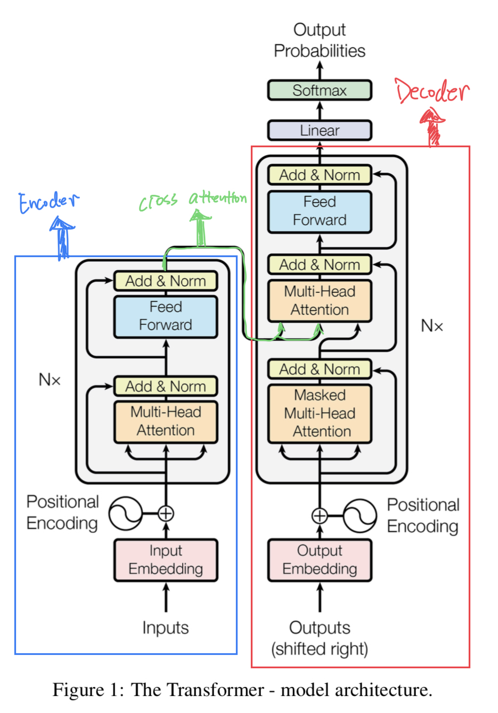
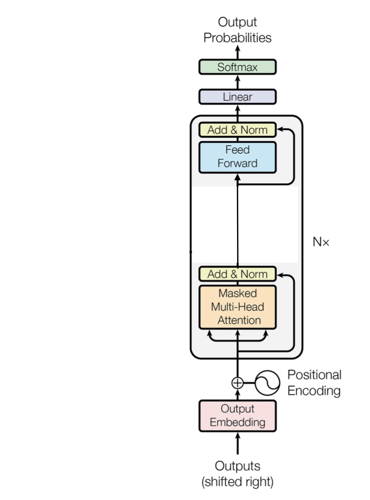
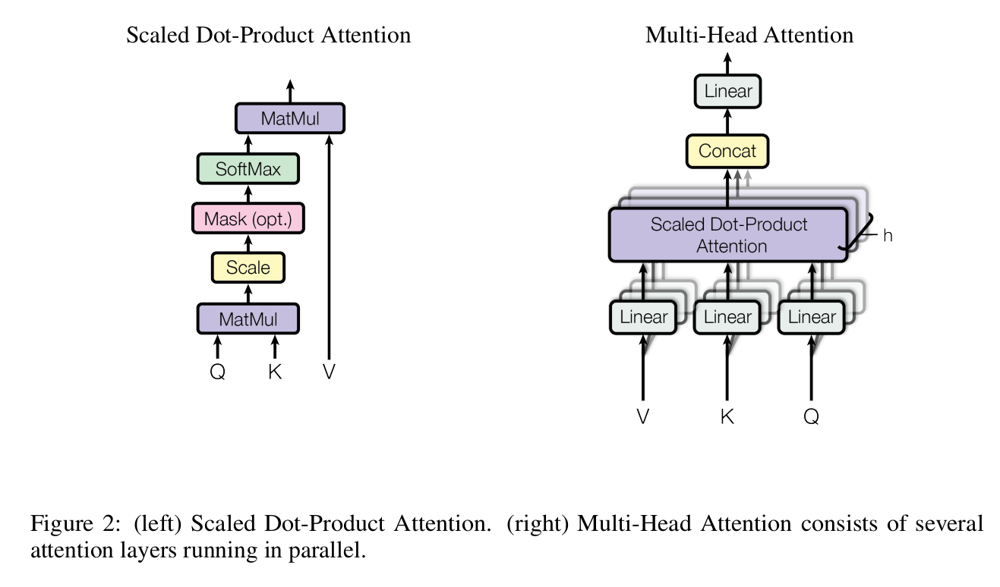
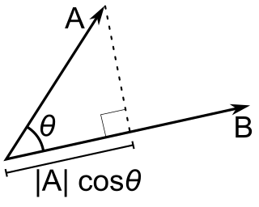
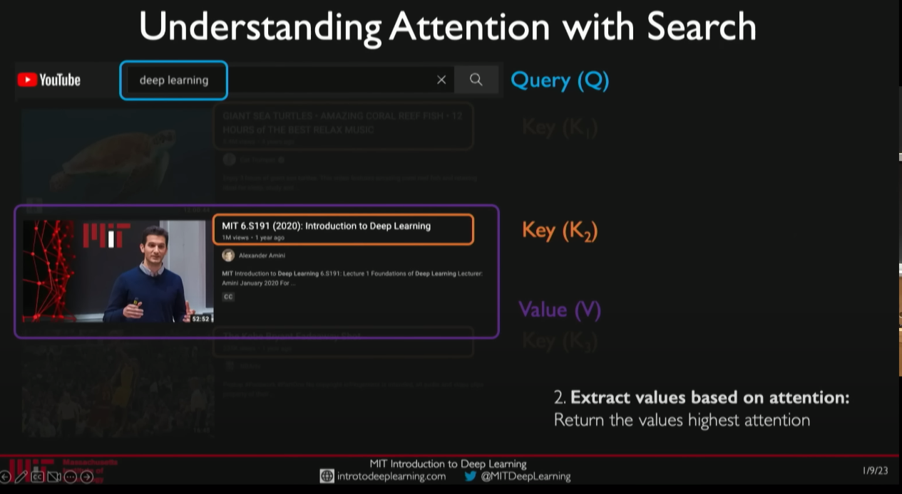
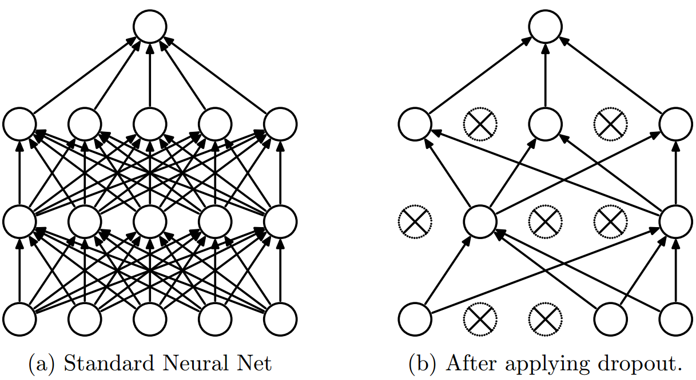
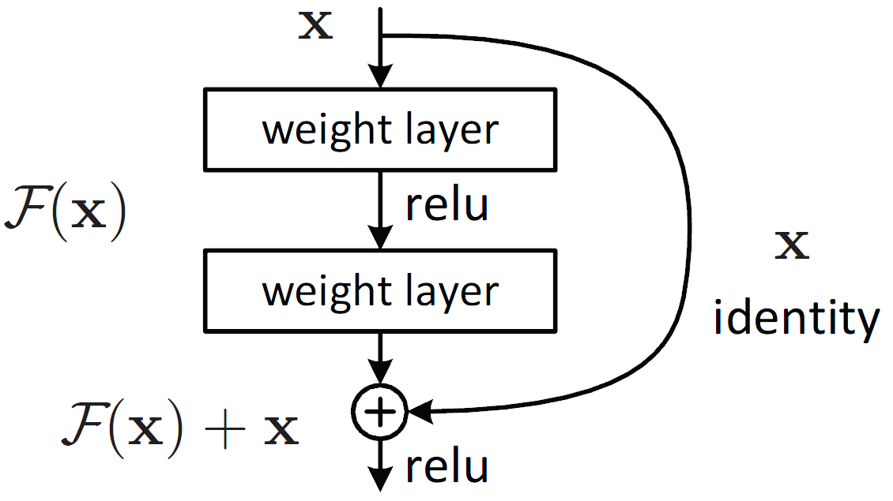
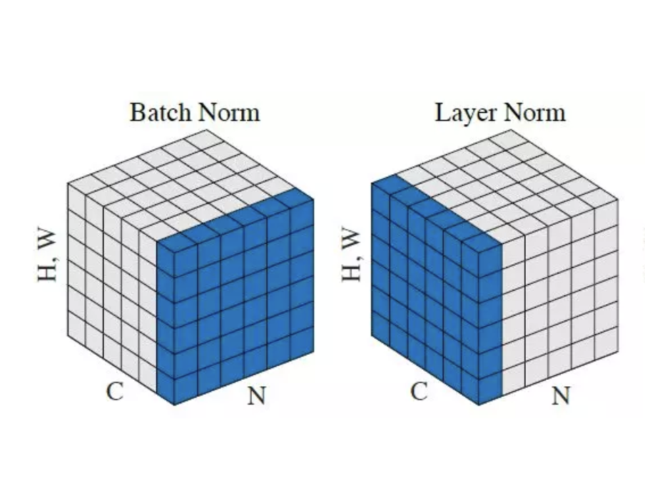



In [Part 2](), we built a simple MLP that generates names one character at a time, trained on 32k popular names.
In this lecture, [Andrej Karpathy](https://karpathy.ai) walks through the transformer architecture one piece at a time.
We will start by refactoring that model, then add each transformer component in turn and watch the loss drop as we go.

## Data Preparation

Let's import the libraries and get the data ready.
We will use the tiny Shakespeare dataset, featured in Andrej Karpathy's blog post [The Unreasonable Effectiveness of Recurrent Neural Networks](http://karpathy.github.io/2015/05/21/rnn-effectiveness/).

```python
import math
import requests
import torch
from torch import nn
import torch.nn.functional as F
import numpy as np
import matplotlib.pyplot as plt

device = 'cuda' if torch.cuda.is_available() else 'cpu'

data_url = "https://t.ly/u1Ax"
text = requests.get(data_url).text

# building vocabulary
chars = sorted(list(set(text)))
vocab_size = len(chars)
print(f"Vocabulary size: {vocab_size}")
print(f"Vocabulary: {repr(''.join(chars))}")

# mappings
stoi = {c: i for i, c in enumerate(chars)}
itos = {v: k for k, v in stoi.items()}
def encode(s): return [stoi[c] for c in s]
def decode(l): return ''.join([itos[i] for i in l])
```

    Vocabulary size: 65
    Vocabulary: "\n !$&',-.3:;?ABCDEFGHIJKLMNOPQRSTUVWXYZabcdefghijklmnopqrstuvwxyz"

The vocabulary has 65 characters: every lower- and upper-case letter, plus a handful of punctuation marks, `\n !$&',-.3:;?`.
Next, we split the data 90/10 into a training set and a validation set.

```python
# create tensor
data = torch.tensor(encode(text), dtype=torch.long)
n = int(0.9*len(data))
train_data = data[:n]
val_data = data[n:]
print(train_data.shape)
print(val_data.shape)
```

    torch.Size([1003854])
    torch.Size([111540])

### Training Data

Feeding the entire text to the transformer at once is computationally prohibitive.
Instead, we cut the training set into smaller subsets, or batches, of size `batch_size`, and update the model's weights one batch at a time.
A training sample for a character generation model is a sequence of characters, so each sample also carries a time dimension: every prefix of the sequence is its own example.
In the sample below, the input at time 0 is `[18]` and the target is `47`; at time 1 the input is `[18, 47]` and the target is `56`; and so on.

```python
block_size = 8
x = train_data[:block_size]
y = train_data[1:block_size+1]
for t in range(block_size):
    context = x[:t+1]
    target = y[t]
    print(f"Time: {t}, input: {context}, target: {target}")
```

    Time: 0, input: tensor([18]), target: 47
    Time: 1, input: tensor([18, 47]), target: 56
    Time: 2, input: tensor([18, 47, 56]), target: 57
    Time: 3, input: tensor([18, 47, 56, 57]), target: 58
    Time: 4, input: tensor([18, 47, 56, 57, 58]), target: 1
    Time: 5, input: tensor([18, 47, 56, 57, 58,  1]), target: 15
    Time: 6, input: tensor([18, 47, 56, 57, 58,  1, 15]), target: 47
    Time: 7, input: tensor([18, 47, 56, 57, 58,  1, 15, 47]), target: 58

To build a batch, we pick `batch_size` random starting points in the data and take `block_size` characters from each.
Unrolling every sequence along the time dimension then gives us `batch_size` times `block_size` training examples.
The example below uses 4 sequences of 8 characters, so each batch holds $4\times 8=32$ training examples.

``` python
batch_size = 4
block_size = 8


def get_batch(split):
    data = train_data if split == "train" else val_data
    idx = torch.randint(len(data) - block_size, (batch_size,))
    x = torch.stack([data[i:i+block_size] for i in idx])
    y = torch.stack([data[i+1:i+block_size+1] for i in idx])
    x, y = x.to(device), y.to(device)
    return x, y

x_batch, y_batch = get_batch("train")
print(x_batch.shape, y_batch.shape)

for b in range(batch_size):
    print(f"---------- Batch {b} ----------")
    for t in range(block_size):
        context = x_batch[b, :t+1] 
        target = y_batch[b, t]
        print(f"Time: {t}, input: {context}, target: {target}")
```

    torch.Size([4, 8]) torch.Size([4, 8])
    ---------- Batch 0 ----------
    Time: 0, input: tensor([53], device='cuda:0'), target: 56
    Time: 1, input: tensor([53, 56], device='cuda:0'), target: 58
    Time: 2, input: tensor([53, 56, 58], device='cuda:0'), target: 46
    Time: 3, input: tensor([53, 56, 58, 46], device='cuda:0'), target: 11
    Time: 4, input: tensor([53, 56, 58, 46, 11], device='cuda:0'), target: 1
    Time: 5, input: tensor([53, 56, 58, 46, 11,  1], device='cuda:0'), target: 41
    Time: 6, input: tensor([53, 56, 58, 46, 11,  1, 41], device='cuda:0'), target: 53
    Time: 7, input: tensor([53, 56, 58, 46, 11,  1, 41, 53], device='cuda:0'), target: 51
    ---------- Batch 1 ----------
    Time: 0, input: tensor([52], device='cuda:0'), target: 52
    Time: 1, input: tensor([52, 52], device='cuda:0'), target: 53
    Time: 2, input: tensor([52, 52, 53], device='cuda:0'), target: 58
    Time: 3, input: tensor([52, 52, 53, 58], device='cuda:0'), target: 1
    Time: 4, input: tensor([52, 52, 53, 58,  1], device='cuda:0'), target: 46
    Time: 5, input: tensor([52, 52, 53, 58,  1, 46], device='cuda:0'), target: 47
    Time: 6, input: tensor([52, 52, 53, 58,  1, 46, 47], device='cuda:0'), target: 58
    Time: 7, input: tensor([52, 52, 53, 58,  1, 46, 47, 58], device='cuda:0'), target: 1
    ---------- Batch 2 ----------
    Time: 0, input: tensor([35], device='cuda:0'), target: 43
    Time: 1, input: tensor([35, 43], device='cuda:0'), target: 56
    Time: 2, input: tensor([35, 43, 56], device='cuda:0'), target: 58
    Time: 3, input: tensor([35, 43, 56, 58], device='cuda:0'), target: 1
    Time: 4, input: tensor([35, 43, 56, 58,  1], device='cuda:0'), target: 58
    Time: 5, input: tensor([35, 43, 56, 58,  1, 58], device='cuda:0'), target: 46
    Time: 6, input: tensor([35, 43, 56, 58,  1, 58, 46], device='cuda:0'), target: 53
    Time: 7, input: tensor([35, 43, 56, 58,  1, 58, 46, 53], device='cuda:0'), target: 59
    ---------- Batch 3 ----------
    Time: 0, input: tensor([53], device='cuda:0'), target: 59
    Time: 1, input: tensor([53, 59], device='cuda:0'), target: 50
    Time: 2, input: tensor([53, 59, 50], device='cuda:0'), target: 42
    Time: 3, input: tensor([53, 59, 50, 42], device='cuda:0'), target: 1
    Time: 4, input: tensor([53, 59, 50, 42,  1], device='cuda:0'), target: 41
    Time: 5, input: tensor([53, 59, 50, 42,  1, 41], device='cuda:0'), target: 46
    Time: 6, input: tensor([53, 59, 50, 42,  1, 41, 46], device='cuda:0'), target: 53
    Time: 7, input: tensor([53, 59, 50, 42,  1, 41, 46, 53], device='cuda:0'), target: 54

## BigramLanguageModel

Let's rewrite the bigram model.
Here is the core of what we built in [Part 1]().

``` python
W = torch.randn((27, 27), requires_grad=True)
logits = xenc @ W 
counts = logits.exp()
probs = counts / counts.sum(1, keepdim=True)
```

### Base Model

In [Part 2](), we learned to represent a token as a fixed-length, learnable vector of real numbers, known as a token embedding.
The embedding matrix is created with [`nn.Embedding`](https://pytorch.org/docs/stable/generated/torch.nn.Embedding.html), where `num_embeddings` is the vocabulary size and `embedding_dim` is the length of the feature vector.
Following the original paper, we call that length `d_model` and set it to 64 rather than to the vocabulary size.
Since the embedding width no longer matches the vocabulary, we add a linear layer to project the output back up to `vocab_size`.

One catch: `cross_entropy` does not accept a 3-dimensional input in this layout, as its [documentation](https://pytorch.org/docs/stable/generated/torch.nn.functional.cross_entropy.html) explains.
So we flatten the batch and time dimensions of the logits and targets before computing the loss.

``` python
torch.manual_seed(42)

batch_size = 32
d_model = 64

# B: batch_size
# T: time, up to block_size
# C: d_model
# 65: vocabulary size

class BigramLanguageModel(nn.Module):

    def __init__(self, vocab_size):
        super().__init__()
        self.token_embedding_table = nn.Embedding(vocab_size, d_model) # 65, C
        self.output_linear = nn.Linear(d_model, vocab_size)            # C, 65

    def forward(self, idx, targets=None):
        # idx: B, T
        embedded = self.token_embedding_table(idx) # B, T, C
        logits = self.output_linear(embedded)      # B, T, 65

        # there is no target when predicting
        if targets is None:
            loss = None
        else:
            B, T, C = logits.shape
            logits = logits.view(B*T, C) # N, C
            targets = targets.view(B*T)  # N
            loss = F.cross_entropy(logits, targets)
        return logits, loss
    
    def generate(self, idx, max_length):
        for _ in range(max_length):
            logits, _ = self(idx)
            # focus on the char on last time stamp because it's a bigram model
            logits = logits[:, -1, :] # B, C
            probs = F.softmax(logits, dim=-1)
            idx_next = torch.multinomial(probs, num_samples=1)
            # concatenate the new generated to the old ones
            idx = torch.cat((idx, idx_next), dim=1)
        return idx

base_model = BigramLanguageModel(vocab_size).to(device)
idx = torch.zeros((1, 1), dtype=torch.long, device=device)
print(decode(base_model.generate(idx, max_length=100).squeeze().tolist()))
```


    dF3unFC;RnXbzDP'CnT-P.lBuYkUWdXRaRnqDCk,b!:UE$J,uuheZqKPXEPYMYSAxKlRpvwisS.MIwITP$YqrgGRpP.AwYluRWGI

The 100 characters above are gibberish, as expected: the model has not been trained yet.

### Training

``` python
optimizer = torch.optim.AdamW(base_model.parameters(), lr=1e-3)

# training
epochs = 10000
for epoch in range(epochs):
    x_batch, y_batch = get_batch("train")
    logits, loss = base_model(x_batch, y_batch)
    optimizer.zero_grad(set_to_none=True)
    loss.backward()
    optimizer.step()
    if epoch % 1000 == 0 or epoch == epochs - 1:
        print(f"Epoch {epoch}: {loss.item()}")

# starting with [[0]]
idx = torch.zeros((1, 1), dtype=torch.long, device=device)
print(decode(base_model.generate(idx, max_length=100).squeeze().tolist()))
```

    Epoch 0: 4.440201282501221
    Epoch 1000: 2.5844924449920654
    Epoch 2000: 2.469000816345215
    Epoch 3000: 2.473245859146118
    Epoch 4000: 2.4555399417877197
    Epoch 5000: 2.5115771293640137
    Epoch 6000: 2.3323276042938232
    Epoch 7000: 2.331480026245117
    Epoch 8000: 2.436919927597046
    Epoch 9000: 2.473867893218994
    Epoch 9999: 2.636822462081909

    Tody inde eve d tlakemang yofowhas

    Thind.
    UCESer ur thathapr me machan fl haisu d iere--sthurore ce

The output is more word-like than before, but most of it is still misspelled, because a bigram model predicts each character from the previous one alone.
To do better, the model needs to draw on all the preceding characters, up to `block_size` of them.
The crudest way to do that is a bag-of-words model, which treats the context as an unordered bag of tokens and throws away grammar and position.
Attention is a far better version of the same idea.
In the next section, we will introduce the transformer architecture from the classic paper [Attention Is All You Need](https://arxiv.org/pdf/1706.03762.pdf).
We will cover what attention is, how to compute it, and, most importantly, how to think about it intuitively, then implement it step by step and measure how much it helps.

## Transformer Architecture

The transformer model architecture from the paper is shown below.



Let's first clarify what an encoder is.
According to the paper:

> "The encoder maps an input sequence of symbol representations $(x_1, ..., x_n)$ to a sequence of continuous representations $z=(z_1, ..., z_n)$.
> It converts an input sequence of tokens into a sequence of embedding vectors, often called a hidden state.
> The encoder is composed of a stack of encoder layers, which are used to update the input embeddings to produce representations that encode some contextual information in the sequence."

In the diagram above, the encoder is the blue box on the left, and it holds a stack of identical encoder layers.
In short, it extracts and compresses the information that matters in the input sequence and discards the rest.

The decoder is the red box on the right.
It is also a stack of layers, much like the encoder layers except that their multi-head attention is masked.

Finally, the hidden state produced by the encoder is passed to the decoder, which uses it to generate the output sequence one token at a time.
That link between the two stacks is called cross-attention.

GPT, short for Generative Pretrained Transformer, keeps only the decoder, so our architecture reduces to the following.



We will build the model from the bottom up.
The input embedding is unchanged from Part 2, so we start one level higher, with positional embedding.

## Positional Embedding

Token embeddings carry no information about where a token sits in the sequence.
A positional embedding injects exactly that.
The paper describes several ways to build one, some fixed and some learnable.
We will use a learnable one, with the same width as the token embedding, `d_model`, so the two can simply be added together.
Its `num_embeddings` is `block_size`, since that is the longest sequence the model will ever see.

It is worth pausing on the shapes here.
The input tokens have two dimensions: batch, how many independent sequences the model processes in parallel, and time, the position within a sequence, up to `block_size`.
Passing them through the token and positional embedding layers adds a third, the channel dimension, a name borrowed from computer vision.
We will write these as `B`, `T`, and `C` throughout.

``` python
class BigramLanguageModel(nn.Module):

    def __init__(self, vocab_size):
        super().__init__()
        self.token_embedding_table = nn.Embedding(vocab_size, d_model)
        # position embedding table
        self.position_embedding_table = nn.Embedding(block_size, d_model)
        self.output_linear = nn.Linear(d_model, vocab_size)

    def forward(self, idx, targets=None):
        # idx: B, T
        B, T = idx.shape
        token_embed = self.token_embedding_table(idx)     # B, T, C
        posit_embed = self.position_embedding_table(torch.arange(T, device=device))  # T, C
        # sum of token and positional embeddings 
        x = token_embed + posit_embed              # B, T, C
        logits = self.output_linear(x)             # B, T, vocab_size

        if targets is None:
            loss = None
        else:
            B, T, C = logits.shape
            logits = logits.view(B*T, C) # (N, C)
            targets = targets.view(B*T)  # (N)
            loss = F.cross_entropy(logits, targets)
        return logits, loss

base_model = BigramLanguageModel(vocab_size).to(device)
optimizer = torch.optim.AdamW(base_model.parameters(), lr=1e-3)
epochs = 10000
for epoch in range(epochs):
    x_batch, y_batch = get_batch("train")
    logits, loss = base_model(x_batch, y_batch)
    optimizer.zero_grad(set_to_none=True)
    loss.backward()
    optimizer.step()
    if epoch % 1000 == 0 or epoch == epochs - 1:
        print(f"Epoch {epoch}: {loss.item()}")
```

    Epoch 0: 4.435860633850098
    Epoch 1000: 2.538156270980835
    Epoch 2000: 2.5488555431365967
    Epoch 3000: 2.479320764541626
    Epoch 4000: 2.3083598613739014
    Epoch 5000: 2.472010850906372
    Epoch 6000: 2.5080037117004395
    Epoch 7000: 2.4842913150787354
    Epoch 8000: 2.3710641860961914
    Epoch 9000: 2.4978179931640625
    Epoch 9999: 2.416473627090454

## Attention

What is attention?

> "An attention function can be described as mapping a query and a set of key-value pairs to an output,
> where the query, keys, values, and output are all vectors. The output is computed as a weighted sum
> of the values, where the weight assigned to each value is computed by a compatibility function of the
> query with the corresponding key."



The paper packs the whole computation into a single formula.

$$Attention(Q,K,V)=softmax\bigl( \frac{QK^T}{\sqrt{d_k}}\bigr) V$$

Before unpacking that formula, it helps to revisit a bit of linear algebra.

### Dot Product

The [dot product](https://www.wikiwand.com/en/Dot_product) of two Euclidean vectors $\vec{a}$ and $\vec{b}$ is defined by

$$\vec{a} \cdot \vec{b} = \sum_{i=1}^n a_ib_i$$

where $n$ is the length of the vectors.

Geometrically, the dot product of two vectors is equal to the product of their magnitudes and the cosine of the angle between them.
Specifically, if $\theta$ is the angle between $\vec{a}$ and $\vec{b}$, then

$$\vec{a} \cdot \vec{b} = \|a\| \cdot \|b\| cos(\theta)$$


*[source](https://www.wikiwand.com/en/Dot_product)*

The quantity $\|a\|cos(\theta)$ is the scalar projection of $\vec{a}$ onto $\vec{b}$.
The larger the dot product, the more the two vectors point in the same direction, and so the more similar they are.
Let's take the embeddings learned by our last model and compute the dot products of a few tokens from the vocabulary.

``` python
char1 = 'a'
char2 = 'z'
char3 = 'e'

token_embeddings = base_model.token_embedding_table.weight

def calc_dp(char1, char2):
    with torch.no_grad():
        embed1 = token_embeddings[stoi[char1]]
        embed2 = token_embeddings[stoi[char2]]
        return sum(embed1 * embed2)

print(f"Dot product of {char1} and {char1}: {calc_dp(char1, char1):.6f}")
print(f"Dot product of {char1} and {char2}: {calc_dp(char1, char2):.6f}")
print(f"Dot product of {char1} and {char3}: {calc_dp(char1, char3):.6f}")
```

    Dot product of a and a: 78.494980
    Dot product of a and z: -14.060809
    Dot product of a and e: 12.071777

The dot product of `a` with itself is far larger than with either `e` or `z`, and `a` comes out closer to `e` than to `z`.

### Attention Score

Every token in the input sequence produces a query vector and a key vector of the same dimension, and the dot product between them measures how well they match.
In GPT, $Q$, $K$, and $V$ are all derived from the same sequence, which is why this is called **self-attention**.

Let $X_{m\times n}$ be the embedding matrix of the input sequence, one row per token, where $m$ is the number of tokens and $n$ is the embedding dimension.
Let $W$ be the weight of a linear transformation whose output dimension is $k$, the head size of our attention.
We apply three such transformations to $X$, projecting it into three new vector spaces:

-   $X_{m\times n} \cdot W^Q_{n\times k} = Q_{m\times k}$ to obtain the query space.
-   $X_{m\times n} \cdot W^K_{n\times k} = K_{m\times k}$ to obtain the key space.
-   $X_{m\times n} \cdot W^V_{n\times k} = V_{m\times k}$ to obtain the value space.

$Q\cdot K^T$ is then the attention score matrix, of shape $m \times m$.
The larger an entry, the closer those two vectors, and the more attention one token pays to the other.

Let's take the token and positional embeddings learned by our previous model, apply the query and key transformations, and compute the attention scores for the sequence `sea`.

``` python
sequence = "sea"
# get positional embeddings from model
position_embeddings = base_model.position_embedding_table.weight

tokens = torch.tensor([stoi [c] for c in sequence])
positions = torch.tensor([i for i in range(len(sequence))])
# final embedding matrix for a given sequence
embed = token_embeddings[tokens] + position_embeddings[positions]

# query and vector weights
d_k = 16
torch.manual_seed(42)
q = nn.Linear(embed.shape[1], d_k, bias=False).to(device)
k = nn.Linear(embed.shape[1], d_k, bias=False).to(device)

# query and key space
with torch.no_grad():
    Q = q(embed)
    K = k(embed)

    # similarity between query and keys
    score = Q @ K.T
print(score)
```

    tensor([[ 1.5712, -2.8564,  3.0652],
            [ 1.6477,  0.1216, -0.4353],
            [-6.8497, -1.1358, -0.8100]], device='cuda:0')

The raw score vector for `e` is the second row, `[1.6477, 0.1216, -0.4353]`.
When the head size $d_k$ is large, though, these dot products grow large in magnitude, which pushes the softmax into a saturated region where its gradients all but vanish.
The paper avoids that by scaling the scores by $\frac{1}{\sqrt{d_k}}$ before the softmax.

``` python
with torch.no_grad():
    score /= math.sqrt(d_k)
    score = F.softmax(score, dim=-1)
    print(score)
```

    tensor([[0.3593, 0.1188, 0.5220],
            [0.4392, 0.2999, 0.2609],
            [0.1031, 0.4302, 0.4667]], device='cuda:0')

After scaling and the softmax, the attention vector for `e` in `sea` becomes `[0.4392, 0.2999, 0.2609]`, so `e` attends most to `s`.

Wait a minute.
Why is `e` attending to `a`, a token that comes *after* it?
For a GPT model that is cheating: at generation time those future tokens do not exist yet.
How do we keep the information from earlier tokens without peeking ahead?
With a mask.

### Masking

Where exactly does the mask go?
The softmax has to normalize over the visible positions only, so that the attention up to the current position sums to one.
That places the mask after the raw scores are computed and before the softmax.
To build it, we use PyTorch's `torch.tril`, which keeps the lower triangular part of a matrix and zeros out the upper part, the part that corresponds to future tokens.
We then replace those future scores with a very large negative number, `float("-inf")`, so that the softmax turns them into exact zeros.

``` python
with torch.no_grad():
    mask = torch.tril(torch.ones(embed.shape[0], embed.shape[0])).to(device)
    score = score.masked_fill(mask == 0, float("-inf"))
    score = F.softmax(score, dim=-1)
    print(score)
```

    tensor([[1.0000, 0.0000, 0.0000],
            [0.5348, 0.4652, 0.0000],
            [0.2614, 0.3626, 0.3760]], device='cuda:0')

The masked attention vector for `e` is now `[0.5348, 0.4652, 0.0000]`: standing at `e`, the model splits its attention roughly evenly between `s` and `e`, and ignores the future token `a` entirely.

### Weighted Sum

Finally, multiplying the attention matrix by the value matrix $V$ gives each token in the context a new, context-aware embedding.

``` python
v = nn.Linear(embed.shape[1], d_k, bias=False).to(device)

with torch.no_grad():
    V = v(embed)
    new_embed = score @ V
    print(new_embed)
```

    tensor([[ 0.0959,  0.4068, -0.2983,  0.8456, -1.6365,  0.9545, -0.5414,  2.2582,
             -0.3868,  1.1196,  1.6244,  0.3545, -1.1479,  0.4165, -0.7899, -0.7008],
            [ 0.1352, -0.2616, -0.4122,  0.1182, -1.2960,  0.5224, -0.3819,  1.3335,
             -0.1463,  0.2113,  0.8228, -0.0095, -0.8548,  0.0567, -0.5980, -0.3525],
            [-0.4126, -0.4585, -0.2760,  0.0813, -0.9609,  0.2358, -0.3887,  0.7906,
              0.0084, -0.1094,  0.3198, -0.5582, -0.7782,  0.4525, -0.1208,  0.1493]],
           device='cuda:0')

Put another way, this last multiplication is what actually lets the tokens talk to each other: a token's new embedding is a weighted blend of the values of every token it is allowed to see.
As training progresses, those blended embeddings come to represent the sequence better and better.

### Demystifying QKV

How should we think about attention intuitively?
Here is a great answer from [Cross Validated](https://stats.stackexchange.com/questions/421935/what-exactly-are-keys-queries-and-values-in-attention-mechanisms).

> The key/value/query concept is analogous to retrieval systems.
> For example, when you search for videos on Youtube, the search engine will map your **query**
> (text in the search bar) against a set of **keys** (video title, description, etc.) associated
> with candidate videos in their database, then present you the best matched videos (**values**).


*[source](https://www.youtube.com/watch?v=ySEx_Bqxvvo&ab_channel=AlexanderAmini)*

Roughly speaking:

-   The **query** matrix represents what each token is looking for.
-   The **key** matrix represents what each token has to offer, so matching a query against the keys tells us how relevant every other token is.
-   The **value** matrix represents the content of each token itself, independent of context.

Or picture yourself at the supermarket, shopping for dinner.
The recipe tells you which ingredients to look for (query).
Scanning the shelves, you read the labels (keys) to see which ones match your list, which is just a similarity check between query and keys.
When a label matches, you take the item itself (value) off the shelf.

Let's put the attention layer into a single `Head` class.

``` python
class Head(nn.Module):

    def __init__(self, d_k):
        super().__init__()
        self.query = nn.Linear(d_model, d_k, bias=False) # C, d_k
        self.key = nn.Linear(d_model, d_k, bias=False)   # C, d_k
        self.value = nn.Linear(d_model, d_k, bias=False) # C, d_k
        # not a model parameter
        self.register_buffer('tril', torch.tril(torch.ones(block_size, block_size)))   # block_size, block_size

    def forward(self, x):
        
        B, T, C = x.shape
        q = self.query(x) # B, T, d_k
        k = self.key(x)   # B, T, d_k

        score = torch.matmul(q, k.transpose(-2, -1)) / math.sqrt(C)         # B, T, T
        score = score.masked_fill(self.tril[:T, :T] == 0, float("-inf"))    # B, T, T
        score = F.softmax(score, dim=-1)                                    # B, T, T

        v = self.value(x)   # B, T, d_k
        out = score @ v     # (B, T, T)@(B, T, d_k) = (B, T, d_k)
        return out
```

With only one head, the head size has to equal the embedding dimension `d_model` for the shapes to line up.
We will hold off on training this version, though, since a few pieces are still missing.

``` python
class BigramLanguageModel(nn.Module):

    def __init__(self, vocab_size):
        super().__init__()
        self.token_embedding_table = nn.Embedding(vocab_size, d_model)
        self.position_embedding_table = nn.Embedding(block_size, d_model)
        self.self_attn = Head(d_model)
        self.output_linear = nn.Linear(d_model, vocab_size)

    def forward(self, idx, targets=None):
        B, T = idx.shape
        token_embed = self.token_embedding_table(idx) 
        posit_embed = self.position_embedding_table(torch.arange(T, device=device)) 
        x = token_embed + posit_embed 
        # apply self attention
        x = self.self_attn(x) 
        logits = self.output_linear(x)

        if targets is None:
            loss = None
        else:
            B, T, C = logits.shape
            logits = logits.view(B*T, C)
            targets = targets.view(B*T)
            loss = F.cross_entropy(logits, targets)
        return logits, loss

    def generate(self, idx, max_length):
        
        for _ in range(max_length):
            logits, loss = self(idx[:, -block_size:])
            logits = logits[:, -1, :]
            probs = F.softmax(logits, dim=-1)
            idx_next = torch.multinomial(probs, num_samples=1)
            idx = torch.cat((idx, idx_next), dim=1) 
        return idx
```

### Multi-head Attention

As the old saying goes, two heads are better than one.
Running several heads in parallel applies several independent projections to the same embeddings.
Each head has its own learnable parameters, so each is free to specialize in a different aspect of the sequence.
We will write the number of heads as `h`.

``` python
class MultiHeadAttention(nn.Module):

    def __init__(self, h, d_k):
        super.__init__()
        self.heads = nn.ModuleList([Head(d_k) for _ in range(h)])
    
    def forward(self, x):
        return torch.cat([head(x) for head in self.heads], dim=-1) # B, T, C
```

### Dropout

Dropout was proposed in [Dropout: A Simple Way to Prevent Neural Networks from Overfitting](https://jmlr.org/papers/volume15/srivastava14a/srivastava14a.pdf) by Nitish Srivastava et al. in 2014.
During training, a fixed proportion of neurons is switched off at random, which stops the network from leaning too heavily on any one of them and helps prevent overfitting.

> We apply dropout to the output of each sub-layer, before it is added to the
> sub-layer input and normalized.


*[source](https://wiki.tum.de/download/attachments/23568252/Selection_532.png)*

We add PyTorch's built-in `nn.Dropout` to both the `Head` and `MultiHeadAttention` layers.

```python
dropout = 0.1

class Head(nn.Module):

    def __init__(self, d_k):
        super().__init__()
        self.query = nn.Linear(d_model, d_k, bias=False) # C, d_k
        self.key = nn.Linear(d_model, d_k, bias=False)   # C, d_k
        self.value = nn.Linear(d_model, d_k, bias=False) # C, d_k
        # not a model parameter
        self.register_buffer('tril', torch.tril(torch.ones(block_size, block_size)))   # block_size, block_size
        self.dropout = nn.Dropout(dropout)

    def forward(self, x):
        
        B, T, C = x.shape
        q = self.query(x) # B, T, d_k
        k = self.key(x)   # B, T, d_k

        score = torch.matmul(q, k.transpose(-2, -1)) / math.sqrt(C)         # B, T, T
        score = score.masked_fill(self.tril[:T, :T] == 0, float("-inf"))    # B, T, T
        score = F.softmax(score, dim=-1)                                    # B, T, T
        score = self.dropout(score)

        v = self.value(x)   # B, T, d_k
        out = score @ v     # (B, T, T)@(B, T, d_k) = (B, T, d_k)
        return out


class MultiHeadAttention(nn.Module):

    def __init__(self, h, d_k):
        super.__init__()
        self.heads = nn.ModuleList([Head(d_k) for _ in range(h)])
        self.dropout = nn.Dropout(dropout)
    
    def forward(self, x):
        x = torch.cat([head(x) for head in self.heads], dim=-1) # B, T, C
        x = self.dropout(x)
        return x
```

### Residual Connection

The concept of residual connections was first introduced in 2015 by Kaiming He et al. in their paper [Deep Residual Learning for Image Recognition](https://arxiv.org/pdf/1512.03385.pdf).
A residual connection lets the signal bypass one or more layers, which gives gradients a shorter path back and eases the vanishing gradient problem in very deep networks.


*[source](https://paperswithcode.com/)*

Here we add the projection layer that the residual path needs, so that the concatenated heads are mixed back into `d_model` dimensions before being added to the input.
The addition itself lands a little later, in the `Block` class.

``` python
class MultiHeadAttention(nn.Module):

    def __init__(self, h, d_k):
        super().__init__()
        self.heads = nn.ModuleList([Head(d_k) for _ in range(h)])
        self.proj = nn.Linear(d_model, d_model)
        self.dropout = nn.Dropout(dropout)
    
    def forward(self, x):
        x = torch.cat([head(x) for head in self.heads], dim=-1)
        x = self.proj(x)
        x = self.dropout(x)
        return x
```

### Feed-Forward

As stated in the paper:

> In addition to attention sub-layers, each of the layers in our encoder and decoder contains a fully
> connected feed-forward network, which is applied to each position separately and identically.

In other words, the feed-forward network does not look at the sequence as a whole: it applies the same linear transformations to each position's embedding independently.

> While the linear transformations are the same across different positions, they use different parameters
> from layer to layer. Another way of describing this is as two convolutions with kernel size 1.
> The dimensionality of input and output is $d_{model} = 512$, and the inner-layer has dimensionality
> $d_{ff} = 2048$.

So the inner layer is four times as wide as the model: the first linear layer expands `d_model` to `d_model * 4`, and the second projects it back down.
We add a dropout layer here as well.

``` python
class FeedForward(nn.Module):

    def __init__(self):
        super().__init__()
        self.net = nn.Sequential(
            nn.Linear(d_model, d_model * 4),
            nn.ReLU(),
            nn.Linear(d_model * 4, d_model),
            nn.Dropout(dropout)
        )
    
    def forward(self, x):
        x = self.net(x)
        return x
```

### Layer Normalization

The concept of layer normalization was introduced by Jimmy Lei Ba et al. in their paper [Layer Normalization](https://arxiv.org/pdf/1607.06450.pdf) published in 2016.
Where batch normalization normalizes each feature across a batch of examples, layer normalization normalizes all the features of a single example, which makes it independent of batch size.
In our implementation, we apply it *after* the self-attention and feed-forward sub-layers, as the original paper does; see the [Notes](#notes) for how this differs from the video.


*[source](https://paperswithcode.com/)*

### Refactoring

Let's fold the multi-head attention and feed-forward layers into a single `Block` class, with the head size derived automatically as `d_model/h`.

``` python
class Block(nn.Module):

    def __init__(self, h):
        super().__init__()
        d_k = d_model // h
        self.attn = MultiHeadAttention(h, d_k)
        self.ff = FeedForward()
        self.ln1 = nn.LayerNorm(d_model)
        self.ln2 = nn.LayerNorm(d_model)
        
    
    def forward(self, x):
        # attention + residual connection
        x = x + self.attn(x)
        # layer normalization
        x = self.ln1(x)
        # feed forward
        x = x + self.ff(x)
        # layer normalization
        x = self.ln2(x)
        return x
```

## Putting It All Together

Here are the steps to assemble the full GPT:

1.  Initialize the token embedding table with the vocabulary size and embedding dimension `(vocab_size, d_model)`.
2.  Initialize the positional embedding table with the maximum sequence length and embedding dimension `(block_size, d_model)`.
3.  Stack `N` identical decoder layers, each a `Block` of multi-head attention, feed-forward, and layer normalization. The head size is set automatically to `d_model/h`.
4.  Add a linear output layer with the output dimension equal to the `vocab_size`.

``` python
batch_size = 16 
block_size = 32
eval_interval = 1000
eval_iters = 200
learning_rate = 1e-3
epochs = 10000
d_model = 64   # dimension of embedding
h = 8          # number of heads
N = 6          # number of identical layers
dropout = 0.1  # dropout percentage

device = 'cuda' if torch.cuda.is_available() else 'cpu'


@torch.no_grad()
def estimate_loss():
    out = {}
    model.eval()
    for split in ['train', 'val']:
        losses = torch.zeros(eval_iters)
        for k in range(eval_iters):
            X, Y = get_batch(split)
            logits, loss = model(X, Y)
            losses[k] = loss.item()
        out[split] = losses.mean()
    model.train()
    return out

class BigramLanguageModel(nn.Module):

    def __init__(self):
        super().__init__()
        self.token_embedding_table = nn.Embedding(vocab_size, d_model)
        self.position_embedding_table = nn.Embedding(block_size, d_model)
        self.blocks = nn.Sequential(*[Block(h) for _ in range(N)])
        self.output_linear = nn.Linear(d_model, vocab_size)
    
    def forward(self, idx, targets=None):
        B, T = idx.shape

        token_embed = self.token_embedding_table(idx)
        posit_embed = self.position_embedding_table(torch.arange(T, device=device))
        x = token_embed + posit_embed
        x = self.blocks(x)
        logits = self.output_linear(x)

        if targets is None:
            loss = None
        else:
            B, T, C = logits.shape
            logits = logits.view(B*T, C)
            targets = targets.view(B*T)
            loss = F.cross_entropy(logits, targets)
        return logits, loss


    def generate(self, idx, max_length):
        for _ in range(max_length):
            logits, _ = self(idx[:, -block_size:])
            logits = logits[:, -1, :]
            probs = F.softmax(logits, dim=-1)
            idx_next = torch.multinomial(probs, num_samples=1)
            idx = torch.cat((idx, idx_next), dim=1)
        return idx


model = BigramLanguageModel().to(device)
print(sum(p.numel() for p in model.parameters())/1e6, 'M parameters')
```

    0.309185 M parameters

## Retraining

``` python
optimizer = torch.optim.AdamW(model.parameters(), lr=learning_rate)

for i in range(epochs):

    if i % eval_interval == 0 or i == epochs - 1:
        losses = estimate_loss()
        print(f"step {i:>6}: train loss {losses['train']:.4f}, val loss {losses['val']:.4f}")

    x_batch, y_batch = get_batch('train')
    logits, loss = model(x_batch, y_batch)
    optimizer.zero_grad(set_to_none=True)
    loss.backward()
    optimizer.step()

context = torch.zeros((1, 1), dtype=torch.long, device=device)
print(decode(model.generate(context, max_length=2000)[0].tolist()))
```

    step      0: train loss 4.4133, val loss 4.4188
    step   1000: train loss 2.1523, val loss 2.1733
    step   2000: train loss 1.9162, val loss 1.9929
    step   3000: train loss 1.8095, val loss 1.9325
    step   4000: train loss 1.7424, val loss 1.8743
    step   5000: train loss 1.7031, val loss 1.8359
    step   6000: train loss 1.6730, val loss 1.8091
    step   7000: train loss 1.6381, val loss 1.8015
    step   8000: train loss 1.6231, val loss 1.7956
    step   9000: train loss 1.6010, val loss 1.7734
    step   9999: train loss 1.5991, val loss 1.7507


    POLINCE:
    O-momen, marran, stack the blow.

    VALUMNIA:
    TRong it is 'twill o despreng.

    MARCIUS:
    She are.

    COMSARIO:
    Thraby, the tongue,
    And lefe to he she this highnoural,
    Have any but ut your to spuake it.

    LEONTES:
    Goot saled shur he wrett.

    SICIDIUS:
    Be she done! te.

    First KINquel:
    Thy had diul as recat my deasury? Faulter'er mean, on altal,
    If none banch with to times? York,
    Vom have yzage; this hight think noble of eye bewill fre,
    In gring might to jue of knot it the clunter,
    Were henrey quoring to jurition tone
    stime to known? Pryity and bear.

    KING EL.TAh, is leaven. For I would in
    Ancompers, for comen telms things:
    I worn apene so Herdow procked love; dime so worder.

    LORIS:
    It is here bear of go him.

    ROMEY:
    How I Leffater the death? And mearrinad
    king cans no myselfy that bartt,
    If you I decdom to be in tellothen,
    Low ke'es hath s duck, and within kindes, that found als
    In he house his
    Of the spine confeive inther his dear to gater:
    And go agonst Marcito, I'll wid my countery,
    I way, lientifirn tenving rulby us my follow honour yield stent poon,
    Jufe the be dared on the kial je:
    The day my Lounges, be agains in have
    once as to plating exvage of his tonake
    That themn were by to the hance,
    The sold long, po somebn o'er becelds
    Is this ofseding on this soak? alrick.

    UMISmed!
    HO, answer
    Off Humbledy, that's will forted yial with pring's lord.
    Forth, Jolsn'd ladib tod
    But thy shorly be this mine stons.
    Good you withnlieds think, this mance and thingn blunge his of be be reep steep your intent
    for thou way, the nober, and visy
    From the pot of lord?
    Mast all to be endought: what my loness,
    Tis is monius and from out of Sunscoa may,
    And not my the see to all, everstrer.

    KING RICHARD III:
    My hidoner, and strangems, honours,
    Before requick?

    ELIFFOLLY:
    O, ce, but and 't: her I near afta humbhal gittled here,
    O
    tAlker of off it dispuised here the heam we froens,
    Wasce, not he rese that dear'd, to,
    And in stay be I have will am gove his derefy:
    lade them brooks it in

The training loss has fallen from about 2.4 with the bigram model to 1.60, and it shows.
The text now has the shape of Shakespeare: speaker names in capitals, line breaks in roughly the right places, and a much larger share of correctly spelled words.
It is still nonsense, of course, but it is nonsense with structure.

## Revisiting Attention

Now that the model is trained, let's look at what a single attention head has actually learned.
We take the last head of the last block and inspect the attention scores it assigns while reading a short passage.

``` python
sequence = """MENENIUS:\nWhat is gra"""
token_embeddings = model.token_embedding_table.weight
position_embeddings = model.position_embedding_table.weight
tokens = torch.tensor([stoi [c] for c in sequence])
positions = torch.tensor([i for i in range(len(sequence))])
embed = token_embeddings[tokens] + position_embeddings[positions]

# query and vector weights for last head of the last block
q = model.blocks[5].attn.heads[7].query
k = model.blocks[5].attn.heads[7].key
v = model.blocks[5].attn.heads[7].value

# query and key space
with torch.no_grad():
    Q = q(embed)
    K = k(embed)
    score = Q @ K.T
    score /= math.sqrt(d_model // h)
    mask = torch.tril(torch.ones(embed.shape[0], embed.shape[0])).to(device)
    score = score.masked_fill(mask == 0, float("-inf"))
    score = F.softmax(score, dim=-1)

    V = v(embed)
    new_embed = score @ V
print(f"Attention scores for the sequence:\n {score[-1, :]}")
print(f"Adjusted and compressed embeddings for the sequence:\n {new_embed}")
```

    Attention scores for the sequence:
     tensor([1.0275e-01, 6.3248e-03, 1.2576e-02, 7.7688e-04, 1.2232e-03, 1.0114e-01,
            5.6094e-03, 1.2616e-01, 1.0319e-01, 1.5049e-01, 4.3153e-02, 4.5383e-03,
            9.5087e-03, 4.0352e-03, 1.8735e-01, 1.6233e-03, 1.2997e-01, 5.6082e-03,
            2.0060e-05, 3.1588e-04, 3.6474e-03], device='cuda:0')
    Adjusted and compressed embeddings for the sequence:
     tensor([[ 3.8285e-01, -5.6125e-01, -1.2138e+00, -5.2913e-01,  9.2973e-01,
             -4.2545e-01, -2.4848e+00,  6.8524e-03],
            [ 3.6920e-01, -5.4390e-01, -9.2868e-01, -4.8776e-01,  8.3288e-01,
             -3.3776e-01, -2.2440e+00,  1.1147e-01],
            [ 4.0217e-01, -4.6048e-01,  8.1029e-01, -1.8336e-01,  2.0483e-01,
              2.0015e-01, -5.8833e-01,  7.3810e-01],
            [ 1.4945e+00, -6.4184e-01, -2.4202e-01,  1.0156e-01,  2.0985e-01,
             -1.5870e-01,  5.5549e-02,  3.1318e-01],
            [ 3.5607e-01, -5.5418e-02,  1.5003e+00, -2.7288e-01, -8.2235e-02,
              1.1763e-01, -7.0800e-01,  1.2626e+00],
            [-6.7275e-02, -1.2190e+00, -1.7885e-01,  2.6792e-01, -2.2870e-01,
             -8.5028e-01,  3.4890e-01,  1.3680e-01],
            [ 1.7077e+00, -8.5935e-01, -6.5319e-01,  1.4917e-01,  2.7577e-01,
             -2.7634e-01,  3.0645e-01,  3.7927e-02],
            [-5.1688e-02, -8.2619e-01,  8.0506e-02,  2.1702e-01, -1.6939e-02,
             -6.4278e-01,  1.9751e-01,  8.1660e-02],
            [-7.1723e-02, -5.1926e-01, -2.9651e-01, -5.3577e-02,  1.8432e-01,
             -4.6867e-01, -7.6557e-01, -1.7440e-01],
            [ 8.1420e-01, -4.1661e-01,  1.0995e+00, -3.2608e-01,  2.8869e-02,
              2.2275e-02, -5.5174e-02,  8.0169e-01],
            [ 2.9553e-01, -5.1129e-01,  2.6954e-01, -1.0131e-01,  1.6535e-03,
             -2.3739e-01,  2.4023e-01,  2.7450e-03],
            [ 9.2807e-01, -5.3834e-01, -4.8175e-01, -1.7232e-02,  1.6207e-01,
             -1.7096e-01,  3.0736e-01, -9.1554e-02],
            [ 4.2730e-01,  6.4469e-01,  8.8334e-01,  4.4953e-01, -3.0363e-01,
              1.3055e-01,  1.1382e+00, -6.6804e-01],
            [ 8.4047e-01, -4.7317e-01, -6.5326e-02, -5.7882e-02,  1.3698e-01,
             -1.0259e-01,  2.5059e-01,  6.1572e-02],
            [ 2.9731e-01, -8.2256e-01, -2.8259e-02,  3.3942e-01, -2.8240e-01,
              1.9379e-01, -9.6743e-02,  2.3589e-01],
            [ 6.0484e-01, -1.0521e-01,  2.7202e-01,  2.2309e-01, -6.7768e-01,
              2.5342e-01, -4.1722e-01,  8.2589e-02],
            [ 4.1097e-01,  6.0131e-01,  8.3584e-01,  4.4749e-01, -2.8864e-01,
              1.3370e-01,  1.0975e+00, -6.3150e-01],
            [-5.1310e-01, -3.5065e-01, -1.4606e-01,  4.4343e-01,  2.1451e-01,
              7.1118e-02, -1.8510e-02,  6.4416e-01],
            [ 1.3922e-01, -5.7186e-02, -2.0533e-01, -2.0123e-01, -2.3971e-01,
              2.8392e-01, -2.8814e-01,  3.0751e-01],
            [ 3.3605e-01,  5.6808e-01,  8.5728e-01,  3.2310e-01, -3.3082e-01,
              1.1003e-01,  1.1402e+00, -6.2344e-01],
            [ 1.1078e-01, -2.0579e-02, -1.6989e-01, -8.3665e-02, -1.2148e-02,
              5.8077e-02, -3.4206e-01,  3.3760e-01]], device='cuda:0')

## Notes

A couple of small differences between my code and the code in the video.

1.  I apply layer normalization *after* each sub-layer (post-LN, as in the original paper), while the video applies it to `x` *before* `x` enters the self-attention and feed-forward layers (pre-LN).

``` python
class Block(nn.Module):
    """ Transformer block: communication followed by computation """

    def __init__(self, n_embd, n_head):
        # n_embd: embedding dimension, n_head: the number of heads we'd like
        super().__init__()
        head_size = n_embd // n_head
        self.sa = MultiHeadAttention(n_head, head_size)
        self.ffwd = FeedFoward(n_embd)
        self.ln1 = nn.LayerNorm(n_embd)
        self.ln2 = nn.LayerNorm(n_embd)

    def forward(self, x):
        x = x + self.sa(self.ln1(x))
        x = x + self.ffwd(self.ln2(x))
        return x
```

2.  The scaling factor should be $\sqrt{d_k}$, the head size, rather than $\sqrt{d_{model}}$ (maybe a typo in his code?).

``` python
class Head(nn.Module):
    """ one head of self-attention """

    def __init__(self, d_k):
        super().__init__()
        self.key = nn.Linear(n_embd, head_size, bias=False)
        self.query = nn.Linear(n_embd, head_size, bias=False)
        self.value = nn.Linear(n_embd, head_size, bias=False)
        self.register_buffer('tril', torch.tril(torch.ones(block_size, block_size)))
        self.dropout = nn.Dropout(dropout)

    def forward(self, x):
        B, T, C = x.shape  # batch_size, block_size, n_embd
        k = self.key(x)    # (B,T,C)
        q = self.query(x)  # (B,T,C)
        # compute attention scores ("affinities")
        wei = q @ k.transpose(-2,-1) * C **-0.5 # (B, T, C) @ (B, C, T) -> (B, T, T)
        wei = wei.masked_fill(self.tril[:T, :T] == 0, float('-inf')) # (B, T, T)
        wei = F.softmax(wei, dim=-1) # (B, T, T)
        wei = self.dropout(wei)
        # perform the weighted aggregation of the values
        v = self.value(x) # (B,T,C)
        out = wei @ v # (B, T, T) @ (B, T, C) -> (B, T, C)
        return out
```

## Other Resources

-   Sebastian Raschka, [Understanding and Coding the Self-Attention Mechanism](https://sebastianraschka.com/blog/2023/self-attention-from-scratch.html)
-   Jay Alammar, [The Illustrated Transformer](https://jalammar.github.io/illustrated-transformer/)
-   Stanford CS224N, [Self-Attention and Transformers](https://www.youtube.com/watch?v=ptuGllU5SQQ&list=PLoROMvodv4rOSH4v6133s9LFPRHjEmbmJ&index=9) (lecture video) and the accompanying [course notes](https://web.stanford.edu/class/cs224n/readings/cs224n-self-attention-transformers-2023_draft.pdf)
-   Cross Validated, [What exactly are keys, queries, and values in attention mechanisms?](https://stats.stackexchange.com/questions/421935/what-exactly-are-keys-queries-and-values-in-attention-mechanisms)
-   Tunstall, von Werra and Wolf, [Natural Language Processing with Transformers](https://learning.oreilly.com/library/view/natural-language-processing/9781098136789/)
-   Harvard NLP, [The Annotated Transformer](https://nlp.seas.harvard.edu/annotated-transformer/)